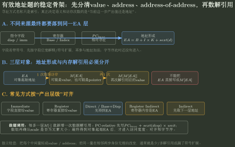

# 字节序、对齐与有效地址

> 训练定位：把“形式地址/位移解释 → EA 有效地址计算 → 大端/小端物理字节排布 → 边界对齐与结构体布局”连成一条推理链；解决有效地址与操作数内容混淆、大端小端顺拼逆拼、结构体内部/尾部填充与数组步长、以及对齐对地址低位的约束等高频断点。  
> 模型归属：[CO-02 ISA 与机器级程序](CO-02_ISA与机器级程序_方法论手册.tex)。寻址方式、有效地址生成、访问宽度与字节序/对齐机制仍由 Canonical 正文拥有。

---

## 一、母问题：地址、内容与存放顺序的三层分离

分析一次多字节内存访问时，必须严格分离三件事：

1. **变量的地址**：该多字节对象在内存中占用的连续字节中**最小的物理/虚拟地址**（起始地址），与机器采用大端还是小端完全无关；
2. **操作数的值与宽度**：数值真值与格式（如 32 位机器数 `1234FF00H`）；
3. **字节存放顺序（Endianness）**：多字节数值内部的高低字节如何对应到从低到高的物理地址单元。

```text
指令寻址 / 形式地址
  ↓ (解释 + 符号扩展 + 基址/变址)
有效地址 EA (起始最小地址)
  ↓ (访问宽度 1B / 2B / 4B / 8B)
连续字节区间 [EA, EA + width - 1]
  ↓ (大端 MSB 在低 / 小端 LSB 在低)
各物理字节内存排布
```

---

## 二、有效地址（EA）生成链：先解释扩展，再加基址

寻址方式的核心是把指令中的形式地址（位移量、立即数）与寄存器内容合成为最终访存地址 $EA$：

$$
\boxed{EA = \text{Base} + (\text{Index} \times \text{Scale}) + \text{Disp}}
$$



图中蓝色层表示“地址形成”，黄色层表示真正的内存解引用；每增加一层 $M[\cdot]$ 才增加一次数据访存。这样可以把“寻址方式名称”和“实际数据流层级”分开，避免把 EA 直接当作操作数内容。

### 核心断点：形式地址是补码还是无符号

当指令中的位移量（形式地址）字段带有负数含义时（如基址寻址负偏移、相对寻址向前跳转）：

1. 必须先按题设位宽（如 16 位补码）进行**符号扩展**到与基址相同的位宽（如 32 位）；
2. 再执行地址加法。

### 局部规则：形式地址带符号时先做符号扩展

**触发信号**：形式地址最高位为 1，题面明确“补码表示”或负位移。

**第一动作**：将形式地址按补码还原其真实负权值或符号扩展为全位宽十六进制负数，再与基址相加。

**检查与退出**：若直接把 `FF12H` 当成无符号整数 $65298$ 与基址相加，导致地址不减反增，立即撤回并先做符号扩展。

---

## 三、字节序：大端与小端的物理排布

设 32 位机器数 `0x12345678` 存放在起始有效地址 `0x1000` 处：

- 最高有效字节（MSB）：`12H`
- 最低有效字节（LSB）：`78H`

| 字节序 | 低地址 `0x1000` (EA+0) | `0x1001` (EA+1) | `0x1002` (EA+2) | 高地址 `0x1003` (EA+3) | 读图/拼数规则 |
|---|---|---|---|---|---|
| **大端 (Big-Endian)** | `12H` (MSB) | `34H` | `56H` | `78H` (LSB) | **顺着拼**（与人类书写一致，网络字节序） |
| **小端 (Little-Endian)** | `78H` (LSB) | `56H` | `34H` | `12H` (MSB) | **倒着拼**（低地址存低字节） |

### 两种排法的本质权衡

- **大端优势**：直观，符合人类阅读习惯；
- **小端优势**：**变宽度访问同一个数时低字节地址不变**。例如把 32 位 `int` 的低 8 位当 `char` 读取，小端下该 `char` 的地址依然是 `EA`，硬件无需进行地址修正（大端下则需访问 `EA + 3`）。

### 局部规则：字节序读写先画物理地址表

**触发信号**：题目给出内存连续字节转储或要求确定某字节（如 LSB/MSB）所在地址。

**第一动作**：画出水平或垂直地址表，左边/上边标低地址（EA），右边/下边标高地址（EA+k）；按大端 MSB 在低、小端 LSB 在低填入各字节。

**检查与退出**：从小端内存转储恢复 32 位数值时，必须从高地址向低地址逆向拼接为十六进制数值；若直接从低地址到高地址顺着抄，立即停止纠正。

---

## 四、边界对齐：省的是访存次数

### 物理本质

现代存储器通常按字或双字（如 4B、8B）总线粒度对齐访问。一次总线事务读取的是 $8i\sim 8i+7$ 的整块。

若一个 4 字节整数存放在地址 `0x1001`（跨越了 `0x1000~0x1003` 与 `0x1004~0x1007` 两个物理块），硬件必须执行**两次访存事务**并在内部拼接，导致执行延迟增加。

**边界对齐的本质是用少量的内存空间空洞（填充），换取每次数据访问都只需单次访存事务。**

### 对齐对地址二进制位的约束

$k$ 字节数据对齐到 $k$ 的整数倍地址（$k=2^m$）：

$$
\boxed{\text{地址对齐到 } 2^m \iff \text{地址的低 } m \text{ 位恒为 } 0}
$$

| 对齐粒度 | 要求地址特性 | 硬件设计红利 |
|---|---|---|
| 2 字节（short） | 末 1 位恒为 `0` | 地址低 1 位可不存 |
| 4 字节（int/float/指令） | 末 2 位恒为 `00` | 32 位指令对齐时 PC 只需存高 30 位；分支偏移以指令为单位范围扩大 4 倍 |
| 8 字节（double） | 末 3 位恒为 `000` | 地址低 3 位恒为 0 |

---

## 五、结构体对齐三规则与“为什么尾部必须插空”

结构体内存布局遵循三条规则：

1. **规则 ①（整体对齐要求）**：结构体的总对齐要求等于其所有成员中**最大的对齐要求**（注意：`char name[10]` 的对齐要求是 `char` 的 1，不是 10）；
2. **规则 ②（成员内部对齐）**：每个成员按声明顺序放置，其相对结构体首地址的偏移量必须是**该成员自身对齐要求的整数倍**；若不满足则向前**内部插空（Padding）**；
3. **规则 ③（结构体尾部对齐）**：结构体的总大小必须是其**总对齐要求（规则 ①）的整数倍**；若不满足则在末尾**尾部插空**。

### 为什么尾部插空不能省略

尾部填充是**唯一为结构体数组服务的机制**：

$$
\operatorname{addr}(sa[i]) = \operatorname{addr}(sa) + i \times \operatorname{sizeof}(\text{struct})
$$

若没有尾部填充，$\operatorname{sizeof}$ 不是对齐要求的倍数，则从 $sa[1]$ 开始，后续所有元素的首地址都会脱离对齐基准，导致数组中所有后续元素的内部成员对齐全部失效。

### 成员重排优化

**规律**：按成员对齐要求**从大到小排列**，填充字节最少，所占空间最小。

### 局部规则：结构体布局逐成员排偏移

**触发信号**：求结构体大小、成员偏移或最优重排。

**第一动作**：先列各成员大小与对齐要求，从偏移 0 开始逐个分配，按“对齐倍数”向上取整确定偏移，最后将总长向上对齐到结构体最大对齐要求。

**检查与退出**：禁止直接将各成员 `sizeof` 相加；必须逐项列出内部 padding 与尾部 padding。

---

## 六、复合题：先算寄存器位模式，最后才让字节序介入

当一道题同时出现 signed→unsigned 转换、移位和大小端时，最容易把三个层次搅在一起。转换本身的完整训练见 [类型转换与混合表达式](../10_数据表示与运算/类型转换与混合表达式.md)；本节只负责把转换结果交给内存布局。稳定顺序是：

```text
源机器数
→ 类型转换后的位模式 / 解释
→ 寄存器内运算结果
→ 多字节结果写入内存
→ Endianness 决定各字节地址
```

例如同宽补码 `int` 转为 `unsigned int` 时，在典型模 $2^n$ 语义下保留低 $n$ 位模式，只改变后续解释；若随后对 unsigned 做右移，则是逻辑右移。只有最终问“较低地址单元是什么字节”时，才调用大端/小端排布。

### 局部规则：Endianness 永远放在“值已经算完”之后

**触发信号**：题面同时出现类型转换、算术/逻辑移位和“低地址/高地址字节”。

**第一动作**：先完全忽略字节序，在寄存器位宽内得到最终机器数；然后按字节切分，最后画地址—字节表。

**检查与退出**：若计算过程中因为“大端”把寄存器中的十六进制数先反转，立即撤回；大小端只描述多字节对象与内存地址的对应，不改变寄存器里的数值运算。若类型转换本身涉及 C 的实现相关/未定义行为，先由题面或 ISA/语言模型补足语义，不能让字节序替它决定结果。

---

## 七、母例：2019 年真题 Q15

### 题设条件

- 计算机按字节编址，采用**大端方式**；
- 操作数机器数为 `1234FF00H`（4 字节）；
- 基址寻址方式，形式地址（补码表示）为 `FF12H`；
- 基址寄存器内容为 `F0000000H`；
- 求：该操作数的 LSB（最低有效字节）所在地址。

### 推理链

1. **形式地址符号扩展**：
   16 位补码 `FF12H` 的最高位为 1，真值为：
   $$
   \mathtt{FF12_H} - 2^{16} = 65298 - 65536 = -238 = -\mathtt{00EE_H}.
   $$
2. **有效地址 EA 计算**：
   $$
   EA = \mathtt{F0000000_H} + (-\mathtt{00EE_H}) = \mathtt{EFFFFF12_H}.
   $$
3. **大端排布与 LSB 定位**：
   操作数 `1234FF00H` 占 4 字节，MSB 为 `12H`，LSB 为 `00H`。大端下 MSB 在低地址、LSB 在高地址：
   ```text
   EA+0 (EFFFFF12H) : 12H  (MSB)
   EA+1 (EFFFFF13H) : 34H
   EA+2 (EFFFFF14H) : FFH
   EA+3 (EFFFFF15H) : 00H  (LSB)
   ```
   所以 LSB 所在地址为：
   $$
   \boxed{\mathtt{EFFFFF15_H}}
   $$

---

## 八、易错边界

> **易错边界：变量的起始地址恒为最小物理地址。** 无论大端还是小端，程序引用的指针/变量首地址永远是 `EA`，区别仅在于 `EA` 处存放的是 MSB 还是 LSB。

> **易错边界：`char buf[10]` 的对齐要求是 1，不是 10。** 数组的对齐要求取决于元素类型，因为访存是以单个元素为单位进行的。

> **易错边界：字节序与边界对齐相互独立。** 大端机器可以对齐也可以不对齐，小端机器同理；计算结构体对齐时无需关心字节序，判断字节序时也无需考虑对齐规则。

> **易错边界：小端内存转储逆向读取。** 给定小端机器内存字节序列 `DC EC FF FF`（低地址到高地址），对应的 32 位补码数值是 `0xFFFFECDC`（$-4900$），切忌顺向读成 `0xDCECFFFF`。

---

## 九、本批题库怎样攻击地址与布局模型

- **Q276**：数组偏移先把地址定位到具体 `short`，再让小端决定该地址处是低字节还是高字节；“数组第几个元素”和“这个字节在元素中的位次”是两层索引。
- **Q278**：结构体不能直接把成员 `sizeof` 相加；成员起点必须逐个满足自身对齐，最后总大小再满足结构体最大对齐要求。
- **Q279**：类型转换、逻辑右移、大小端必须按顺序分层；大端不能反向改变寄存器中 `A1B6H >> 1 = 50DBH` 的运算结果。
- **Q280–281**：MSB/LSB 地址题都可统一为“先算元素起始 EA，再由对象宽度和 endian 求字节偏移”；不需要为小端 int、大端 double 分别背公式。
- **Q282**：形式地址 `FF00H` 先按 16 位补码符号扩展参与 EA 计算，得到对象首地址后才排 `AB CD 00 FF`；字节序永远不是地址加法的一部分。

这批题没有要求改变 CO-02 的地址母模型；它们反复验证的是同一顺序：**先得到对象与最终机器数，再得到起始地址，最后才把字节映射到递增地址。**

正式题面与解析见：

- [03｜字节序、对齐与类型转换：题面](../../../archives/408/题库/计算机组成原理/03_字节序对齐与类型转换_选择题.md)
- [03｜字节序、对齐与类型转换：答案与解析](../../../archives/408/题库/计算机组成原理/03_字节序对齐与类型转换_答案与解析.md)

## 十、代表题与证据

- [2019 年真题 Q15 题解](../../../archives/408/2019年真题/solutions/q15.md)：基址寻址 + 16 位补码负位移 + 大端 LSB 定位综合母题。
- [2023 年真题 Q44 题解](../../../archives/408/2023年真题/solutions/q44.md)：二维数组 `a[i][j]` 基址变址寻址与反汇编机器码中小端判断。
- [2018 年真题 Q15 题解](../../../archives/408/2018年真题/solutions/q15.md)：结构体边界对齐、成员重排与数组步长。
- [2016 年真题 Q14 题解](../../../archives/408/2016年真题/solutions/q14.md)：大端与小端内存字节分布对比。
- [2017 年真题 Q13 题解](../../../archives/408/2017年真题/solutions/q13.md)：基本数据类型与结构体填充。
- [2020 年真题 Q14 题解](../../../archives/408/2020年真题/solutions/q14.md)：结构体嵌套与对齐大小计算。

---

## 十一、压缩

$$
\boxed{
\text{EA 是起始最小地址；大端顺着排 (MSB 在前)，小端倒着排 (LSB 在前)；对齐省访存，尾部插空保数组。}
}
$$
