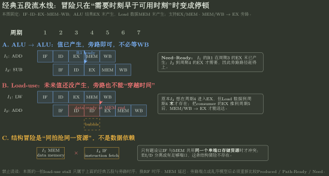
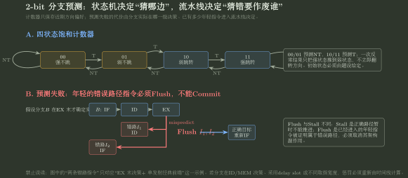

# 流水线时空图、旁路与阻塞

> 训练定位：面对 5 段/多段流水线、时钟周期、有限指令序列总周期、RAW 数据冒险、旁路、load-use、分支阻塞以及超标量辨析题时，训练把每条依赖写成 `Produced / Ready / Need / Commit`，再用时空图决定 forwarding、stall 与 flush。  
> 模型归属：[CO-04｜流水线与指令级并行](CO-04_流水线与指令级并行_方法论手册.tex)拥有流水段、hazard、need-ready、转发/停顿/冲刷和性能机制；本文件只训练时空图与真题攻击，不建立固定“五级流水万能停拍表”。

## 母题表示：流水线题不是“第几级”，而是“这个值什么时候能到”

统一写成：

```text
Stage / Resource Assumptions
→ Instruction Read/Write Set
→ Producer / Consumer
→ Produced
→ Path-Ready
→ Consumer-Need
→ Forward / Stall / Flush
→ Commit
```

同样叫 5 段流水线，只要以下任一项改变，停顿数都可能改变：

- 寄存器堆同周期先写后读还是不能同周期读写；
- ALU 结果在哪一级末产生；
- load 数据在哪一级末产生；
- forwarding 起点/终点；
- 分支在哪一级决定；
- IF 与 MEM 是否争同一存储端口。

### 局部规则：先抄模型，不先画气泡

**触发信号**：题目出现“5 段流水、旁路、阻塞、冒险”。

**第一动作**：草稿第一行写 `stage duties / RF timing / forwarding / branch resolve / memory latency`；没有明示的信息不要偷偷套另一道题。

**检查与退出**：若答案中的“停 1 拍/2 拍/3 拍”无法追溯到某个 ready 与 need 的时刻差，说明只是背表，应重画时空图。

## 一、时钟周期由最慢流水段决定，还要加段间寄存器开销

若段组合延迟为 $t_i$，段间寄存器额外延迟为 $t_r$，则：

$$
\boxed{T_{clk}\ge \max_i t_i+t_r}.
$$

- 2009 Q18：忽略寄存器开销，四段 90/80/70/60ns，最小时钟周期为 90ns；
- 2018 Q20：最慢功能段 80ps，流水寄存器 20ps，因此不是 80ps，而是 100ps。

### 局部规则：先把“功能部件延迟”和“流水寄存器延迟”分列

**触发信号**：给各段/各部件延迟并问主频或时钟周期。

**第一动作**：先找最大组合段，再确认题目是否另给 pipeline-register overhead；只对串在同一拍关键路径上的延迟求和。

**检查与退出**：若题目说“忽略段间缓存时间”，不要自行加寄存器开销；若明确给出，就不能漏掉。

## 二、有限序列的吞吐率不能直接写成主频

理想 $k$ 级流水执行 $n$ 条、无任何阻塞：

$$
Cycles=k+n-1,
$$

$$
T=(k+n-1)T_{clk}.
$$

因此这段有限任务的平均完成率为：

$$
\boxed{Throughput_n=\frac{n}{(k+n-1)T_{clk}}}.
$$

只有 $n$ 很大、进入稳态极限时，才趋近于每周期完成一条：

$$
Throughput_{steady}\to \frac1{T_{clk}}.
$$

2013 Q18 的 4 级、100 条、1.03GHz 恰好用 $100/103$ 修正填充开销，得到约 $1.0\times10^9$ 条/s，而不是直接写 1.03G 条/s。

### 局部规则：题目给具体指令条数就把 Fill/Drain 算进去

**触发信号**：给 $n$ 条指令、$k$ 级流水、无阻塞并问总时间/吞吐率。

**第一动作**：先写 $k+n-1$，再乘时钟周期；只有题目明确问稳态峰值才直接用每周期完成数。

**检查与退出**：当 $n=1$ 时，总周期应退化为 $k$；若你的公式得到 1，说明把吞吐和 latency 混了。

## 三、依赖不是 hazard：先看读写集合，再看时间冲突

2019 Q18 的四条指令提供了最小辨析：

```text
I1: add   s2,...      // write s2
I2: load  s3,...      // write s3
I3: add   s2,s2,s3    // read s2,s3; write s2
I4: store s2,...      // read s2
```

静态依赖先由 Read/Write Set 判定：

- I1 → I3：RAW on `s2`；
- I2 → I3：RAW on `s3`；
- I3 → I4：RAW on `s2`；
- I2 与 I4 没有生产者—消费者数据边，因此不构成该题的数据冒险。

真正是否 stall，还要继续把这些依赖放进当前时间模型。

### 局部规则：数据冒险题先做寄存器“读写签名”

**触发信号**：给指令序列问“哪两条相关/哪条阻塞”。

**第一动作**：每条只写 `R={...}, W={...}`，先找 RAW/WAR/WAW，再进入时空图。

**检查与退出**：同一个寄存器名字出现两次不自动构成 RAW；必须是较老指令写、较年轻指令读，并且当前时间安排真的让新值来不及。

## 四、没有旁路时，消费者等的是“写回可读”，而不只是“结果算出”

2012 Q44 明确规定：

- 五级 IF/ID/EX/M/WB；
- 无 forwarding；
- 同一寄存器不能同周期写和读；
- 按序发射、按序完成。

因此消费者即使知道生产者早已在 EX 算出 ALU 结果，也不能越过寄存器堆取得它；要等生产者 WB 完成以后，消费者的 ID 才能合法读新值。

更重要的是，若较年轻指令卡在 ID，按序前端还会让后面的 IF 保持，不能让更年轻指令绕过它继续发射。

### 局部规则：无旁路模型把 ready 点放到题设允许的寄存器读时刻

**触发信号**：题面明确“无转发/旁路”或只允许从寄存器堆取源操作数。

**第一动作**：把 producer ready 改成“写回后能被 RF 读到”的时刻，并应用题设同周期读写规则。

**检查与退出**：若前面一条卡在 ID，而后面一条仍在 IF/ID 越过它，检查题面是否真的允许乱序发射；按序模型通常不允许。

## 五、有旁路只改变 Ready Path，不会让未来值提前产生

2010 Q19 把 forwarding 作为缓解数据相关的机制；但 2023 Q19 与 2024 Q19 专门攻击“有旁路就绝不停顿”。

### ALU → ALU / 地址计算

```text
I1: add  s2,...
I2: load s3,0(s2)
```

I1 的 ALU 结果在 EX 末已经 produced，I2 下一拍 EX 才 need `s2`。若存在 EX/MEM → EX 旁路，就可直接 forwarding，无需等 WB。

### Load-use

```text
I2: load s3,...
I3: beq  ...,s3,...
```

load 的真正 data 到 MEM 末才 produced，而紧随其后的 I3 在 EX 需要它。即使有 MEM/WB → EX 旁路，最早路径仍晚于原 need，因此必须先 stall，让消费者的 need 后移。

所以：

$$
\boxed{Forwarding\ can\ shorten\ path-ready,
\quad but\ cannot\ make\ unproduced\ data\ exist.}
$$

### 局部规则：旁路题固定问“值现在已经 produced 了吗？”

**触发信号**：题目说“采用转发/旁路”。

**第一动作**：先标 producer 真正产生目标值的级末，再画到 consumer need 端的实际旁路；不要看到 forwarding 就直接删除 RAW。

**检查与退出**：EA 不是 load data。若 producer 是 load，EX 末只产生地址，必须等数据存储器真正返回。



图中的一拍 Load-use stall 与 IF/MEM 冲突都绑定于图首声明的经典五段假设；换级职责、memory latency、RF 时序或旁路端点后，重新做 Need--Ready/Resource 检查。

## 六、分支阻塞也会改变后续数据依赖的时间距离

2014 Q44 的循环中，本轮 I5 更新 `R2`，下一轮 I1 读取 `R2`。静态上存在跨迭代 RAW；但题设又规定分支 I6 固定造成 3 个周期控制阻塞。这个额外间隔让 I5 的结果在下一轮 I1 真正需要前已经可用，于是该静态依赖不再形成实际 stall。

这说明：

> **hazard 是“依赖 + 当前时间表”的产物。其他原因引入的 stall 可能顺便消除一条数据时间冲突。**

因此总停顿不能把“数据停顿”和“控制停顿”机械逐项相加；先得到真实时间线，再看哪些约束已经被别的等待覆盖。

## 七、控制冒险的停顿数来自“决策什么时候确定”

2023 Q19 中 I3 是分支，题设采用硬件阻塞而非预测。I4 是否能继续，取决于分支条件/目标在哪一级真正确定。在该题的具体实现中，要等到后级给出 PC 决策，因此 I4 因控制冒险阻塞。

不同题若分支在 ID、EX 或 MEM 决策，惩罚会不同；“分支固定 2/3 拍”没有跨模型意义。

### 局部规则：分支题画“未知 Next PC”的窗口

**触发信号**：硬件阻塞、静态预测、分支惩罚、flush。

**第一动作**：标分支进入流水的时刻、真实 Next PC 可确定的级末；两者之间前端是否等待或猜测由题设策略决定。

**检查与退出**：若采用预测，预测错误时要数 flush；若采用硬件等待，则不要再把同一窗口重复算成 mispredict penalty。

## 八、Bubble、Stall、Flush 必须说清“保留谁、作废谁”

- **stall**：正确路径还没条件推进，通常保持 PC/某些前级寄存器；
- **bubble**：向后级送一个“不产生架构副作用”的空控制包，让后级继续推进；
- **flush**：已经进入的年轻指令被证明属于错误/异常路径，必须作废。

把三者都叫“插空”会失去状态意义。2012 Q44 的 ID 阻塞属于等待；分支预测错误时的年轻指令则属于作废，二者不是一回事。



预测器状态只决定“猜哪边”；真正的 mispredict penalty 仍由分支在哪一级确定、错误路径已经推进到哪里生成。

## 九、超标量增加的是“同拍发射/完成宽度”，不是缩短流水段

2017 Q17：超标量的核心是同一周期可以发射多条独立指令，并可结合动态调度提高 ILP；它不自动缩短单个流水功能段的组合延迟。

理想情况下：

- 基本单发射流水的稳态 CPI 可趋近 1；
- $W$ 路超标量的理论 CPI 可以低于 1，但实际受 ILP、端口、功能部件、分支和 Cache 限制。

因此“CPI<1”是多发射能力在理想负载下的可能结果，不是每个程序的保证。

## 十、本轮真题攻击结论

| 真题 | 攻击的错误模型 | 稳定修正 |
|---|---|---|
| 2009 Q18 / 2018 Q20 | 时钟取平均段延迟 | 取最长 stage，并按题设加寄存器开销 |
| 2013 Q18 | 吞吐率恒等于主频 | 有限序列要计 fill/drain，稳态才趋近峰值 |
| 2012 Q44 | 只看 producer“算完” | 无旁路时必须等实际可读路径 ready |
| 2014 Q44 | 每种 hazard penalty 独立相加 | 真实时间线可能让控制停顿覆盖数据等待 |
| 2019 Q18 | 寄存器名重复就算冒险 | 先 Read/Write Set，再判 producer-consumer |
| 2023 Q19 / 2024 Q19 | 有 forwarding 就无 stall | load-use 受 produced 时刻限制 |
| 2017 Q17 | 超标量会缩短 stage 时间 | 它主要增加 issue/execute width 与 ILP |
| 2020 Q17 / 2026 Q20 | “CPI=1”是一切流水结论 | 只能在明确的理想单发射模型/口径下成立 |

## 陌生流水线题固定落笔协议

```text
1. 抄 stage、RF 时序、memory latency、branch resolve、forwarding 端点。
2. 每条指令写 Read/Write Set。
3. 每条 RAW 写 producer / consumer。
4. 标 Produced → Path-Ready → Need → Commit。
5. 先画理想时空图，再叠加结构/数据/控制约束。
6. Forward 写路径；剩余 ready>need 才 Stall。
7. Stall 写“谁保持、谁插 bubble”；Flush 写“谁作废”。
8. 从最终图数总周期，不重复加 fill/drain 或被覆盖的 penalty。
9. 用年龄顺序和 Write Set 检查错误路径没有提交。
```

## 最短压缩

> **流水线不背“停几拍”：先问值何时 produced，沿现有路径何时 ready，消费者何时 need；ready 晚了才 stall，值已产生且路径够快才 forwarding，错误路径才 flush。**
