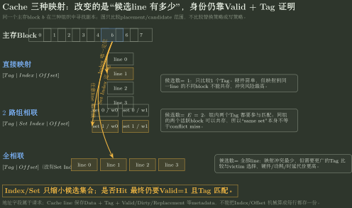
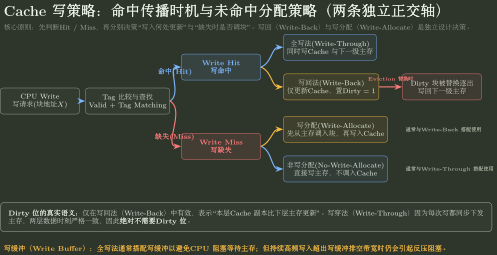

# Cache 访问流与命中率

> 训练定位：面对 Cache 地址字段、数组/循环访问、命中率、组冲突、LRU 状态、写策略、Cache 行容量、完整 miss 生命周期与 AMAT 题时，训练把**程序行为先变成访存事件，再把事件变成 Cache 状态变化**。  
> 模型归属：[CO-06 Cache 与存储层次方法论手册](CO-06_Cache与存储层次_方法论手册.tex)。locality、block/line、mapping、tag/valid、replacement、write policy、3C 与 AMAT 的稳定机制由 Canonical 正文拥有；本文件只负责真题中的输入生成、逐次模拟、计数和检查。

## 母题表示：Cache 题真正输入的不是“数组”，而是一串访存事件

训练统一使用：

```text
Program / Address Request
→ Memory-reference Events
→ Address Stream
→ Block Stream
→ Set / Tag / Offset
→ Cache State Transition
→ Hit / Miss / Writeback / Fill
→ Event Count
→ Cost
```

箭头表示**求解信息逐步生成**：程序语义先决定真实访存事件；每个访存事件再生成地址；地址按 Cache 几何映射成块/组/标记；随后当前 Cache 状态决定 hit/miss；最后才能统计命中率和成本。

> [!idea] Cache 综合题第一动作
> **先数一次循环体到底产生几次针对目标对象的 memory reference。** 不先数 read/write/fetch，就不要算命中率。

## 一、Stage 0：先生成真实访存事件

例如：

```c
s[k] = 2 * s[k];
```

若题目明确按普通 load + store 语义计数据访问，则对 `s[k]` 至少生成：

```text
read s[k]
write s[k]
```

因此 1 个元素可能对应 2 次 Cache reference，而不是“访问一个元素 = 访问一次 Cache”。2016 Q15 与 2025 Q43 都直接验证这一点。

### 源码局部性与真实 Cache reference 要分层

源码中的变量可以表现出“近期反复使用”的程序级复用，但是否真正形成数据 Cache reference 还取决于编译后的存放位置。例如循环变量 `i`、累加器 `sum` 往往可以长期驻留寄存器；这不妨碍我们说源码层面存在时间复用，却意味着它们可能根本不进入数据 Cache 统计。

因此局部性辨析先问“题目是在讨论程序访问规律，还是精确统计某一级 Cache reference？”前者可以描述 source-level reuse，后者必须生成实际 memory-reference stream。

### 哪些对象应计入当前统计

先根据题目问法限定对象：

- 只问“访问数组 a 的数据 Cache 命中率” → 只统计数组 a 的 data references；
- 变量明确分配在寄存器 → 不把该变量再算成数据 Cache reference；
- 指令 Cache 与数据 Cache 分离 → 取指不混入数据 Cache 命中率；
- 题目明确“代码已在 Cache” → 不重复把取指 miss 混入数据数组统计；
- 写策略可能使一次 store 进一步产生下一级写流量，但这与“CPU 对 Cache 发出几次 reference”是两种计数对象。

> [!trap] “一次 C 语句 = 一次访存”
> C 表达式只描述程序语义；真正 memory-reference 数必须结合题设给出的寄存器分配、指令行为和写策略生成。

## 二、Stage 1：统一粒度，再做地址字段

给出：

- 主存地址宽度 $A$；
- Cache 数据容量 $C$；
- 块大小 $B$；
- 相联度 $E$；
- 编址单位。

先得到：

$$
N_{line}=\frac{C}{B},\qquad
N_{set}=\frac{N_{line}}{E}.
$$

若按字节编址且 $B=2^b$ B、$N_{set}=2^s$，则：

$$
offset=b,\qquad index=s,\qquad tag=A-b-s.
$$

若按字编址，必须把 $B$ 换成“一个块包含多少**可寻址单位**”，不能把字节数直接取对数。

### 几何变化题：先守住地址位预算

对字节编址、2 的幂组织：

$$
A=TagBits+IndexBits+OffsetBits.
$$

不要背“块变大 Tag 就怎样”“相联度翻倍 Tag 就怎样”；先写哪些总量保持不变。

| 变化 | 保持不变 | Offset | Index | Tag |
|---|---|---:|---:|---:|
| 块大小 $\times2$ | Cache 数据容量、相联度、地址宽度 | +1 | -1 | 0 |
| 相联度 $\times2$ | 块大小、总 line 数、地址宽度 | 0 | -1 | +1 |
| 块大小 $\times2$ | 组数、地址宽度 | +1 | 0 | -1 |

直接映射还可用一个独立检查：若主存与 Cache block 相同，主存块数是 Cache line 数的 $2^t$ 倍，则 Tag 正好需要 $t$ 位。在“主存容量 / Cache 数据容量 = $2^t$”的规则组织中，这个容量比也可直接检验 Tag 位数。

### 局部规则：参数变化题先列“不变量”

**触发信号**：题目改变 block size、associativity、Cache lines 或容量，问 tag/index/offset 怎样变化。

**第一动作**：先写 $A=t+s+b$ 与 $S=C/(BE)$，把明确保持不变的量圈出来，再计算位数增减。

**检查与退出**：若题面没有说明是固定总容量、固定 line 数还是固定组数，不允许只凭“块翻倍/相联度翻倍”推出唯一 Tag 变化；不同不变量会得到不同答案。

### 地址字段与 Cache 行内容严格分开

地址是请求身份的编码：

```text
Tag | Set Index | Block Offset
```

Cache 行是当前保存的副本状态，至少可能包含：

```text
Data + Tag + Valid + Dirty + Replacement/ECC/other metadata
```

`Tag` 同时出现在地址解释与 Cache metadata 中；`Index/Offset` 通常不是“每行额外存一份地址字段”。

### 物理容量题

先确认题目问：

- data capacity；还是
- data + tag + valid + dirty + replacement metadata 的物理总位数。

对于 write-back，通常需要 dirty；write-through 通常不靠 dirty 判断逐出写回。替换状态的精确位数必须服从题设/实现，不能把“每行固定 $\log_2E$ 位 LRU”当普遍定理。

## 三、Stage 2：把地址流投影成 Block / Set 流

对字节地址 $A_i$：

$$
Block(A_i)=\left\lfloor\frac{A_i}{B}\right\rfloor,
$$

$$
Set(A_i)=Block(A_i)\bmod N_{set}.
$$

再由高位恢复 tag。

这一步是数组题的分水岭：真正决定冲突和复用的不是“i/j 循环名字”，而是生成出来的 block/set 访问序列。

### 连续数组

若元素大小为 $e$ B，数组首地址为 $A_0$：

$$
A(i)=A_0+i\cdot e.
$$

二维行优先数组 $a[R][C]$：

$$
A(i,j)=A_0+(iC+j)e.
$$

交换循环后，公式不变，变的是 $(i,j)$ 的访问顺序，因此地址 stride 改变。

### Stride 与冲突

连续访问时，空间局部性来自同一 block 内多个元素；大 stride 访问时，应进一步看：

$$
\Delta Block
\quad\text{以及}\quad
\Delta Set=\Delta Block\bmod N_{set}.
$$

若多个反复访问的 block 映射到相同 set，且活跃 block 数超过该 set 的 way 数，就可能发生 conflict/replacement；不能只凭“跨得远”就直接判命中率为 0。

2010 Q44 的列优先访问正是“stride 生成 block 流，再由取模产生固定组冲突”的典型证据；2023 Q43 则提醒：列优先不必然更差，若每组活跃行数不超过相联度，仍可保持同样的 $7/8$ 命中率。

> [!trap] Same Set ≠ Conflict Miss
> 两个不同主存块映射到同一组，只说明它们属于同一个候选集合。若是 $E$ 路组相联且同时活跃的竞争块数不超过 $E$，它们可以共存，不产生冲突缺失。`conflict miss` 要求有限映射相对于同容量全相联基线**额外**造成了逐出/缺失。



图只比较 placement 与候选 Tag 的数量：Index/Set Index 负责缩小候选集合，真正命中仍要检查 Valid + Tag；全相联没有 Set Index。

## 四、Stage 3：Alignment 不是小陷阱，而是 Footprint 入口

给定一个连续对象：

- 单元粒度 $U$（可取 Cache block 或 page）；
- 对象总长度 $L$ B；
- 起始地址在当前 $U$ 单元内的偏移 $d$，其中 $0\le d<U$。

则它接触的单元数为：

$$
\boxed{N_U=\left\lceil\frac{d+L}{U}\right\rceil}.
$$

等价的整数端点写法为：

$$
N_U=
\left\lfloor\frac{d+L-1}{U}\right\rfloor+1,
\qquad L>0.
$$

这不是 Cache 的新机制，而是训练层的**边界穿越工具**。

### 用在 Cache block

令 $U=B$：得到连续数组实际触及多少主存块。

- 2020 Q44：数组从块边界开始，$d=0$，4KB 数组恰好 64 个 64B block；
- 2025 Q43：8KB 数组从 block 内偏移 32B 开始，故跨 129 个 64B block，而不是 128 个。

### 用在 Page

令 $U=PageSize$：得到连续对象跨多少页。2025 Q43 中同一个 8KB 数组从 4KB 页内偏移 32B 开始，因此跨 3 页，而不是只看 $8KB/4KB=2$。

> [!idea] Footprint 第一动作
> 先画 `[当前单元剩余空间] + [完整中间单元] + [尾部]`。任何“对象长度恰好是若干块/页，所以一定占若干块/页”的结论，都必须先检查起始偏移。

### 精确命中率题的题面完整性检查

若题目要求一个**精确数值命中率**，而结果会随首地址而变，则必须明确 alignment / 起始 block offset；若还存在其他对象访问，则必须给出足以确定是否污染/冲突的地址关系或直接说明不会在复用前驱逐目标块。

同样，程序题必须明确 reference stream。编译器可能把源码中的重复数组值保存在寄存器里；如果答案依赖“源码出现三次 `A[i]` 就一定产生三次 Cache reference”，题面必须规定未优化访存模型或直接给机器级访问流。

**硬检查：解析中如果第一次出现“假设数组按块边界对齐”“假设编译器没有复用寄存器值”，说明关键输入放错了位置，应回题面补条件。**

## 五、Stage 4：逐访问推进 Cache 状态

对于每个 reference，至少记录：

| 字段 | 当前问题 |
|---|---|
| block / set / tag | 这次请求是谁、去哪组？ |
| valid/tag | 当前组里有没有这个副本？ |
| dirty | victim 若被逐出，是否需要写回？ |
| replacement state | miss 时谁是 victim？hit 后策略状态怎样更新？ |
| access type | read 还是 write？写策略走哪个分支？ |

### Read hit

```text
Index 找候选组
→ Valid + Tag 确认身份
→ Offset 取块内数据
→ 更新 replacement state
```

### Read miss

```text
选择 invalid line / victim
→ dirty victim 必要时 write back
→ 向下一级 fetch block
→ 写 data/tag/state
→ valid 生效
→ retry / satisfy original read
```

### Write

分两条独立轴：

- hit 时：write-through vs write-back；
- miss 时：write-allocate vs no-write-allocate。

不要从 write-back 自动推出 write-allocate。



图把“命中后何时传播”与“写 miss 是否分配 line”分开；Dirty 只表示 write-back 副本比下一级更新，逐出时才触发必要写回。

### Way 编号与替换策略的两个边界

- **way 编号通常没有架构语义**：若题目只给“4 路组相联 + 初始为空”，却没规定空 way 的填入编号，就不要问“最后替换 way 2 还是 way 3”。应问语义不变量：哪个主存块是 victim、最后 resident set 是什么。
- **直接映射没有 victim 选择**：每个主存块只有唯一候选 line，miss 时目标位置天然确定，因此不存在 LRU/FIFO/Random 三选一的 replacement-policy 决策。题面若同时写“直接映射 + 随机替换”，后者是无效/矛盾条件，应删除。

## 六、命中率：分母永远先来自 Event Stream

$$
HitRate=\frac{N_{hit}}{N_{reference}},\qquad
MissRate=\frac{N_{miss}}{N_{reference}}.
$$

固定四步：

1. **对象**：统计谁的访问？指令、数组、全部数据还是某变量？
2. **事件数**：每次循环/指令产生几次相关 reference？
3. **块复用**：一个 block 中的数据按什么顺序被使用？
4. **状态破坏**：在再次利用前是否被容量、冲突、替换、别的对象访问破坏？

### “一个块只 miss 一次”何时成立

只有当：

- 首次进入该 block 后；
- 在其中后续需要的数据被使用完之前；
- 该 line 没有被冲突/容量/替换驱逐；

才可把一块简化成“一次 compulsory miss + 若干 hit”。

因此“每块装 $k$ 个元素 → 命中率 $(k-1)/k$”不是无条件公式，它依赖访问顺序和驻留寿命。

## 七、局部性：描述访问规律，不代替状态模拟

- 时间局部性：近期访问对象再次被访问；
- 空间局部性：附近地址在短时间内被访问。

局部性解释**为什么 Cache 值得存在**、为什么某种访问顺序可能受益；但具体命中率仍由 block size、mapping、capacity、replacement 和访问流决定。

2017 Q14 用重复访问前缀数组体现时间+空间局部性；2023 Q43 的每个数组元素只访问一次，所以对“同一元素”没有时间局部性，但每个 block 内连续元素仍产生空间局部性。

### 多级 Cache 的总命中率先看“穿透到最底层的原始请求”

若一次 CPU 原始 reference 依次访问多级 Cache，且没有 bypass/prefetch 等额外请求，那么“整个 Cache 层次至少一级命中”的比例就是：

$$
HR_{hierarchy}=1-MR_{global,last}.
$$

例如 1000 个 CPU references 中最终只有 10 个穿透所有 Cache，则层次总命中率为 $990/1000=99\%$。这里 40/1000 可能是 L1 miss rate，10/40 可能是 L2 local miss rate，它们的分母不同，不能直接相加或相减。

### 局部规则：多级命中率先写每个分母

**触发信号**：题目同时给 L1 miss 次数、L2 miss 次数或 local/global miss rate，并问“总命中率”。

**第一动作**：在每个比率旁边写分母：`CPU original refs / L1 accesses / L2 accesses`，再判断题目所谓“总命中”是至少一级命中还是某一级局部命中。

**检查与退出**：若存在 bypass、prefetch、write traffic 等使下一层访问数不再等于上一层 miss 数，停止使用简单层级关系，直接按真实 event count 统计。

## 八、性能：先数事件，再给事件定价

时间定义与不同存储层次先调用 [存储层次与 AMAT](存储层次与AMAT.md)。本节只负责把已经得到的 Cache hit/miss 事件接入成本模型，不重新拥有 AMAT 的完整定义。

Cache 性能题不要边模拟边加时间。先得到：

```text
N_reference
N_hit
N_miss
N_writeback
N_lower-level transaction
```

再声明每种事件的成本模型。

若题目定义：

- $T_{hit}$ = 当前 Cache 命中路径总时间；
- $MP$ = 相对 hit 路径的 miss **额外**损失，即 $T_{miss,total}-T_{hit}$；

则：

$$
AMAT=T_{hit}+MR\times MP.
$$

若题目给的是“miss path 总时间”而不是额外 penalty，则应按条件期望写：

$$
AMAT=(1-MR)T_{hit}+MR\,T_{miss,total}.
$$

两种公式不能混用。

> [!warning] 2025 Q43 的口径冲突必须显式保留
> 真题题面给“Cache 命中时间 2 周期，缺失损失 200 周期”。若“缺失损失”按额外 penalty 解释，应为 $2+0.0315\times200\approx8.30$ 周期；当前真题归档解析使用 $(129\times200+(4096-129)\times2)/4096\approx8.24$，等价于把 200 当成 miss 总路径时间。训练时必须先声明术语口径；在没有更高优先级官方评分细则前，不把两个数静默合并成同一结论。

## 九、把主存/总线成本接进来

2013 Q43 说明：Cache miss penalty 可能不是题面直接给一个数，而要先由 CO-05 / CO-08 算出：

```text
Cache miss
→ 需要几个 burst
→ 一次 burst 的地址/准备/数据时间
→ 得到一次 block fill 的额外成本
→ 再乘 miss 次数
```

因此：

$$
TotalCost=BaseCost+\sum_i N_i\cdot Penalty_i
$$

前提是各项没有重复包含，且题设没有允许重叠。2013 Q43 的正确数值链为：CPU 800MHz → 1.25ns；100 条、CPI=4 → base 500ns；120 次访存、5% miss → 6 misses；每 miss 85ns → 510ns；总计 1010ns。

## 十、概念边界

| 概念边界 | 为什么容易混淆 | 真正判据 | 题目信号 | 混淆后的错误 |
|---|---|---|---|---|
| C 元素访问 ≠ Cache reference | 都写成“访问 a[i]” | 一条语句可能 read + write，多条指令也可能访问同一对象 | `a[i]=a[i]+...` | 分母少算一倍 |
| 地址字段 ≠ Cache 行内容 | 都出现 Tag | 地址用于发请求，行内容保存 data + metadata | 问“地址划分”或“总物理位数” | 把 index/offset 也计入每行元数据 |
| Block count ≠ `数据长度/B` | 对齐时二者相等 | 还要看起始 block offset | 非对齐首地址 | 2025 型少算首尾块 |
| Spatial locality ≠ 必然高命中 | 连续地址通常受益 | 还受映射、容量、相联度、污染影响 | 行/列遍历 | 只凭循环次序猜命中率 |
| Conflict ≠ Capacity | 都表现为 line 被逐出 | 全相联同容量基线仍 miss 才是 capacity；映射额外 miss 是 conflict | 直接/组相联 | 错选优化方向 |
| Write-back ≠ Write-allocate | 常作为搭配出现 | hit 传播策略 vs miss 分配策略 | 写命中/写缺失 | 从一个策略推出另一个 |
| Hit Rate ≠ Performance | 命中率高常常更快 | 还需 hit time、miss penalty、写回和重叠 | AMAT/CPU time | 单看命中率判快慢 |
| Miss Penalty ≠ Miss Total Time | 都可能写“200 cycles” | 是否为额外损失要由题面定义 | AMAT | 重复或漏算 hit time |

## 十一、本批题库怎样攻击 Cache 模型

- **310**：把 L1 miss rate、L2 local miss rate 与穿透整个层次的 global miss rate 分开，证明“总命中率”必须先写分母。
- **313**：只给数组长度和 block size 仍不足以唯一得到精确命中率；alignment、初始状态与干扰访问属于正式输入。
- **314**：源码里 `A[i]` 出现几次不天然等于 Cache reference 几次；若答案依赖未优化访存模型，必须把 reference stream 写进题面。
- **316/328**：相联度、块大小变化题不该背独立口诀；统一由 $A=t+s+b$ 和 $S=C/(BE)$ 在给定不变量下生成。
- **318**：LRU 真正决定的是 victim block / resident set；way 编号没有题设约定时不具备稳定语义。
- **321**：direct-map Tag 位数可由地址三分生成，也可用“主存块数 / Cache line 数”的比值做独立检查。
- **323**：直接映射没有 victim 选择，因此“direct mapped + random replacement”不是更丰富的条件，而是冗余/矛盾描述。
- **329**：same set 只是候选集合相同；2-way 下两个块可以共存，所以 same set 不能直接改写成 conflict miss。
- **333**：Cache 与翻译/虚存慢路径必须先分 Owner；只有形成合法物理访问身份后，普通物理 Cache 命中/缺失才有语义。

正式题面与解析：

- [05｜Cache、局部性与存储层次：题面](../../../archives/408/题库/计算机组成原理/05_Cache局部性与存储层次_选择题.md)
- [05｜Cache、局部性与存储层次：答案与解析](../../../archives/408/题库/计算机组成原理/05_Cache局部性与存储层次_答案与解析.md)

## 十二、真题证据链（2009—2026）

- **2009 Q14**：主存地址 → block → set 的基本映射；
- **2009 Q21**：hit/miss 分母定义；
- **2010 Q44**：二维数组行/列访问 → block/set 流 → 冲突与命中率；同时考数据容量与 tag/valid 元数据；
- **2012 Q17**：2 路组相联 + LRU，逐访问维护 set state；
- **2012 Q43**：miss event rate → 主存带宽，进一步传播到 page fault / DMA；
- **2013 Q43**：Cache miss → burst 总线/多体主存 → miss penalty → CPU 总时间；
- **2014 Q16**：I/D Cache 分离的目标是减少流水资源冲突，不是自动提高 hit rate；
- **2015 Q15**：直接映射、write-back、data/tag/valid/dirty 的物理容量；
- **2015 Q16**：write-through 使写命中也必须向主存传播，训练“CPU Cache reference”和“下一级主存访问”分层；
- **2016 Q15**：`a[k]=a[k]+32` 每元素 read+write，两次 reference；4 个 int/block → 每块 8 次 reference 中 1 miss，miss rate 12.5%；
- **2017 Q14**：时间/空间局部性的访问序列判断；
- **2018 Q44**：2 路 Cache、tag/valid、LRU/dirty metadata 与翻译后的物理地址访问；
- **2020 Q15**：TLB 与 Cache 的共同“局部副本”特征和实现边界；
- **2020 Q44**：8 路组相联、数组块对齐、64 次 miss、完整首次 instruction Cache miss 生命周期；
- **2021 Q16**：Cache line 的最小物理位数；
- **2022 Q16**：组相联比较器数量 = way 数，比较宽度 = tag 位数；
- **2023 Q43**：页 + Cache 联合；行/列循环生成不同 stride，但相联度足够时两者命中率都可为 $7/8$；
- **2024 Q16**：Cache—主存与主存—外存层次的传输单位、管理者、写回/映射差异；
- **2025 Q43**：block alignment、read+write 双 reference、129 blocks、miss rate、AMAT 口径与 page footprint；
- **2026 Q18**：1024 行、4 路、32B block 下由地址恢复 block/set。

## 十三、陌生题调用协议

```text
1. 题目到底统计哪些访问？
2. 每次程序动作产生几个 reference？
3. 编址单位、block、line、set、way 分别多大？
4. 每个 reference 的 address/block/set/tag/offset 是什么？
5. 起始地址是否跨 block/page 边界？
6. 逐次 valid/tag/dirty/replacement 怎么变？
7. miss 后 victim/writeback/fill/retry 怎么走？
8. 先统计 event count，再声明 cost model。
9. 最后用访问总数、块数上界、命中率范围与独立时间口径检查。
```

## 十四、最短压缩

> [!summary] 一句话
> **Cache 真题不是“套命中率公式”，而是把程序变成 address stream，再让这串地址驱动有限副本状态机；命中率是状态轨迹的统计结果，AMAT 是事件计数之后的成本结果。**

若题目开始要求 VPN/PFN、TLB/page walk、权限或 Page Fault，停止本训练文件，转 CO-07 / CO-B02；若开始要求 DRAM/Bank/burst 细节，转 CO-05；若缺页后要分配 frame、置换或阻塞，转 OS-04 / X-B02。
