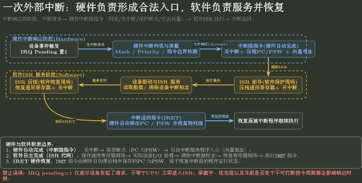
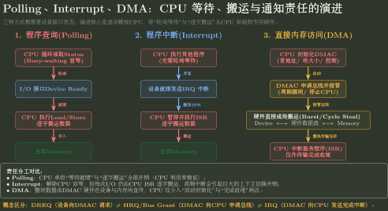

# 总线仲裁、中断与 DMA 状态推演

> 训练定位：解决“给多个总线主设备、中断请求/屏蔽状态、DMA 控制器寄存器和传送方式，要求判断谁获得总线、CPU 何时响应、DMA 怎样推进、一次 I/O 里 DREQ/IRQ 分别意味着什么”的题目族。  
> 模型归属：[CO-08｜总线与 I/O 硬件](CO-08_总线与IO硬件_方法论手册.tex)。总线事务、仲裁、中断硬件入口、DMA/Channel 硬件机制由 Canonical 正文拥有；本文件只训练事件状态表和硬件责任边界。OS 侧设备分配、阻塞/唤醒与缓冲策略请转 OS-05。

## 母题表示：先分“执行权”和“总线发起权”

总线题最容易把两个资源混在一起：

- CPU 当前是否在执行某进程/ISR；
- 哪个 initiator/master 当前获得共享总线事务发起权。

DMA 控制器拿到总线，不等于发生 CPU 上下文切换；CPU 也不是所有系统中唯一可能的 bus master。

## 问题一：一次总线事务先按四阶段推进

经典抽象：

```text
申请/分配
-> 寻址/命令
-> 数据传输
-> 结束/释放
```

多主设备时，第一步通常需要仲裁；突发传送获得一次授权后可连续传多个 data beat。

### 局部规则：先确定 initiator 与 target

**触发信号**：CPU、DMA、多个设备/处理器共享总线。

**第一动作**：每次事务在草稿写：

```text
initiator = ?
target = ?
request/grant = ?
data direction = ?
completion evidence = ?
```

**检查与退出**：若还说不清“谁在请求、谁被寻址、谁当前驱动共享资源”，不要进入带宽或优先级计算；若问题已经转成 OS 的设备分配/阻塞唤醒，停止本文件并转 OS-05。

## 问题二：仲裁只决定“谁现在可以发起事务”

### 固定优先级

高优先级请求低延迟，但持续高优先请求可能让低级请求饥饿。

### 轮转

从上次服务位置继续，提高公平性，但最坏等待与状态逻辑不同。

### 链式查询 / 独立请求 / 计数器查询

比较时固定看：

- 控制线数量；
- 判优速度；
- 优先级是否固定/可变；
- 单点/断链故障范围。

### 停止条件

总线仲裁 ≠ OS 设备分配。仲裁器允许某 DMAC 发起一个事务，不代表进程已经获得某独占设备的长期所有权。

## 问题三：中断必须拆成五个阶段

```text
Request
-> Priority/Eligibility
-> CPU Accept/Entry
-> ISR Service
-> Return
```

至少维护四类硬件状态：

- pending：请求已经到达；
- enable/mask：当前是否允许响应；
- priority：多个 pending 谁先；
- in-service：谁正在服务。

> `pending=1` 不等于 CPU 已经进入 ISR；ISR 返回也不保证设备源头已经自动清除。

## 问题四：可屏蔽中断响应先检查硬件条件

经典教材至少检查：

1. 请求源确实 pending；
2. 全局/局部允许位未屏蔽；
3. 当前优先级规则允许它被接受；
4. CPU 到达 ISA 规定的可响应边界。

NMI 可绕过普通 mask 规则，但仍不意味着“任意微操作中间立刻插入”。

## 问题五：中断隐指令与 ISR 软件动作分开

### 硬件自动入口

题设常见：

```text
暂时关中断
-> 保存 PC/PSW 等最小断点状态
-> 形成中断入口地址
-> PC 跳到 handler
```

### ISR 软件服务

```text
保存需要的通用寄存器
-> 必要时调整屏蔽/允许嵌套
-> 访问设备状态/数据
-> acknowledge/clear source
-> 恢复软件现场
-> interrupt return
```

具体自动保存哪些寄存器由 ISA 规定，不能把某教材固定清单提升成所有体系结构事实。



图把 Request、Accept、Entry、ISR、Return 分成独立阶段；硬件只负责形成合法入口状态，驱动服务、确认设备源和软件现场保护仍属于 ISR/OS。

## 问题六：响应优先级与处理优先级不是一个量

- **响应优先级**：决定当前多个硬件请求谁先被 CPU 接受；
- **处理优先级**：ISR 运行期间通过屏蔽字等控制谁能嵌套抢占。

做屏蔽字题必须以题面编号/位义为准，并检查当前 ISR 至少不能被同级无限重入。

## 问题七：DMA 固定三阶段

```text
Setup
-> Transfer
-> Completion
```

### Setup

CPU/driver 写入：

- source/destination；
- memory address；
- length/count；
- direction/control 或 descriptor。

### Transfer

设备可向 DMAC 提出 DREQ；DMAC 申请总线，获 grant 后在 device ↔ memory 间传输，并更新地址/计数。

### Completion

计数归零或错误：控制器写完成状态，并可能产生 IRQ 通知 CPU。

### 关键边界

$$
\boxed{DREQ\neq IRQ}
$$

- DREQ：设备请求 DMA 搬运；
- IRQ：控制器/设备请求 CPU 处理事件。

## 问题八：DMA 方式看“每次授权占多久”

### Cycle Stealing

每次取一个或少量存储/总线周期，与 CPU 交替，干扰较分散。

### Burst / Block

一次授权连续传一批，吞吐高，但 CPU 可能更久无法使用共享内存/互连。

### Transparent / Interleaved

利用约定的 CPU 空闲时隙或交替分周期，减少显式等待，但依赖硬件时序前提。

### 局部规则：DMA 传送方式先画共享资源时间线

**触发信号**：题目给主存周期、设备数据到达间隔、块长度。

**第一动作**：画 CPU 与 DMA 对共享存储资源的时间占用，再判断方式是否能满足设备速率；不要只背“哪个最快”。

**检查与退出**：若题目没有给 CPU/DMAC 争用的资源、授权粒度或存储时序，就只能比较机制性质，不能凭名称推出唯一吞吐率；若进入 Cache 一致性/驱动缓冲管理，转相应 Owner。

## 问题九：为什么高速设备常从中断升级到 DMA

若设备每秒产生大量小数据，而每个数据都触发中断，CPU 每次都要支付：

```text
accept + entry + context service + transfer + return
```

当到达间隔小于一次中断响应/服务所需时间，CPU 甚至来不及逐个处理。

DMA 把介入粒度从“每个数据/小单元”扩大为“每块”：

```text
一次 setup
-> 大块传输
-> 一次 completion
```

### 边界

DMA 不等于零成本：描述符、总线竞争、Cache 一致性、完成处理仍有成本。



图中的升级方向是减少 CPU 的持续等待和逐数据搬运，而不是让设备介质本身变快；真正选择仍取决于设备速率、块大小与共享资源成本。

## 问题十：Channel 是 DMA 之上的组织层

经典 Channel 拥有自己的通道指令/程序，可自主组织设备选择、块操作和一串 I/O 控制。

因此稳定层级：

```text
Interrupt: 卸载等待
DMA:       进一步卸载逐字数据搬运
Channel:   进一步卸载 I/O 操作序列与设备控制组织
```

不能把 Channel 定义成 DMA 控制器的别名。

## 代表母题 A：中断请求是否立即响应

当前：

```text
IRQ2 pending = 1
IRQ2 mask = 0 (允许)
CPU global interrupt enable = 1
但 CPU 正在执行当前指令中间微操作
```

稳定结论不是“立刻跳 ISR”，而是等待 ISA 规定的精确响应边界，然后进行硬件入口动作。

## 代表母题 B：DMA 读取块

```text
1. CPU 写 AR/WC/CR，启动 DMA
2. device ready -> DREQ
3. DMAC request bus
4. arbiter grants DMAC
5. DMAC transfers beat(s), AR++, WC--
6. WC=0 -> completion state
7. IRQ to CPU
8. CPU 在合法边界接受中断并进入 completion ISR
```

整个过程中：DMAC 获 bus grant ≠ CPU 被中断；只有第 7–8 步才进入中断路径。

## 本轮真题攻击结论

- **2009 Q43**：把中断与 DMA 放进同一 CPU 成本模型。中断介入粒度是每个 32 位数据单元，DMA 介入粒度是每个 5000B 块；性能差来自 CPU 介入频率下降，而不是“DMA 单次事务神奇地零开销”。
- **2012 Q43**：Cache miss、Page Fault、DMA request 是连续生成的不同事件；DMA 与 CPU 争用存储器总线时，仲裁的是总线/主存访问权，不是 CPU 执行权。
- **2019 Q22**：DMA 明确分 `driver/CPU setup → DMAC request bus → DMAC transfer → completion IRQ/ISR`，验证 Setup / Transfer / Completion 三阶段。
- **2023 Q22**：攻击“DMA 方式下 CPU 执行 DMA 传送程序”。CPU 配置和收尾，真正逐 beat 搬运由 DMAC/设备接口硬件推进。
- **2024 Q22**：攻击“DMA 数据仍先经过 CPU”。稳定数据路径是 `device interface ↔ memory`，DMAC 负责发起和控制相关事务。
- **2025 Q21**：DMA 是否值得使用首先看数据量、速率和 CPU 介入开销；网卡/SSD 这类高吞吐块设备典型适合，键盘等低速小流量设备没有同样收益。

这些题持续验证同一个模型：**Request、Bus Grant、Data Transfer、Completion IRQ 是不同事件；DMA 卸载的是逐数据搬运循环，不是把所有 I/O 责任从 CPU/OS 中删除。**

## 陌生总线/中断/DMA题固定落笔协议

```text
1. 每个事务写 initiator / target / request / grant / data direction。
2. 仲裁只决定总线发起权，不等于 OS 资源所有权。
3. 中断维护 pending / mask-enable / priority / in-service。
4. Request、Accept、Entry、ISR、Return 分开。
5. 硬件自动保存与 ISR 软件保存分开。
6. DMA 按 setup -> transfer -> completion；DREQ 与 IRQ 分开。
7. Cycle stealing / burst / transparent 按共享资源时间线比较。
8. Channel 只作为更高控制卸载层，不等同 DMA。
9. 最后检查：是否把“请求”误写成“已完成”，或把“总线授权”误写成“进程调度”？
```

## 最短压缩

> **I/O 硬件题追状态而不背名词：仲裁决定谁发事务；中断走 Request→Accept→Entry→Service→Return；DMA 走 Setup→Transfer→Completion，DREQ、bus grant、IRQ 是三个不同事件。**
