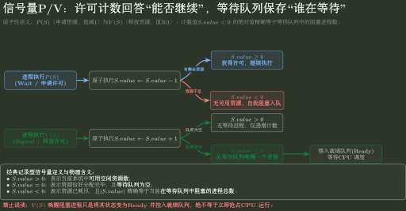

# PV 题的约束建模

> 训练定位：面对生产者—消费者、前驱同步、共享对象互斥、多资源申请和“信号量尽可能少”等题面时，训练如何把自然语言约束翻译成可执行的 P/V 结构。  
> 模型归属：[OS-03 并发锁与 PV 方法论手册](OS-03_并发锁与PV_方法论手册.tex)。信号量的许可语义、同步与互斥、读者—写者、哲学家、死锁与公平性等机制均由 Canonical 正文拥有；本文件只负责识别、决策、检查和代表题。

## 这类题真正要解什么

PV 题不是“识别经典题型以后套模板”。题面真正给出的是一组并发约束：

- 某个动作必须等另一个动作完成以后才能发生；
- 某种资源或容量在任一时刻不能超过上限；
- 某些代码不能同时进入，否则会破坏共享状态；
- 多个等待关系不能形成无法推进的闭环；
- 有时还要求尽可能保留并发度或减少同步对象数量。

因此训练目标只有一句话：

> **先恢复约束，再选择最少而足够的许可；最后证明坏状态不可达。**

## 母题表示：把题面压成“坏状态—继续条件—许可”

动笔前先写三栏，不急着写代码：

| 题面约束 | 不能出现的坏状态 | 当前动作继续前必须满足什么 |
|---|---|---|
| 容量有限 | 空取、满放、资源超额占用 | 当前存在可消费的容量/资源资格 |
| 前驱顺序 | 后继早于前驱完成 | 已经收到所需的前驱完成事实 |
| 共享修改 | 两个执行流同时破坏同一结构 | 当前拥有进入该临界区的独占资格 |

这里的“许可”只是对 OS-03 semaphore 模型的调用接口。本训练文件不重新定义 semaphore；只要求你能从题面判断当前缺的是哪一类事实。

## 变式轴：题目换皮通常只改这些地方

同一个约束模型会沿下面几条轴变化：

| 变式轴 | 需要重新判断什么 |
|---|---|
| 一次性前驱 ↔ 循环生产/消费 | 许可是否按轮次反复产生和消费 |
| 单生产者/消费者 ↔ 多生产者/消费者 | 同步已经成立后，底层共享结构是否仍会并发修改 |
| 抽象原子“取/放” ↔ 明确数组/链表/指针更新 | 是否需要额外互斥保护结构不变量 |
| 单一资源 ↔ 多类资源 | 是否出现持有后等待和循环依赖 |
| 只要求正确 ↔ 要求尽可能并发 | 临界区是否过宽，是否把本可并行的执行流串行化 |
| 普通实现 ↔ “信号量尽可能少” | 多个同步对象是否表达同一个可合并的事实 |
| 只要求无死锁 ↔ 还要求无饥饿/公平 | 是否需要额外公平性假设或准入策略 |

题目变化以后，优先重新检查这张表，而不是搜索“这道题像哪一个模板”。

## 完整落笔流程：先业务骨架，再许可与原子区

旧 Canonical 中的“PV 大题统一建模算法 / 作答模板”现在统一归到训练层。落笔时可以分四遍完成：

1. **只写业务动作**：列出执行流，以及每类执行流反复做什么；先写 `produce → put`、`get → consume` 这类业务骨架，不急着插 P/V；
2. **恢复共享状态与不变量**：列共享缓冲区、资源、计数器、索引、标志位、队列；写出不能被破坏的关系和每类动作的继续条件；
3. **标许可与原子区**：对每个等待点写“缺什么事实”，对每个状态制造点写“产生什么事实”；再找哪些多步共享更新必须表现得像一个整体；
4. **独立证明**：分别检查 Safety、Deadlock、Liveness/Fairness 与不必要串行化。

### 局部规则：每个 P/V 都必须能翻译回一句中文

**触发信号**：伪代码已经写出多个 P/V，但你开始靠位置或模板判断它们是否成对。

**第一动作**：在每个 `P(S)` 旁写“我现在缺少哪一份事实/资源/许可”；在每个 `V(S)` 旁写“我刚刚制造了哪一份可被消费的事实”。

**检查与退出**：如果某个 P/V 无法翻译成稳定语义，停止调代码顺序，回到共享状态和许可定义；不要用“有 P 必有 V”替代许可生命周期分析。

## 关键决策点一：先区分“等待条件”和“并发冲突”

一道题可能同时存在两种完全不同的问题：

1. **等待条件**：现在能不能继续？例如有没有产品、有没有空位、前驱是否完成；
2. **并发冲突**：即使大家都满足继续条件，能不能同时修改某个共享结构？

### 局部规则：同步和互斥分两遍建模

**触发信号**：题面同时出现“必须等待某条件”和“多个执行流访问同一对象”，或者你下意识准备写 `empty/full/mutex` 一整套模板。

**第一动作**：第一遍只列“谁必须等什么”；第二遍再问“已经通过等待条件的执行流是否仍可能同时破坏同一共享结构”。

**检查与退出**：如果现有同步关系已经保证两段代码不可能并发，就不要再机械增加互斥；如果允许并发后会出现丢失更新、指针/队列状态破坏或题面明确要求独占，再调用 OS-03 的互斥机制。

## 关键决策点二：先确认题目采用哪一种 semaphore 内部记法

408 旧教材常采用允许负值的记录型信号量：

```text
P(S): S-- ; S < 0  -> 当前进程进入等待队列
V(S): S++ ; S <= 0 -> 唤醒一个等待者
```

在这套表示中，$S<0$ 时 $|S|$ 常表示等待者数量；但这是**教学编码**，不是 semaphore 抽象语义本身。现代实现完全可以把可用许可数保持非负，并把等待者单独放在队列中。



图采用抽象 permit + wait queue 语义，避免把经典负值编码当定义；若题设明确记录型信号量，再额外使用 `S<0` 表示等待者数量。

### 局部规则：看到负值先找定义，不直接背绝对值

**触发信号**：题目给出 `S=-1/-2`、问等待者数量、问 P/V 后的取值范围。

**第一动作**：先确认采用“经典负值模型”还是“许可计数非负 + waiter queue”的抽象。只有前者才使用 `等待者数 = |S|`。

**检查与退出**：若题面没有说明内部表示，而且答案依赖负数的具体含义，应补模型前提后再计算；不能把某种实现表示升级成 semaphore 定义。

## 关键决策点三：初值只来自初始世界

最容易写错的不是 P/V 本身，而是信号量初值。不要从“标准模板通常是多少”回忆，直接问：

> 系统一开始已经存在多少份可以立即被消费的事实或资格？

### 局部规则：先写初始事实，再写初值

**触发信号**：需要给 semaphore 设初值，尤其是 `0 / 1 / N` 容易混淆时。

**第一动作**：用自然语言写“初始已经有几份产品、几格空位、几份资源、几个前驱已经完成、几人可以进入临界区”，再把这个数量翻译成初值。

**检查与退出**：把所有执行流都停在第一条 P 之前，检查这些许可是否真的在系统初始时已经存在。若某许可只有执行某个动作以后才会产生，它的初值通常不能凭空设为 1。

## 关键决策点四：多个 P 连在一起时检查等待依赖

看到连续申请多个许可，不要先背“哪个 P 应该写前面”。真正危险的是：某个 P 阻塞以后，当前执行流还占着另一个对象，而制造所需许可的人又必须先取得这个对象。

### 局部规则：Blocked 不等于自动 Unlock

**触发信号**：执行流在临界区内发出 I/O、条件等待或另一次可能阻塞的 P，题目问别的执行流能否进入同一临界区。

**第一动作**：分别追踪“CPU 所有权”和“锁/许可所有权”。进程可以因为 Blocked 失去 CPU，但如果没有执行相应 V/unlock，原有互斥许可仍然被它持有。

**检查与退出**：`失去 CPU != 释放锁`。持锁阻塞既可能降低并发度，也可能把等待依赖接成死锁环；只有明确的 unlock/V 或题设特殊机制才释放所有权。

### 局部规则：连续 P 先问“抱着什么睡”

**触发信号**：同一个执行流在一个动作前连续执行两个及以上 P，或者代码结构表现为“持有 A，再等待 B”。

**第一动作**：在每个可能阻塞的 P 旁边写两项：`正在等什么`、`此时仍持有什么`；再检查“谁能产生我等待的许可，它是否需要我仍持有的对象”。

**检查与退出**：一旦出现闭合等待链，停止调整代码顺序，回到 OS-03 的等待依赖/死锁模型重新设计；不要用“标准答案好像先 P 某个信号量”代替依赖检查。

## 关键决策点五：“最少信号量”先做语义压缩

“尽可能少”不是删变量比赛。只有当两个同步对象保存的是同一种事实、且合并后仍能精确表达原约束时，才值得合并。

### 局部规则：先给每个信号量写中文含义，再考虑合并

**触发信号**：题目要求信号量尽可能少，或者你的草稿出现很多“一条边一个信号量”。

**第一动作**：给每个候选 semaphore 写一句“它当前在数什么”。先检查多个前驱事件能否作为同一个汇合点的完成计数，再检查某个 mutex 是否已经被已有同步关系隐含排除。

**检查与退出**：每合并或删除一个同步对象，都重新验证原来的前驱、容量和互斥约束；如果合并以后已经说不清“这个数现在代表什么”，立即停止压缩。

## 关键决策点六：最后分别检查四件事

完成 P/V 伪代码以后，不要只检查“看起来不会同时进入”。至少分开检查：

1. **安全性**：题面禁止的坏状态能否到达？
2. **死锁**：是否存在一组执行流相互等待而无人能继续制造许可？
3. **饥饿/公平**：题目若要求公平，某一类执行流是否可能长期被越过？
4. **并发度**：有没有把本来互不冲突的工作无谓放进同一临界区？

前三项机制定义仍回 OS-03；这里把它们作为答案完成后的独立检查维度。

## 代表真题：先看题目在问什么，再抽象成同一控制链

### [2015 年 Q45｜两个有限容量信箱，A/B 相互收发邮件](../../../archives/408/2015年真题/solutions/q45.md)

题目里每个信箱都有固定容量，A/B 会从自己的信箱取邮件，再向对方信箱放新邮件。第一步不是先加 mutex，而是先问两个真正的等待条件：**现在有没有邮件可取？现在还有没有空槽可放？** 所以每个信箱天然对应 `full / empty` 两类计数许可。题面把“取/放一封邮件”当作抽象原子操作时，不需要为了“看到共享信箱”而额外机械加锁。

这道题代表的是：**容量约束和底层互斥是两个问题。** 先表达“能不能继续”，再判断底层共享结构是否真的还需要互斥。

### [2019 年 Q43｜哲学家既要碗，又要左右两根筷子](../../../archives/408/2019年真题/solutions/q43.md)

只给每根筷子一个互斥信号量，只能保证“一根筷子不会被两个人同时拿”，却不能阻止所有哲学家各拿一根筷子后形成完整环形等待。第一步应先画出死锁坏状态：**n 个人都进入抢筷子阶段，等待环闭合。** 于是把碗当作准入门，最多只允许 `n-1` 个人同时进入抢筷子阶段，就能直接打断这个环。

这道题代表的是：**局部互斥正确，不等于整体等待关系安全。** PV 题要同时看资源本身和等待图。

### [2020 年 Q45｜A、B 完成后 C 才能做；C、D 完成后 E 才能做](../../../archives/408/2020年真题/solutions/q45.md)

这题没有共享临界资源，只有前驱关系。第一步应该先画偏序：`A,B -> C`，`C,D -> E`。C 需要“收到两份前驱完成事实”，E 也一样，因此可以把同一个汇合点的完成事件合并成一个计数信号量：A、B 各 V 一次，C 连续 P 两次；C、D 对 E 同理。

这道题代表的是：**信号量不一定是锁，也可以是“已发生多少个前驱事件”的计数器。** 不必机械地“一条同步边一个信号量”。

### [2024 年 Q46｜同一个单缓冲区，C1 写、C2 读、C3 修改](../../../archives/408/2024年真题/solutions/q46.md)

这道题最重要的是分清两类约束：**必须先后**和**不能同时**。例如 B 初始为空、P1 只执行一次 C1、P2 只执行一次 C2 时，只要用一个同步信号量保证 `C1 -> C2`，二者就已经不可能并发访问缓冲区，不需要再额外加 mutex。反过来，两个人都执行 C3 修改同一数据时，就需要互斥，而不需要前驱同步。

这道题代表的是：**先写共享谓词，再判断当前缺的是同步还是互斥。** 已有约束如果已经排除了并发，就不要重复加锁。

### [2025 年 Q45｜挖坑 → 放苗/填土 → 浇水，且未填坑最多 3 个](../../../archives/408/2025年真题/solutions/q45.md)

这题把三类许可同时放在一个场景里：`pitSlot` 表示容量，`dugPit / waterReady` 表示前驱完成事实，`shovel` 才表示唯一铁锹的互斥使用权。第一步应先列坏状态：没有坑却放苗、没填土就浇水、未填坑超过 3、甲乙同时用铁锹。再为每一种坏状态寻找最小许可。

这道题代表的是：**容量、同步、互斥必须分别找 Owner。** 另外临界区只包真正需要铁锹的“挖坑/填土”，不要把“放树苗”也锁进去，否则虽然可能正确，却会无谓降低并发度。

这五道真题故事完全不同，但都可以先问同一组问题：**什么坏状态不能出现？当前动作继续前缺什么事实/资源？谁制造这份许可？哪些代码真的必须互斥？**

## 题库母题：把 P/V 从符号恢复成“谁在等什么”

### [Q550｜“同步信号量初值到底是 0 还是 1？”](../../../archives/408/题库/操作系统/03_并发同步互斥与IPC_选择题.md#550)

这题最容易被模板记忆误导。第一步不要看选项，先写一句：**系统一开始已经有多少份可以立即被消费的事实/资格？** 如果前驱事件尚未发生，初值可能是 0；如果一开始就有 $N$ 个空位/资源，初值就是 $N$。所以同步信号量没有固定“标准初值”。

### [Q554–556｜“为什么有时 semaphore=0，有时=-1？”](../../../archives/408/题库/操作系统/03_并发同步互斥与IPC_选择题.md#554)

先确认题目采用的是经典记录型负值模型：P 先减 1，若结果 $<0$ 就阻塞；V 先加 1，若结果 $\le0$ 则唤醒等待者。于是：

- `0` 可以表示许可已经被占用，但还没人等待；
- `-1` 表示已有 1 个等待者；
- V 后仍 `<=0`，说明刚刚确实从等待队列中唤醒了人。

这套“负数=等待人数”只是该模型的内部表示，不能当成所有 semaphore 实现的定义。

### [Q563｜“生产者为什么可能唤醒另一个生产者？”](../../../archives/408/题库/操作系统/03_并发同步互斥与IPC_选择题.md#563)

很多人只盯着 `empty/full`，于是觉得生产者只能唤醒消费者。实际上多生产者/多消费者还共同竞争 `mutex`。一个生产者退出临界区执行 `V(mutex)` 时，可能唤醒另一个正在等 mutex 的生产者；消费者同理。第一步应问：**这次 V 的究竟是哪一个 semaphore，它保存的是什么许可？**

### [Q564｜“两段 P/V 程序怎样算最终 x、y、z？”](../../../archives/408/题库/操作系统/03_并发同步互斥与IPC_选择题.md#564)

不要枚举所有随机交错。先把 P/V 转成必须满足的先后关系：`V(s1)` 发生后 P2 才能越过 `P(s1)`；`V(s2)` 发生后 P1 才能越过 `P(s2)`。这些 happens-before 边先把大部分交错剪掉，再按剩余顺序更新变量。**P/V 题的第一步是恢复约束，不是猜结果。**

### [Q574｜“没有死锁，为什么还不能立刻说没有饥饿？”](../../../archives/408/题库/操作系统/04_死锁安全状态与并发程序_选择题.md#574)

死锁只问“系统是否形成无人能推进的等待闭环”；饥饿问“某一个等待者是否可能一直被别人越过”。因此证明没有环，只能得到 no deadlock。要继续推出 no starvation，还必须检查等待队列是否 FIFO、调度是否公平、准入策略是否允许同一类请求不断插队。Q574 正是因为题干补了 FIFO 和公平调度，才可以进一步得到无饥饿。

**这几题共同要求：每个 P 都翻译成“我缺哪一份许可”，每个 V 都翻译成“我制造了哪一份许可”；然后再分别检查 Safety、Deadlock 和 Fairness。**

## 易错边界

> **不要机械执行“有 P 必有 V”。** 当前训练只检查许可生命周期是否完整；一次性初始事实与循环资源的生命周期不同，具体语义回 OS-03 判断。

> **不要把“同步 P 在互斥 P 前”背成一般定律。** 标准有界缓冲区里这个顺序来自等待依赖；陌生题仍要重新检查“阻塞时持有什么”。

> **不要因为用了一个 semaphore 就把它自动叫作锁。** 先写它在计数什么，再决定它承担的是容量、前驱还是独占资格。

> **不要把无死锁直接升级成无饥饿。** 如果题目明确要求公平，还必须继续检查准入、唤醒与调度条件。

## 考场压缩

PV 大题草稿第一屏只保留七问：

```text
1. 坏状态是什么？
2. 每个动作继续前缺什么事实？
3. 初始已经有几份？
4. 谁消费，谁制造？
5. 同步成立后还有真实共享冲突吗？
6. 任一 P 阻塞时还持有什么，未来制造许可的路径可达吗？
7. Safety / Deadlock / Fairness / 并发度分别过了吗？
```

七问已经回答清楚以后再写 P/V；如果其中某一问仍含糊，继续堆伪代码通常只会把尚未解决的约束错误藏进程序表面。
