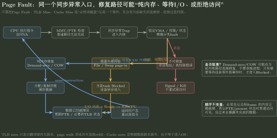

# 地址翻译与缺页

> 训练定位：面对虚拟地址拆分、多级页表、TLB、PTE 权限、缺页、COW 与跨计组地址翻译题时，训练把“地址、映射、驻留、翻译、异常”分层，避免把所有 miss 都叫作缺页。  
> 模型归属：[OS-04 虚拟内存与地址翻译方法论手册](OS-04_虚拟内存与地址翻译_方法论手册.tex)。地址空间、页表、缺页、COW 与映射机制由 Canonical 正文拥有；硬件 TLB/MMU 细节继续调用计组 Owner 与跨科 X-B02。

## 先把题面压成五层

| 层次 | 先确认什么 | 常见输出 |
|---|---|---|
| 地址 | VA/PA 位数、页大小、访问类型 | VPN / offset |
| 映射 | 页表级数、PTE、权限 | PFN 或 fault 原因 |
| 驻留 | 当前页是否已有物理 frame | resident / non-resident |
| 翻译加速 | TLB 是否已有可用翻译副本 | hit / miss |
| 访问结果 | 翻译与权限检查能否继续 | PA 或精确 fault |

关键不是背顺序，而是始终知道“当前缺的是哪一种状态”。

## 局部规则：地址拆分先锁页内偏移

**触发信号**：题目给 VA/PA 位宽和 page size，要求页号、页表索引或物理地址。

**第一动作**：先由页大小确定 offset 位数；页表只处理 VPN，offset 在正常分页翻译中原样保留到 PA 低位。

**检查与退出**：若你在 page walk 中又改变了 offset，或把整个 VA 都拿去查页表，停止并回到“VPN 被映射、offset 被保留”的机制。

## 局部规则：连续对象跨页先算 footprint

**触发信号**：题目给数组/连续区间的首地址、总长度和 page size，问跨几页、首次触页地址或在“无置换且初始不驻留”条件下的最少缺页次数。

**第一动作**：先取首地址的页内偏移 $d$。若对象总长度为 $L$、页大小为 $P$，则连续区间实际触及的页数为

$$
N_{page}=\left\lceil\frac{d+L}{P}\right\rceil,
$$

其中 $0\le d<P$。若题目给的是闭区间端点，也可直接比较起止地址的 VPN。

**检查与退出**：`L/P` 只有在首地址页对齐等条件下才可直接当页数。静态跨页数不自动等于动态缺页数；只有访问确实触及这些页、初始均不驻留且过程中不因置换重复 fault 时，两者才可对应。

## 局部规则：TLB miss 之后先问 page walk 能不能成功

**触发信号**：题面出现 TLB miss，你准备直接计一次 page fault 或磁盘访问。

**第一动作**：继续检查页表/PTE；TLB miss 只表示翻译缓存没有副本，page walk 仍可能成功并 refill。

**检查与退出**：只有当前映射/权限无法让访问继续时才进入 fault 语义。TLB miss、page fault、cache miss 必须分别记账。

## 局部规则：PTE 要同时看“有没有映射”和“能不能这样访问”

**触发信号**：题目给 valid/present、R/W/X、user/supervisor、dirty/accessed 等位，或要求判断访问是否合法。

**第一动作**：先检查映射是否存在/可驻留，再检查本次访问类型和特权级是否满足权限；不要只看“PTE 有内容”。

**检查与退出**：如果是权限 fault、COW write fault、非法地址或 non-resident fault，必须继续分类；不要统一写成“从磁盘调页”。

## 缺页分类：先问它能不能修

| fault 场景 | 当前缺失 | 典型处理方向 |
|---|---|---|
| demand-zero / lazy allocation | 合法虚拟区域尚未兑现物理页 | 分配、清零、建映射、重试 |
| swapped / file-backed non-resident | 合法内容不在 RAM | page-in I/O，必要时阻塞，完成后重试 |
| COW write | 共享只读映射需要恢复私有写语义 | 验证 COW，复制/拆分或恢复写权限 |
| genuine protection fault | 访问方式违反真实权限 | 拒绝访问，不伪造可写映射 |
| invalid address | 地址不属于合法地址空间 | 拒绝/终止，不分配页面“修复” |

### 局部规则：Page Fault 不等于磁盘 I/O

**触发信号**：题面只说发生 page fault，没有说明 backing object 或驻留原因。

**第一动作**：先分类 fault：demand-zero、COW、file/swap、permission、invalid。

**检查与退出**：只有确实需要外存内容时才把磁盘 I/O、Blocked→Ready 与额外延迟加入时间线。



图把“fault 入口”与“是否阻塞”彻底拆开：demand-zero/COW 可能纯内存完成；file/swap page-in 才需要等待外部事件；非法地址/真实权限错误不能靠“调页”修复。

## COW：四个状态点足够跑通

1. fork 前：谁映射哪个 frame；
2. fork 后：父子是否共享同一 frame，PTE 写权限和引用关系怎样变化；
3. 写 fault：谁写、为什么 fault、内核凭什么判断是 COW；
4. 修复后：谁拿到新 frame，旧 frame 谁继续引用，写权限怎样恢复。

### 局部规则：先验证“原来允许写”再处理 COW

**触发信号**：只读 PTE 上发生 write fault，题目同时出现 fork/COW。

**第一动作**：确认该映射带有 COW 语义且原始逻辑权限允许写；然后再决定复制还是在唯一引用时恢复写权限。

**检查与退出**：真正只读的代码/数据页不能因为“发生写 fault”就升级为可写。

## 综合地址翻译题的落笔顺序

```text
访问请求 (VA, R/W/X, privilege)
→ 锁定 page size 与 VPN/offset
→ 查 TLB；miss 则继续 page walk
→ 检查 PTE 映射与权限
→ 成功才得到 PA 并进入 Cache/Memory
→ 失败则分类 fault，交给 OS 修复/拒绝
→ 可修复后处理旧翻译一致性并 retry
→ 最后才统计访问次数与时间
```

这里的箭头只是这份训练文件中的操作顺序，不作为 Canonical 的逻辑证明。跨软硬件交接的正式语义回 X-B02。若最后一步要求计算 TLB/page walk/Page Fault 对平均访问时间的影响，调用 [存储层次与 AMAT](../../20_计算机组成原理/60_Cache与存储层次/存储层次与AMAT.md)：OS-04 只提供 fault/residency 路径和事件，平均时间公式按路径期望组合。

## 题库母题：地址题先把每一层地址说清楚

### [Q606 / Q607｜“逻辑地址怎样翻成物理地址？”](../../../archives/408/题库/操作系统/05_内存管理与虚拟内存_选择题.md#606)

先由页大小把地址拆成

$$
VA=VPN\mid offset.
$$

页表只负责把 `VPN → PFN`，页内 offset 原样保留。因此真正的计算顺序是“求页号和偏移 → 查页表得到页框号 → `PFN×page_size+offset`”。Q606 还把“指令所在地址”和“指令访问的数据地址”放在同一题里，提醒你：**一条指令里可以同时出现多个不同的逻辑地址。**

### [Q609 / Q632｜“多级页表到底需要几级？”](../../../archives/408/题库/操作系统/05_内存管理与虚拟内存_选择题.md#609)

第一步永远先锁页内偏移。4KB 页就是 12 位 offset。剩下的 VPN 位数再问：**一个页表页能放多少 PTE？** 如果一页 4KB、PTE 8B，就有 512=$2^9$ 个表项，所以一级索引能消化 9 位 VPN。最后用 VPN 总位数除以每级索引位数，向上取整。

### [Q610｜“多个虚拟页能不能映射同一个物理页？”](../../../archives/408/题库/操作系统/05_内存管理与虚拟内存_选择题.md#610)

可以。虚拟地址只是不同地址空间中的名字；多个 PTE 完全可以指向同一 frame。这是共享只读代码、共享内存以及 COW 的基础。**但共享同一物理页只说明可见同一对象，不代表并发访问自动安全**，同步仍是另外一个问题。

### [Q613 / Q629｜“TLB 平均访问时间为什么总算错？”](../../../archives/408/题库/操作系统/05_内存管理与虚拟内存_选择题.md#613)

因为很多人把 TLB miss 直接当成 Page Fault。正确做法是先分别写路径：

```text
TLB hit  -> 目标内存
TLB miss -> page walk -> 目标内存
```

只有页表继续告诉你页面不驻留/权限不允许时，才进入 Page Fault。平均时间就是按 hit/miss 概率对这些路径加权；先把每条路径的访存次数列清，再代命中率。

### [Q617｜“为什么一条指令会算出 4 次内存访问？”](../../../archives/408/题库/操作系统/05_内存管理与虚拟内存_选择题.md#617)

因为“一条指令”不是“一次访存”。题干明确这条指令既要取指，又要访问一次内存操作数；无 TLB 单级页表时，每个逻辑地址访问都要“查页表 + 访问目标”两次，所以总共 $2×2=4$ 次。

**这一组题共同要求：先把地址、映射、TLB、驻留、权限分层。当前缺的是哪一层状态，就只处理哪一层；不要把所有 miss 都叫缺页。**

## 易错边界

> **TLB miss ≠ Page Fault。** 前者缺翻译缓存副本；后者是当前访问不能按现有映射/权限继续。

> **Mapping ≠ Residency。** 建立虚拟映射不保证内容已经驻留 RAM。

> **COW ≠ 共享写 IPC。** COW 的目标是延迟复制同时保持最终私有写语义。

> **mmap ≠ 整文件立刻装入内存。** 它先建立地址空间与 backing object 的关系，具体页面可以按需驻留。

## 最短压缩

看到虚存综合题先问：**当前问题属于地址、映射、驻留、翻译缓存、权限还是 fault 修复哪一层？** 层次锁定以后再计算；如果一开始就把所有事件塞进“缺页”两个字里，后面的访问次数和状态变化几乎一定会串层。
