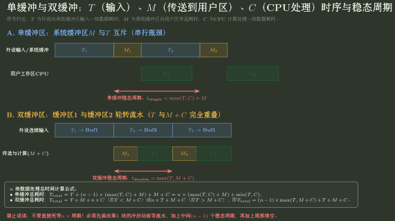

# 单缓冲、双缓冲与缓冲池计算

> 训练定位：解决“给设备输入时间 $T$、内核到用户复制时间 $M$、CPU 处理时间 $C$，要求单/双缓冲总时间、稳态周期、瓶颈或缓冲池状态”的题目族。  
> 模型归属：[OS-05｜I/O 系统](OS-05_IO系统_方法论手册.tex)。Buffer/Cache/Spooling 边界、单/双/循环缓冲机制与 I/O 生命周期由 Canonical 正文拥有；本文件只训练时间线、重叠关系和状态迁移。

## 母题表示：公式之前先画三段工作

设一块数据经历：

```text
Device -> Kernel Buffer     时间 T
Kernel Buffer -> User Work  时间 M
CPU consumes/processes      时间 C
```

先问：**哪两个阶段可以同时发生，哪两个阶段因为共享同一 buffer/工作区而不能重叠？**

公式只是时间线压缩，不能脱离这个问题。

## 问题一：单缓冲的关键是复制阶段 $M$ 仍占用唯一 buffer

经典教材模型中，同一个内核 buffer：

```text
设备填充完成
-> M: 从该 buffer 复制到用户工作区
-> buffer 才重新空闲，可接下一块
```

CPU 处理上一块时，设备可以在 buffer 已释放后填下一块，因此稳态周期常写：

$$
\boxed{t_{single}=\max(T,C)+M}.
$$

### 为什么不是 $T+M+C$

设备填下一块与 CPU 处理上一块可以重叠；真正不能被覆盖的是唯一 buffer 仍被 $M$ 占用的阶段。

### 为什么也不是 $\max(T,M,C)$

$M$ 不是完全独立流水级：在单缓冲模型里，它把“设备再次拥有唯一 buffer”的时刻向后推迟。

## 问题二：双缓冲把 $M$ 并到 CPU 一侧

两个 buffer 交替：

```text
B0 被复制/消费时
B1 可被设备填充
```

经典稳态周期：

$$
\boxed{t_{double}=\max(T,C+M)}.
$$

因为设备可以在另一块 buffer 上工作，而 CPU 侧必须完成“复制 + 处理”才能准备好继续消费下一块。



图把公式还原成资源占用：单缓冲中 $M$ 仍占着唯一输入 buffer；双缓冲让设备在另一块 buffer 上继续填充，因此稳态瓶颈变成设备侧 $T$ 与 CPU 侧 $M+C$ 的较大者。

### 局部规则：双缓冲不保证严格更快

**触发信号**：题目让你比较单/双缓冲，或者你看到“双缓冲”就准备直接判断总时间一定更短。

**第一动作**：先比较设备侧 $T$ 与 CPU 侧 $C+M$ 的稳态瓶颈。若

$$C+M\ge T,$$

则 CPU 侧已经是瓶颈，多一个 buffer 不会让 $C+M$ 变小。

**检查与退出**：只有双缓冲确实扩大了可重叠区间、且被隐藏的阶段原本位于关键路径上，才会缩短时间。Buffer 提供重叠机会，不会提高慢阶段本身的服务率。

## 问题三：总时间题先分“启动—稳态—排空”

对 $n$ 块数据，最稳的方法不是机械写 $n\times$ 周期，而是画：

```text
startup: 第一块必须先被设备填好
steady: 后续块按瓶颈周期推进
drain: 最后一块还要完成复制/处理
```

不同教材对“第一块从何时开始计”“最后是否要求 CPU 处理结束”“$M$ 能否与某些阶段重叠”的定义不同，因此总时间必须根据题面时间轴推。

### 局部规则

**触发信号**：题目问“处理 n 块总时间”而不是“平均每块时间/吞吐率”。

**第一动作**：至少把前两块和最后一块画出来，确认启动与排空项，再抽象中间重复周期。

**检查与退出**：若最终总时间只是“块数 × 稳态周期”，却没有解释第一块何时可被 CPU 使用、最后一块何时真正处理结束，就回到时间线补 startup/drain；不要把稳态吞吐公式直接当有限块数总时间公式。

## 问题四：循环缓冲不改变稳态瓶颈，只增加库存容量

$n\ge2$ 的缓冲池可以吸收更长突发，但长期稳态吞吐仍由慢侧决定：

$$
throughput\le \frac1{\max(T,C+M)}
$$

（在与双缓冲相同的教材假设下）。

更多 buffer 的主要价值：

- 吸收 burst；
- 减少短时速度抖动导致的互相等待；
- 允许生产/消费在一段时间内相位错开。

如果长期生产率大于消费率，有限 buffer 最终仍会满。

## 问题五：循环缓冲的两个“追赶”事件

设 producer/input 指针和 consumer/output 指针在 ring 上推进。

- 无空 buffer：producer 追上未释放位置 → producer 等资源；
- 无可消费数据：consumer 追上 producer → consumer 等数据。

分析时不要只看两个下标相等，因为常见实现还需要 count、保留一个空槽或额外 flag 来区分 empty/full；以题设编码为准。

## 问题六：经典缓冲池追踪 buffer 状态，不背队列名字

输入方向可以统一画：

$$
Free
\to Filling
\to Ready
\to InUse/Consuming
\to Free.
$$

教材可能实现为：

- 空闲缓冲队列；
- 输入队列；
- 输出队列。

真正要问的是：

```text
当前 buffer 由谁拥有？
内容是否有效？
谁在等资源？
哪个事件会让它迁移到下一状态？
```

## 问题七：Buffer 与 Cache 不能因为都“在内存里存数据”而合并

### Buffer

核心问题：当前生产/消费速度、粒度或相位不匹配，需要暂存。

### Cache

核心问题：慢对象未来可能再次访问，所以保留可复用副本以避免慢路径。

一个真实内存区可能兼有两种功能，但题目分析时必须分别问：

- 数据被消费后是否仍保留以便未来命中？
- 是否存在命中/替换语义？
- 还是只是等待另一侧来取走？

> 上传速记稿把 Page Cache 与虚拟内存页驻留层混为同一个层级，这一点不能进入本训练。文件 Page Cache 与 VM residency/backing store 是不同 Owner，`mmap` 处可以交汇但不等同。

## 问题八：DMA 与 Buffer 也不是一回事

DMA 回答：**谁搬数据**。  
Buffer 回答：**数据在生产/消费不同步时暂存在哪里**。

所以一个典型磁盘读可以同时是：

```text
blocking API
+ interrupt completion
+ DMA transfer
+ kernel buffer/page cache
```

四个标签分别描述不同维度。

## 代表母题：比较单缓冲和双缓冲

给：

$$T=100\text{ ms},\quad M=10\text{ ms},\quad C=80\text{ ms}.$$

单缓冲稳态：

$$
t_{single}=\max(100,80)+10=110\text{ ms/block}.
$$

双缓冲：

$$
t_{double}=\max(100,90)=100\text{ ms/block}.
$$

双缓冲把复制阶段与设备填充放到不同 buffer 上重叠，瓶颈回到设备 100 ms。

若改为：

$$T=70,\quad M=20,\quad C=100,$$

则：

$$
t_{single}=100+20=120,
$$

$$
t_{double}=\max(70,120)=120.
$$

此时 CPU 侧 `M+C` 已是瓶颈，双缓冲不提高稳态吞吐。

## 陌生缓冲题固定落笔协议

```text
1. 列出 T/M/C 分别由谁执行、占用哪个 buffer/work area。
2. 画前两块时间线，标出能并行和互斥的阶段。
3. 单缓冲检查 M 是否占着唯一输入 buffer。
4. 双缓冲检查设备是否能填另一块 buffer。
5. 求稳态周期后，再单独处理 startup/drain。
6. 多缓冲只提高库存与抗突发，不自动提高慢级服务率。
7. 缓冲池按 Free/Filling/Ready/InUse 状态迁移。
8. 最后区分 Buffer/Cache/DMA/Interrupt 四个维度。
```

## 最短压缩

> **缓冲题先画时间线：单缓冲常见周期 $\max(T,C)+M$，双缓冲常见周期 $\max(T,C+M)$；公式只在重叠假设一致时成立，更多 buffer 不能突破慢阶段。**
