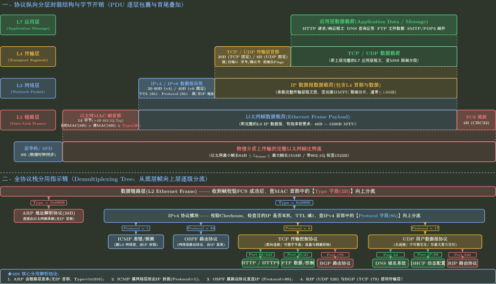

# 计算机网络统一总图：分布式状态、作用域与报文的一生

状态：Source；Atlas Deep Map 工作稿，待与根目录 Canonical Subject Atlas README 做 Source Diff。

> **迁移提示**：以下内容保留为网络 Atlas 的旧 Deep Map Source，用来检查根 Atlas 是否漏掉重要母模型、作用域边界或路由。当前正式 Subject Atlas 已由 `../README.md` 直接拥有，不再把这份旧稿迁成第二份 Atlas `.tex`。

## 0. Position

本文件是 [Computer Network Subject Atlas](../README.md) 的 **Atlas Deep Map Supplement**，不是第二个独立 Atlas Owner。根 `README.md` 拥有正式 Topic/Bridge/Integration 导航；本文件保留更展开的网络坐标系：解释网络机制为什么出现、八个 Topic 分别拥有哪个问题，以及陌生题应先观察什么。

本册拥有六个根本矛盾、Scope 模型、封装责任、命名与交付链、状态所有者、Data/Control Plane、Reliability/Flow/Congestion 三分和网络八问。

本册不推导 Nyquist/Shannon，不模拟 GBN/SR，不计算子网，不运行 Dijkstra，不完整推演 TCP 状态，也不解释 HTTP 字段。局部机制进入相应 Topic；跨机制全过程进入[一个网络请求的一生](../60_综合专题/README.md)。

## 1. 学科母问题

计算机网络研究：

> 在机器彼此独立、链路有限、传输会延迟和失败、资源需要共享、网络异构、系统没有全局即时状态的条件下，怎样让不同机器上的 process 完成有意义的通信？

统一生成性内核是：

$$
\boxed{
\text{Scope}
\to \text{State Owner}
\to \text{Event}
\to \text{Transition}
\to \text{Feedback}
\to \text{Cost}
}
$$

它不是 packet 的时间顺序，而是一组观察问题：当前机制在哪个作用域有效，谁持有什么状态，什么事件改变状态，反馈怎样返回，以及正确性付出什么代价。

## 2. 六个根本矛盾怎样生成八个 Topic

| 根本约束 | 朴素方案为什么失败 | 生成的机制族 | Owner |
|---|---|---|---|
| Distance | 等一次反馈再发会让高速链路长期空闲 | delay、BDP、pipeline | [通信基础](../01_通信基础与网络性能/README.md)、[可靠传输](../03_可靠传输_序号_ACK_定时器与滑动窗口/README.md) |
| Finite Capacity | 多个 sender 的总输入可以超过服务率 | queue、throughput、congestion feedback | [通信基础](../01_通信基础与网络性能/README.md)、[拥塞](../07_拥塞_共享资源与反馈控制/README.md) |
| Unreliability | 沉默无法区分数据丢失、ACK 丢失和延迟 | Seq、ACK、Timer、Retransmission | [可靠传输](../03_可靠传输_序号_ACK_定时器与滑动窗口/README.md) |
| Sharing | 多节点同时使用介质会冲突，多 process 需要分用 host | MAC、multiplexing、port | [单跳交付](../02_单跳交付_帧_MAC_局域网与交换机/README.md)、[传输层](../06_传输层_端点_UDP与TCP状态机/README.md) |
| Heterogeneity/Scale | 每对网络定制协议、每台 router 保存每台 host 都不可扩展 | layering、IP prefix、next hop | [IP 转发](../04_IP地址_子网与分组转发/README.md) |
| No Global Instant State | router 不会天然知道全网拓扑与策略 | DV/LS/BGP/SDN control | [路由](../05_路由_分布式知识与控制平面/README.md) |

[应用层](../08_应用层_DNS_HTTP与服务语义/README.md)解决最后一层问题：即使 transport 已能传 byte，双方仍需要共同理解名字、资源、操作和响应。

## 3. Scope：先问“这条结论在哪里有效”

| Scope | 主要对象 | 典型名字 | 典型状态 Owner | 结束边界 |
|---|---|---|---|---|
| Signal / one link | bit、symbol、frame | MAC / channel resource | NIC、switch port、MAC protocol | link endpoint |
| One subnet / broadcast domain | host interface、gateway | IP prefix、MAC | host route/ARP cache、switch table | router/VLAN boundary |
| End to end | process endpoint、byte/datagram | IP + port | transport endpoints | remote process |
| One routing area/AS | prefix、router、path | router ID、prefix | routers/controllers | area/AS boundary |
| Inter-AS Internet | AS、policy path | prefix、ASN | BGP speakers/operators | destination AS/prefix |
| Application service | name、resource、message | domain、URI、mailbox | authority/server/cache/client | service operation |

字段和状态只能在所属 Scope 内解释。MAC 不负责跨 Internet 定位，BGP 不负责把 byte 交给 process，HTTP method 不参与 router LPM。

## 4. 五层模型的正确用途

五层模型是责任与封装地图，不是五个互不相干的盒子：

```text
Application: object/name/operation semantics
Transport: process endpoint + optional connection/byte state
Network: global-ish logical address + next-hop forwarding
Link: current-hop frame + local delivery
Physical: signal representation + propagation
```

发送端逐层添加本层控制信息；接收端按本层协议解释并向上交付。Router 通常处理到 network layer 后为下一跳重新创建 link-layer frame；switch 主要处理 link layer；end host 处理完整 stack。

分层的价值是替换局部实现而保持接口，代价是 header、复制、跨层信息不足和功能重复。Middlebox、offload 和 cross-layer optimization 说明工程实现未必物理上严格分层，但责任分析仍应先从接口开始。




## 5. 名字不是一种东西

一次 Web 访问中的典型命名链：

$$
\boxed{
\text{URL/resource}
\to \text{Domain name}
\to \text{Destination IP}
\to \text{Next-hop IP}
\to \text{Next-hop MAC}
\to \text{Signal}
}
$$

同时，destination port 把 host 内的传输数据交给 application endpoint。

- URL/URI 标识应用资源或目标；
- domain name 属于分布式命名系统；
- IP prefix/address 支持跨网络定位与聚合；
- next-hop IP 是当前 forwarding action 的网络层目标；
- MAC 是当前链路的交付标识；
- port 是主机内 transport namespace。

每次出现“地址”“目的地”“端点”，都应把类型写全。

## 6. 状态所有者地图

| 状态 | 谁主要持有 | 从什么事件学习/更新 | 忘记或过期会怎样 |
|---|---|---|---|
| ARP/neighbor mapping | host/router interface | local query/reply | 重新解析下一跳 |
| MAC forwarding table | switch | source address observation | unknown unicast flood |
| Forwarding table | router/data plane | routing/control plane installation | 无路由、旧路由或 fallback |
| Routing knowledge | routing process/controller | adjacency, LSA, UPDATE, policy | convergence failure |
| DNS cache | resolver/client | DNS answer + TTL | 重新查询或短期旧值 |
| TCP connection | two endpoints | SYN/ACK/data/FIN/timer | connection failure/reset |
| Receiver capacity | receiving endpoint | buffer use/application read | `rwnd` changes |
| Congestion estimate | sending endpoint | ACK/loss/ECN/delay | `cwnd` changes |

“协议在哪里运行”不如“哪份状态由谁根据什么事件更新”更能解释题目。

## 7. 三组必须固定的边界

### 7.1 Routing 与 Forwarding

$$
\text{Routing / Control Plane}
\to \text{Generate state}
\to \text{Forwarding / Data Plane applies state to packets}.
$$

### 7.2 Reliability、Flow Control 与 Congestion Control

| 问题 | 保护对象 | 状态/信号 |
|---|---|---|
| Reliability | 数据正确、完整、不重复、有序 | Seq、ACK、Timer、Retransmission |
| Flow Control | receiver buffer/application capacity | `rwnd` |
| Congestion Control | shared network path | `cwnd`、loss/ECN/delay |

$$
FlightSize\le \min(rwnd,cwnd).
$$

### 7.3 Object 与 Representation

| 概念 A | ≠ | 概念 B | 真正区别与题目信号 | 混淆后果 |
|---|:---:|---|---|---|
| Application resource | ≠ | HTTP representation | 资源身份与某次传输表示 | 缓存/内容协商误判 |
| TCP byte stream | ≠ | TCP segment | 连续应用 byte 与网络分段表示 | 把 write 边界当报文边界 |
| IP packet | ≠ | Link frame | 跨网络对象与单跳表示 | 认为 MAC 端到端不变 |
| Route knowledge | ≠ | Forwarding entry | 控制平面输入/决策与数据平面动作 | 把协议通告直接当 LPM 结果 |
| Data | ≠ | Signal | 信息内容与物理载体 | 编码/调制题层次错位 |

## 8. 八个 Topic 的学习关系

机制生成顺序：

```text
有限信道与距离
-> 单跳 frame 和共享介质
-> IP 跨异构网络逐跳转发
-> routing 生成 forwarding state
-> 可靠传输填满长反馈管道
-> transport 建立 process/connection state
-> congestion feedback 约束共享路径
-> application 定义服务语义
```

课程同步时也可按 $01 \rightarrow 02 \rightarrow 03 \rightarrow 04 \rightarrow 05 \rightarrow 06 \rightarrow 07 \rightarrow 08$ 学习；每次需要明确当前课程章节在生成链中的位置，而不是把编号当作唯一因果顺序。

## 9. 导航母例：一个 packet 的地图

以下只定位 Owner，不展开机制：

```text
URL
-> DNS maps domain to destination IP                    [08]
-> host chooses local destination or gateway            [04]
-> ARP maps next-hop IP to MAC                           [04]
-> Ethernet/WLAN sends one frame                         [02]
-> router LPM selects next hop and re-encapsulates       [04]
-> routing protocols had generated that forwarding state [05]
-> TCP tracks bytes, ACKs and receiver window            [06 + 03]
-> congestion control limits in-flight load              [07]
-> HTTP interprets request/response as resource semantics [08]
```

完整状态交接见[一个网络请求的一生](../60_综合专题/README.md)。

## 10. Question Control Adapter：网络八问

1. 当前 Scope 是一条链路、一个 subnet、端到端、一个 AS 还是跨 AS？
2. 当前 Object 是 signal、frame、packet、segment、byte stream 还是 application resource？
3. 当前 Name 是 domain、IP、next-hop IP、MAC、port 还是 URI？
4. 当前 State 由 endpoint、switch、router、controller、resolver 还是 server 持有？
5. 发生了什么 Event？
6. State、header 与 encapsulation 怎样 Transition？
7. Feedback 是 ACK、timeout、ICMP、routing update、loss/ECN 还是 application response？
8. Cost 是 transmission、propagation、queue、state、bandwidth、loss、consistency 还是 complexity？

这八问是网络 Adapter，不自动成为“已采用做题规则”。实际使用证据记录在[网络做题规则](../90_做题规则/README.md)。

## 11. Atlas 的 Failure Boundary

若一个解释出现以下特征，应离开 Atlas 进入 Topic：

- 开始逐字段计算 header；
- 需要逐事件更新窗口或 TCP state；
- 需要运行 Dijkstra/Bellman-Ford/LPM；
- 需要算分片、子网、CRC 或具体 RTT；
- 需要判断 HTTP cache/status 的具体规则。

Atlas 只保证找到正确模型入口，不替代局部机制。

## 12. Compression：一句话与重建问题

一句话：

> 网络是在不同 Scope 内由不同 Owner 维护局部状态，并通过报文与反馈不断更新这些状态，使数据能够以可接受的成本从应用对象逐层落到物理信号，再在远端重新解释。

重建全图时回答：

1. 六个根本约束各生成了什么机制？
2. domain、IP、next-hop IP、MAC、port 分别在哪个 Scope 有效？
3. forwarding state 从哪里来，又由谁使用？
4. reliability、flow 和 congestion 为什么不能合并？
5. 一个 URL 到 response 之间有哪些独立状态 owner？

## 13. 当前成熟度与人工确认点

八个 Topic 与 Integration 已形成工作稿，但尚未由使用者运行 Model Diff 和陌生题检验。当前需要人工确认的不是术语数量，而是三项架构判断：

1. 六矛盾是否足以生成 408 网络主干；
2. DHCP 归 IP bootstrap、可靠传输独立成跨层机制是否符合个人调用方式；
3. 网络八问是否在真实题中降低定位成本，而非增加机械步骤。
