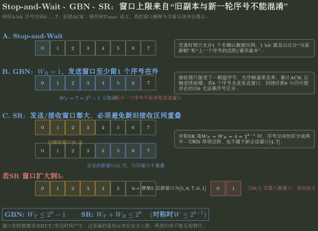

# GBN、SR 与窗口状态推演

> 训练定位：解决“给出窗口大小、序号位数、ACK、丢包、超时、乱序后，怎样逐事件推出发送端与接收端状态”的题目族。  
> 模型归属：[NET-03 可靠传输](NET-03_可靠传输_方法论手册.tex)。Seq / ACK / Timer / Window、Stop-and-Wait、GBN、SR 及不歧义约束的理论由 Canonical 正文拥有；本文件只训练状态账本、计算路径和独立核验。

## 母题表示：先声明协议语义，再开始画窗口

滑动窗口题最危险的做法，是看到“窗口”两个字就直接套 GBN 或 SR 公式。

草稿第一屏固定写四件事：

```text
ACK 语义：累计确认 / 单帧确认 / 下一期望序号？
接收端：失序帧丢弃还是缓存？
Timer：只计最老未确认帧，还是逐帧计时？
序号空间：0 ... 2^k-1，按模 2^k 循环
```

只有这四个语义确定后，才画 sender / receiver 窗口。

## 双账本：任何事件都只更新这些状态

### Sender

- `base`：最老未确认序号；
- `nextseq`：下一个可用于新数据的序号；
- `ACKed`：已经确认的集合/连续前缀；
- `timer`：当前哪些未确认对象正在计时；
- `send window`：当前允许占用的序号区间。

### Receiver

- `rcv_base / expected`：当前接收窗口左边界或下一期望序号；
- `buffered`：已收到但还不能按序交付的对象；
- `delivered`：已经向上交付的连续前缀；
- `receive window`：当前合法接收区间。

> **核心不变量：Receive ≠ Deliver。** SR 中一个 frame 可以“已经收到且已 ACK”，但因为左侧仍有缺口，还不能向上交付。

## 问题一：Stop-and-Wait 先把四种异常分开

发送一帧后没有推进，至少分别检查：

1. data 丢失；
2. data 损坏；
3. ACK 丢失/损坏；
4. data 或 ACK 只是延迟。

发送方不能知道网络内部真实发生了哪一种，只能依靠 timer 在等待过久后执行重传。

### 局部规则：超时是动作触发，不是“丢失证明”

**触发信号**：题面写“超时”“未收到 ACK”。

**第一动作**：保持发送方仍处于等待当前序号确认的状态，然后执行题设规定的重传。

**检查与退出**：若接收端已经交付过该序号，重传副本只能重新确认，不能再向上交付。

## 问题二：GBN 用“连续前缀”维护状态

经典 408 GBN 模型：

- receiver window 通常为 1；
- 失序 frame 不缓存；
- ACK 通常表示连续前缀；
- sender 通常只给最老未确认 frame 维护一个主 timer；
- 最老未确认 frame 超时后，从 `base` 起重传全部尚未确认 frame。

### GBN 事件更新模板

收到一个 ACK：

```text
1. 解释 ACK 的累计语义
2. 若它扩大了已确认连续前缀：base 右移
3. 若仍有未确认帧：timer 对新的 oldest unACKed 继续/重启
4. 若窗口释放了槽位：允许发送新的 seq
```

超时：

```text
timeout(oldest unACKed)
-> retransmit [base, nextseq)
-> restart main timer
```

### 检查

始终保持：

$$
base\le nextseq\le base+W_T
$$

（按模序号解释时画圆环，不把十进制大小关系机械套过回绕点。）

## 问题三：SR 用“接收、缓存、交付”三层状态

经典 SR：

- receive window 可以大于 1；
- 窗口内失序 frame 可以缓存；
- ACK 通常逐 frame；
- sender 为不同未确认 frame 维护独立确认/计时状态；
- 只重传真正超时的 frame。

### SR 接收端固定三分法

收到序号 $n$：

1. **在当前 receive window 内**：首次有效副本则缓存并 ACK；若恰好补齐左端缺口，再连续交付并滑窗；
2. **在 receive window 之前**：说明它属于已处理旧数据，不能再次交付，但通常需要重新 ACK；
3. **在 receive window 之后**：当前还不合法，按题设丢弃。

### 局部规则：窗口不能跨过洞

即使后面的 frame 已经收到并确认，只要左端缺口还在，`rcv_base` 就不能越过它。

**检查与退出**：若你在 SR 中“收到任意窗口内 frame 就把整个接收窗口向右滑一格”，立即停止；滑动条件是左端连续前缀已经可交付。

## 问题四：序号空间约束不是背出来的，是防旧帧歧义

### GBN

经典接收窗口 $W_R=1$ 时：

$$
W_T\le2^k-1.
$$

要至少保留一个序号不属于当前发送窗口，避免新一轮复用与仍可能出现的旧副本完全重合。

### SR

一般不歧义条件：

$$
W_T+W_R\le2^k.
$$

若发送/接收窗口等大：

$$
W_T=W_R\le2^{k-1}.
$$

### 局部规则：先构造“迟到旧帧”反例

**触发信号**：题目问最大发送窗口、至少几位序号、为什么 SR 只能一半空间。

**第一动作**：画出旧窗口和序号回绕后的新窗口；问一个迟到旧 frame 是否可能落入新合法接收区间。

**检查与退出**：只有当接收端仅凭“当前窗口 + 序号”仍能区分新旧时，窗口大小才合法。



图用 3-bit 序号空间直接构造旧帧迟到反例：GBN 至少留一个序号在发送窗口外；SR 则要求发送窗口与接收窗口合计不超过整个序号空间。

## 问题五：利用率先从完整反馈周期生成

设：

- 数据 frame 发送时延 $T_f$；
- ACK 发送时延 $T_a$；
- 单向传播时延 $\tau$；
- 接收处理时间 $T_p$。

停止等待的一个完整周期：

$$
T_{cycle}=T_f+2\tau+T_p+T_a.
$$

于是：

$$
U_{SW}=\frac{T_f}{T_{cycle}}.
$$

窗口为 $W$ 时，理想无差错条件下：

$$
U(W)=\min\left(1,\frac{W T_f}{T_{cycle}}\right).
$$

因此填满反馈周期所需最小窗口：

$$
W_{sat}=\left\lceil\frac{T_{cycle}}{T_f}\right\rceil.
$$

### 局部规则：先求物理窗口需求，再求协议序号位数

正确顺序：

```text
链路时间线
-> 满载需要 W_sat
-> GBN/SR 的序号空间是否允许这个窗口
-> 反推至少需要 k bit seq
```

不能把 $2^k-1$ 或 $2^{k-1}$ 直接当利用率公式。

## 问题六：ACK 丢失在 GBN 与 SR 中为什么代价不同

### GBN

若较小累计 ACK 丢失，但随后更大的累计 ACK 到达，那么更大 ACK 已经包含了此前连续前缀的知识，sender 可以继续推进。

### SR

逐 frame ACK 通常不能由“ACK 后一个 frame”自动证明前一个 frame 已收到。因此某 ACK 丢失后，对应 timer 仍可能超时，产生一次冗余重传。

> 这不是“SR 更差”，而是反馈信息结构不同：GBN 压缩连续前缀，恢复粒度粗；SR 表达任意接收模式，状态更多。

## 代表母题：SR 的洞怎样推进

设序号空间为 0–7，$W_T=W_R=4$，接收窗口当前为：

```text
[0,1,2,3]
```

依次收到 `1, 2, 0`。

### 收到 1

- 1 在窗口内；
- 缓存 1，ACK 1；
- 0 尚未到，不能交付，`rcv_base=0`。

### 收到 2

- 缓存 2，ACK 2；
- 0 仍缺，窗口仍不能移动。

### 收到 0

- 0 到达并成为左端；
- 0、1、2 形成连续前缀，依次向上交付；
- 新 `rcv_base=3`，接收窗口相应向右滑。

如果此时又收到旧副本 1，它不能再次交付，但仍可能需要重新 ACK 1，让 sender 关闭残留 timer。

## 代表母题：GBN 超时到底重传谁

发送窗口为 4，sender 已发送 0、1、2、3，接收端正确收到 0、1，却丢失 2；3 失序到达。

经典 GBN receiver：

- 0、1 按序交付；
- 3 因期待 2 而丢弃；
- sender 的累计 ACK 最多推进到连续前缀末端；
- 当最老未确认 2 的 timer 到期时，sender 重传当前所有 outstanding：2、3。

若只重传 2，就已经把 GBN 恢复策略写成 SR。

## 题库验证：代表题与变式轴

题库已经能验证本文件最重要的“先声明语义，再维护双账本”控制法：

| 证据题 | 题面变化 | 实际验证点 |
|---|---|---|
| 761、762 | 卫星/普通链路、窗口/帧长反推利用率 | 先算完整反馈周期，再求物理窗口需求 |
| 763 | data frame 丢失 | timeout 是恢复触发，不是发送方直接看见“丢失事实” |
| 764 | GBN 收到多个确认后超时 | 累计 ACK 先推进 `base`，超时只从当前 oldest unACKed 开始回退 |
| 767、770 | 窗口边界与 outstanding 数 | 逻辑窗口只前进或停留，发送许可与已确认状态分开 |
| 769、772 | GBN 窗口反推序号位数 | 先有性能所需窗口，再检查 `W_T <= 2^k-1` |
| 771 | SR 接收窗口已给 | 使用 `W_T+W_R<=2^k` 防止新旧序号歧义 |
| 773 | SR 收到洞后面的 ACK | 非超时条件下不因缺口自动立即重传，接收/确认/恢复事件分开 |

### 变式轴

1. **ACK 语义**：累计 / 单帧 / 下一期望；
2. **失序处理**：丢弃 / 缓存；
3. **Timer 粒度**：最老未确认一个 / 逐帧；
4. **故障位置**：data、ACK、延迟、重复；
5. **序号回绕**：窗口靠近模空间边界时旧帧是否会冒充新帧；
6. **性能限制**：窗口先由物理反馈周期决定，还是先被协议序号空间卡住。

> **仍需补的证据：**当前题库缺少真正把 SR 的“乱序缓存—补洞—连续交付—旧副本再 ACK”完整跑一遍的状态题，也缺少 ACK 丢失后 GBN 与 SR 恢复代价的对照题。Canonical 无需扩写，训练层应补这两类母题。

## 题目攻击：ACK 的“信息压缩方式”决定恢复动作

### 攻击 764：收到 ACK 1、3、5，不等于还欠 2、4

在经典 GBN 累计确认语义下，真正决定 `base` 的是最大的有效累计 ACK：ACK 5 已经覆盖连续前缀 0–5。因此超时时只剩 6 outstanding。若把“收到三个 ACK”按三个独立 frame confirmation 逐项打勾，就把 GBN 写成了 SR。

**First Divergence**：没有先声明 ACK 是“连续前缀边界”还是“单帧集合”。

### 攻击 773：SR 的缺口存在，不等于立即重传

收到 5 的 ACK 而 4 未确认，只说明发送窗口内部形成了洞；只要 4 尚未超时，sender 可以继续发送窗口内其他新帧。恢复动作的触发来自 timer/题设反馈，不来自“我看见一个洞就立刻重传”的直觉。

### 攻击 772：先算物理反馈周期，再检查协议序号空间

772 特意让 ACK 也有 128 B，若仍套“数据发送时间 + 2×传播”会少算 ACK serialization。正确顺序是：完整周期 → 为满载需要多少在途帧 → GBN 序号空间能否容纳 → 反推 `k`。

**升级动作**：窗口题同时维护两种约束：`performance-required window` 与 `protocol-legal window`；前者由时间线产生，后者由新旧序号不歧义产生。

## 陌生窗口题固定落笔协议

```text
1. 先声明 ACK 的精确语义。
2. 写 receiver 是否缓存失序帧。
3. 写 timer 是一个还是逐帧。
4. 画 sender / receiver 两条状态线。
5. 每个事件后更新 base、nextseq、buffer、timer。
6. 窗口滑动只跨过满足条件的连续前缀。
7. 回绕题用“迟到旧帧能否冒充新帧”检查序号空间。
8. 利用率先画一个完整反馈周期，再求窗口。
9. 最后攻击：是否可能重复交付？是否把 TCP 整体误判成 GBN/SR？
```

## 最短压缩

> **先定 ACK/缓存/Timer 语义，再逐事件维护双账本；GBN 看连续前缀，SR 看洞与缓存，序号空间用旧帧歧义反推。**
