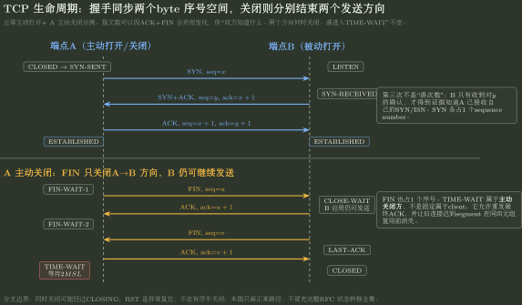

# TCP 序号、窗口与连接状态推演

> 训练定位：解决“给出 TCP 报文、SEQ/ACK、窗口、握手/关闭事件后，怎样逐步推出两端连接状态与可发送范围”的题目族。  
> 模型归属：[NET-06 传输层与 TCP](NET-06_传输层与TCP_方法论手册.tex)。Port/socket、UDP/TCP 首部、byte sequence、connection lifecycle、`rwnd` 与 TCP 计时状态归 Canonical；通用可靠性参见 NET03，`cwnd` 更新参见 NET07。本文件只训练题目状态推进。

## 母题表示：TCP 必须画“双向两套状态”

TCP 是 full-duplex byte stream。任何 SEQ/ACK 题都先分 A→B 与 B→A 两个方向，不能只画一条“连接序号”。

每一端至少维护：

```text
local/remote endpoint
connection state
send next byte / oldest unACKed byte
receive next expected byte
rwnd
retransmission/timing state
```

若题目还涉及拥塞，再额外调用 NET07 的 `cwnd/ssthresh`，不要把它们混进 `rwnd`。

## 问题一：先确定“序号单位是 byte”

TCP 的 SEQ 指向本 segment 的第一个数据 byte；ACK 通常表示“下一期望 byte”。

若一个 segment：

```text
SEQ = x
payload length = L
```

且无 SYN/FIN，则对端在连续收到后下一 ACK 通常指向：

$$x+L.$$

### 两个特殊控制事件

- SYN 占 1 个 sequence number；
- FIN 占 1 个 sequence number；
- 纯 ACK 若无 data、SYN、FIN，通常不消耗序号。

### 局部规则：先算“本报文消耗多少序号空间”

**触发信号**：给 SEQ、ACK、payload、SYN/FIN。

**第一动作**：写：

$$
\Delta seq=L_{data}+[SYN]+[FIN].
$$

**检查与退出**：若每发一个 TCP segment 就机械让 SEQ `+1`，说明把 byte sequence 错当 packet sequence。

## 问题二：三次握手按“双方知道了什么”推进

客户端 ISN 为 $x$，服务端 ISN 为 $y$：

```text
CLOSED                         LISTEN
SYN seq=x -------------------->
             <--------------- SYN+ACK seq=y ack=x+1
ACK seq=x+1 ack=y+1 ---------->
ESTABLISHED                    ESTABLISHED
```

第三次的关键知识是：server 获得证据，知道 client 已经收到 server 的 SYN/ISN。

### 局部规则：报文合法性由“当前状态 + flags + SEQ/ACK”共同决定

不能只看“这是第三个包”就进入 ESTABLISHED；若 ACK 数不覆盖 server SYN，状态不能按正常路径推进。

## 问题三：TCP 分用先用完整连接身份

经典教材模型：

- UDP endpoint 主要依据本地 IP/port 与 transport binding；
- TCP connection 用两端 endpoint 共同确定，通常写四元组：

$$
(src\ IP,src\ port,dst\ IP,dst\ port).
$$

所以服务器 `:80` 可以同时服务多个客户端，因为 remote endpoint 不同。

### 检查

Port 是本地主机内的命名空间，不是 process ID，也不是一条 TCP connection 的唯一身份。

## 问题四：TCP 发送窗口至少有三个指针

把发送端 byte space 画成：

```text
已确认 | 已发未确认 | 当前可发送 | 暂不可发送
       P1           P2         P3
```

于是：

$$
P_2-P_1=FlightSize,
$$

$$
P_3-P_1=W_{send},
$$

$$
P_3-P_2=W_{usable}.
$$

若同时考虑接收流控和拥塞控制：

$$
W_{usable}=\max\{0,\min(rwnd,cwnd)-FlightSize\}.
$$

### 局部规则：ACK、实际发送、窗口通告分别动不同指针

- 新累计 ACK 推动 $P_1$；
- 本端真正发出新 data 推动 $P_2$；
- 新的有效窗口约束影响 $P_3$。

不要用一个 `window=...` 数字替代全部状态。

## 问题五：`rwnd` 是接收端库存，不是路径容量

经典题设可写：

$$
rwnd=receive\ buffer\ capacity-buffered\ unread\ bytes.
$$

Data 到达会占用 buffer，应用读取会释放 buffer。

若 `rwnd=0`：

- sender 停止普通新数据发送；
- 但不能永久沉默；
- persist / zero-window probe 用于防止非零窗口更新丢失后双方死锁。

### 检查

`rwnd` 保护 receiver；`cwnd` 保护 network path。两者都叫窗口，不代表 Owner 相同。

## 问题六：累计 ACK 与乱序缓存要分开

TCP 可以缓存失序数据，却仍用累计 ACK 表达“当前连续前缀到哪里”。

例如连续前缀到 byte 1000，随后收到 1501–2000，而 1001–1500 缺失：

- 接收端可以缓存后段；
- 累计 ACK 仍不能跨过缺口；
- 若启用 SACK，可额外报告已收到的非连续 block。

> **停止条件：**“接收到了更大的 SEQ，所以 ACK 直接跳到它后面”只有在中间连续字节都已收到时成立。

## 问题七：RTO 与 RTT 不是一个量

RTT 是观测到的往返时间；RTO 是 sender 何时认为等待太久、应进入重传分支的本地阈值。

若题目给 SRTT/RTTVAR 教材模型，严格按题设更新顺序计算；重传 segment 的 ACK 可能无法确定对应原发还是重传，Karn 原则说明这类模糊样本不能直接当正常 RTT 样本。

训练重点不是死背参数，而是区分：

```text
sample RTT -> estimator state -> RTO threshold -> timeout event
```

## 问题八：关闭连接要分别关闭两个方向

典型主动关闭：

```text
A FIN
-> B ACK
-> A->B 方向已结束，但 B 仍可继续发送
-> B FIN
-> A ACK
-> active closer TIME-WAIT
```

若 ACK 与 FIN 合并，报文数可以少于经典“四次挥手”；但两个方向分别关闭的状态语义不变。

### 常见状态辨析

- `FIN-WAIT-2`：本端 FIN 已被确认，正在等对方 FIN；
- `CLOSE-WAIT`：已经收到对方 FIN，等本地应用决定何时关闭本方向；
- `LAST-ACK`：本端 FIN 已发，等最终 ACK；
- `TIME-WAIT`：主动关闭方保留状态，既允许重发最终 ACK，也隔离旧连接迟到 segment。

### 局部规则：谁主动关闭，谁才通常进入 TIME-WAIT

不能仅凭 client/server 身份判断。



图把正常主动打开与 A 主动关闭放在同一双端点时间线上：SYN/FIN 都占一个 byte 序号；FIN 只关闭一个发送方向；TIME-WAIT 的 Owner 由主动关闭事件决定，不由 client/server 身份决定。

## 问题九：UDP/TCP checksum 先划“计算输入”和“线上字段

Pseudo-header 参与 UDP/TCP checksum 计算，但不是在线传输层首部的一部分。

因此做长度题：

- 不把 pseudo-header 计入 TCP/UDP header length；
- 做 checksum 时把 source/destination IP、protocol、length 等纳入计算输入；
- NAT 改写相关 IP/port 后，必须同步维护受影响的校验和。

## 代表母题 A：SEQ/ACK 推演

A 发：

```text
SEQ=1000
payload=500 B
```

B 连续正确收到，则下一期望 byte 为：

$$1500.$$

因此正常累计 ACK 为 1500。

随后 A 发一个无数据 FIN，若 FIN 的 SEQ=1500，则 FIN 自己占一个序号，B 对 FIN 的确认应推进到 1501。

## 代表母题 B：发送窗口

若：

```text
cwnd = 12 KB
rwnd = 8 KB
FlightSize = 5 KB
```

则当前还能发送的新数据上限：

$$
\min(12,8)-5=3\text{ KB}.
$$

不能回答 7 KB（只用 cwnd）或 3 KB 后顺便把 `cwnd` 改成 8 KB；`rwnd` 只限制实际发送，不自动改写拥塞算法状态。

## 题库验证：代表题与变式轴

传输层题库对 endpoint、首部、byte sequence 和连接生命周期的攻击已经比较充分：

| 证据题 | 表面题型 | 实际验证的母模型 |
|---|---|---|
| 912–920、927 | TCP/UDP/port/socket 概念 | port、endpoint、connection、protocol namespace 不能互相替代 |
| 918、921–926、928 | UDP/TCP 首部、checksum、效率 | pseudo-header 是校验输入，不是在线首部；长度预算必须逐层扣除 |
| 929–933、944 | byte stream / Window | TCP 不保留应用消息边界；`rwnd`、`cwnd`、byte window Owner 分开 |
| 934–939、942–943 | 三次握手、ISN、ACK | SYN 占序号；第三次握手完成 server 对 client 已收到其 ISN 的知识闭环 |
| 932、937、945、946 | SEQ/ACK 连续前缀 | ACK 指下一期望 byte，只能跨越连续已收区间 |
| 940、941 | FIN / 关闭 | 两个方向分别关闭，主动关闭方与 TIME-WAIT 角色要按事件判断 |
| 958 | TCP 四元组 | 完全相同四元组不能同时标识两条独立 classic TCP connections |
| 950 | Data Offset / options | 先由 32-bit word 单位恢复真实 header length，再处理 padding/options |

### 变式轴

1. **连接身份**：本地 port 相同但 remote endpoint 不同；
2. **序号消耗**：data、SYN、FIN 的不同组合；
3. **ACK 证据**：连续前缀、乱序缓存、是否有 SACK；
4. **窗口 Owner**：`rwnd`、`cwnd`、FlightSize、应用待发数据；
5. **连接事件**：主动/被动打开、同时打开、半关闭、异常 RST；
6. **首部预算**：Data Offset、MSS、options、pseudo-header、MTU。

> **仍需补的证据：**现有题库对 RTO/SRTT/Karn、SACK block、zero-window persist、Nagle/Clark、同时打开/同时关闭等状态题覆盖不足。它们已经在 Canonical 中有稳定机制，不应再扩写理论；训练层需要用少量事件题验证这些分支。

## 题目攻击：字段、局部状态与服务性质必须分层

### 攻击 930：TCP `Window` 字段的 Owner 是 receiver，不是 network

`Window` 字段通告 `rwnd`，它表达接收端还能容纳多少数据；`cwnd` 是 sender 本地维护的拥塞控制状态，不直接写进这个字段。两个量都叫 window，只能通过 Owner 区分。

**First Divergence**：看到“动态窗口”就把 flow control 与 congestion control 合并。

### 攻击 922：pseudo-header 是校验输入，不是在线首部

UDP checksum 按 16 bit word 计算；奇数字节只为计算临时补 0。pseudo-header 把 source/destination IP、protocol、length 等纳入完整性检查，但它不随 UDP header 在线重复发送，也不计入 UDP Length。

**升级动作**：任何“长度/校验”题都分两栏：`bytes transmitted` 与 `bytes participating in checksum`。

### 攻击 945/946：ACK number 是连续前缀边界

945 中第 3 段即使已到达，只要第 2 段形成缺口，累计 ACK 仍停在第 2 段起点；946 则通过 `ack=311` 反推刚收到的数据区间是 `[301,311)`。两题共同说明 ACK 不是“确认某个 packet 编号”，而是对 byte prefix 的边界描述。

### 压力变式：中间段丢失但后续段到达

若需要继续追问 duplicate ACK、RTO、SACK 和重传证据，不在本文件里把 TCP 硬贴成 GBN/SR，转入 [TCP 丢包证据与可靠性映射](../50_科内桥梁/NET-B03_ReliableTransfer与TCP/TCP丢包证据与可靠性映射.md)。

## 陌生 TCP 题固定落笔协议

```text
1. 写完整 endpoint/四元组和两端当前 TCP state。
2. 分 A->B / B->A 两个 sequence space。
3. 每个 segment 先算消耗多少 seq：data + SYN + FIN。
4. ACK 只跨过连续已收 byte 前缀。
5. 发送窗口分 ACKed / in-flight / usable 三段。
6. rwnd 与 cwnd 分开维护；需要拥塞更新时调用 NET07。
7. 超时题分 RTT sample、RTO state 和 retransmission event。
8. 关闭题逐方向推进 FIN/ACK，不背固定报文数。
9. 最后检查：有没有把 port 当 connection、把 pseudo-header 当线上首部、把 TCP 整体贴成 GBN/SR？
```

## 最短压缩

> **TCP 先画两套 byte 序号空间：SEQ 按字节推进，ACK 只跨连续前缀；连接状态、`rwnd`、`cwnd` 和计时器分别维护。**
