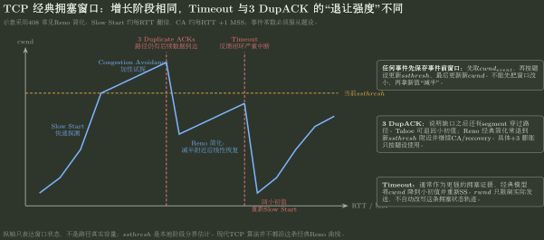

# TCP 拥塞窗口轮次推演

> 训练定位：解决“给出 `cwnd`、`ssthresh`、Tahoe/Reno、timeout、duplicate ACK 和若干轮次，怎样完整推出窗口轨迹”的题目族。  
> 模型归属：[NET-07 拥塞控制](NET-07_拥塞控制_方法论手册.tex)。拥塞反馈、Slow Start、Congestion Avoidance、AIMD、Tahoe/Reno 与 AQM 的机制由 Canonical 正文拥有；本文件只训练题设口径声明、逐事件状态更新与反向核验。

## 母题表示：先冻结题设口径，再算任何一轮

拥塞窗口题最常见的错误不是算错加减，而是把不同教材口径混到同一条轨迹。

草稿顶端固定写：

```text
单位：MSS / Byte？
初始 cwnd = ?
初始 ssthresh = ?
题设版本：Tahoe / Reno / 自定义？
事件发生时点：第 n 轮末 / 当 cwnd=X 时？
cwnd == ssthresh 时属于哪个阶段？
是否有 rwnd 限制实际发送量？
```

上述条件不明确，就不能直接抄 `1,2,4,8,...`。

## 问题一：Slow Start 是“每 RTT 近似翻倍”，不是“每 ACK 翻倍”

经典教材中，一个新 ACK 会让 `cwnd` 增长；在一整个窗口的数据都被正常 ACK 后，RTT 粒度上近似得到：

```text
1 -> 2 -> 4 -> 8 -> ...
```

### 局部规则：题目按什么粒度给事件，就按什么粒度推进

- 若题目直接给 RTT 轮次：按每轮后的 `cwnd` 状态更新；
- 若题目逐 ACK：按题设每个 ACK 的增量逐次更新；
- 不要先按 RTT 翻倍，再把这一轮的每个 ACK 又加一遍。

## 问题二：达到 `ssthresh` 后只是换阶段，不是停止增长

经典简化：

- `cwnd < ssthresh`：Slow Start；
- 到达门限后进入 Congestion Avoidance；
- CA 中每 RTT 约增加 1 MSS。

因此门限是“快增→慢增”的分界，不是路径真实容量，也不是最大窗口。

### 检查

如果轨迹到 `ssthresh` 后变成水平线，除非题目另有限制，否则你把 threshold 当成 capacity 了。

## 问题三：任何拥塞事件都先保存事件前窗口

### 局部规则：事件处理顺序固定

```text
1. 保存 cwnd_event
2. 由 cwnd_event 计算新的 ssthresh
3. 再按 Tahoe/Reno/timeout 规则设置新的 cwnd
4. 确定下一阶段
```

不能先把 `cwnd` 改小，再拿新值去算 `ssthresh`。

## 问题四：Timeout 与 3 Duplicate ACK 的证据强度不同

### Timeout

经典教材把 timeout 当较严重反馈：

```text
ssthresh <- event前窗口的题设比例（常见为一半）
cwnd <- 小初值
-> 回 Slow Start
```

### 3 Duplicate ACK

它说明缺口后面仍有 segment 到达，路径并非完全失去反馈。

- Tahoe：fast retransmit 后通常像严重拥塞一样把 `cwnd` 降到小初值，重新 Slow Start；
- Reno 简化题：通常把 `cwnd` 降到新的 `ssthresh` 附近，然后从 CA/recovery 继续；
- 更细的 Reno 可能有 `ssthresh + 3 MSS` 的临时 fast recovery 膨胀，必须以题设为准。

### 停止条件

若题面明确“Reno 简化模型”，不要又把临时 `+3 MSS` 与下一轮稳定窗口重复相加。



图只固定“阶段 + 反馈强度 + 状态转移”的母模型：3 DupACK 和 Timeout 不能走同一分支；具体减半、初值和 fast recovery 临时膨胀必须服从题设 Tahoe/Reno 版本。

## 问题五：`rwnd` 只限制实际发送，不自动替代 `cwnd`

实际发送上限：

$$
SendWindow\le \min(cwnd,rwnd).
$$

但若拥塞事件发生时算法状态为：

```text
cwnd = 20 MSS
rwnd = 12 MSS
```

且题设规定 `ssthresh = cwnd_event/2`，那么通常仍以事件前算法状态 `cwnd=20` 计算新门限，而不是拿实际发送窗口 12 去代替，除非题目明确另定。

> **Owner 检查：**`rwnd` 来自 receiver capacity；`cwnd` 来自 sender 对 network 的反馈推断。

## 问题六：累计发送量不能直接等于窗口序列之和，除非前提成立

只有在这些条件下，才可把每轮可发送量近似写成窗口值：

- sender 始终有足够数据；
- ACK 正常回来；
- 当前没有前一轮残留 FlightSize 额外占用；
- `rwnd` 不形成更小限制，或已经取了 `min(cwnd,rwnd)`；
- 题目按离散 RTT 轮次近似。

若有重传，还要区分：

- transmitted bytes；
- retransmitted bytes；
- application goodput。

发得更多不代表有效吞吐更高。

## 问题七：从曲线反推事件

常见局部形状：

| 轨迹特征 | 优先怀疑 |
|---|---|
| 近似翻倍 | Slow Start |
| 每轮 +1 MSS | Congestion Avoidance |
| 突然降到小初值 | timeout 或 Tahoe 式严重退让 |
| 约减半后继续线性 | Reno duplicate-ACK 分支 |
| 上升到某门限后从翻倍改 +1 | 到达 `ssthresh` |

### 反向核验

若某次事件把窗口从 $W$ 降到 $W/2$，随后线性增加，要检查新 `ssthresh` 是否也来自**事件前** $W$。这比只看某一轮数值更可靠。

## 代表母题：Reno 两类事件

设题目明确采用以下离散口径：

```text
cwnd0 = 1 MSS
ssthresh0 = 8 MSS
cwnd == ssthresh 时进入 CA
第 6 轮末发生 3 duplicate ACK
后面某轮末发生 timeout
ssthresh 取事件前 cwnd 的一半并向下取整
Reno duplicate ACK 后 cwnd = new ssthresh
```

开始：

```text
轮1  1
轮2  2
轮3  4
轮4  8   <- 到门限
轮5  9
轮6  10  <- 这一轮仍用事件前状态发送
```

第 6 轮末事件：

$$
ssthresh=\lfloor10/2\rfloor=5,
$$

$$
cwnd=5.
$$

下一轮从 5 的 CA/recovery 语义继续，而不是先把第 6 轮重算成 5。

如果后面 timeout 发生在事件前 `cwnd=11`：

$$
ssthresh=\lfloor11/2\rfloor=5,
$$

$$
cwnd\to1
$$

并重新进入 Slow Start。

> 真题若规定“第 n 轮开始时发生事件”或不同离散化，必须按新口径重画；这份母题只训练状态时点意识。

## 问题八：拥塞的根本因果链要能从窗口题复原

窗口曲线不是纯数学递推。其背后的链是：

$$
\text{offered load}\uparrow
\to \text{queue}\uparrow
\to \text{delay/loss signal}
\to \text{sender adjusts cwnd}.
$$

因此：

- queue 短时存在可以吸收 burst；
- buffer 无限增大不能解决持续 $\lambda>C$；
- loss/duplicate ACK/ECN 是反馈证据，不是“拥塞原因”本身；
- `cwnd` 是动态探测状态，不是瓶颈带宽真值。

## 题库验证：代表题与当前证据边界

当前 947–957 组题已经能稳定验证“口径声明—阶段判断—事件前窗口—事件分支”这条训练主线，但题型集中在基础轮次推演：

| 证据题 | 表面题型 | 实际验证点 |
|---|---|---|
| 947、954、955 | timeout 后若干 RTT | 先保存事件前 `cwnd`，再更新 `ssthresh/cwnd`，随后按 SS/CA 分阶段推进 |
| 948、953 | `rwnd` 与 `cwnd` 同时出现 | 实际发送上限取 `min(cwnd,rwnd)`，但 receiver window 不冒充拥塞状态 |
| 949 | 到达门限后继续增长 | `ssthresh` 是阶段分界，不是最大窗口 |
| 951、956 | 每 ACK / 每 RTT 粒度 | Slow Start 是 RTT 粒度近似翻倍，不是每个 ACK 翻倍 |
| 952 | 新门限来源 | 新 `ssthresh` 来自拥塞事件前窗口，而不是旧门限再减半 |
| 957 | 事件发生时点 | “第 n 轮开始/末”必须先固定，否则同一数字序列会错一轮 |

### 变式轴

1. **状态单位**：MSS / KB / byte；
2. **事件时点**：轮开始、轮末、当 `cwnd=X`；
3. **阶段边界**：`cwnd==ssthresh` 的题设 convention；
4. **拥塞证据**：timeout / duplicate ACK / ECN；
5. **算法版本**：Tahoe / Reno 简化 / 更细 fast recovery；
6. **实际发送限制**：`rwnd`、FlightSize、application-limited。

> **验证结论：**NET07 的“Probe → Feedback → Adjust cwnd → Probe again”母模型成立，基础 `cwnd/ssthresh` 轮次题已经覆盖充分。

> **明显缺口：**这一批题几乎没有直接验证 3 duplicate ACK 下 Tahoe/Reno 分叉、fast retransmit/recovery、AQM/RED/ECN、goodput 与 queue 正反馈。下一轮若继续补题，应优先补这些机制，而不是再增加同构的 timeout 后 `1→2→4→...` 计算题。

## 题目攻击：拥塞题最先攻击“状态时点”和“Owner 偷换”

### 攻击 957：同一串数值只要事件时点不同，答案就会错一轮

957 已把语义收紧为“第 8 轮按 `cwnd=12` 完成发送，轮末发生 timeout，第 9 轮从 1 开始”。若改成“第 8 轮开始前发生 timeout”，第 8 轮就不能再用 12 发送。

**升级动作**：任何轮次题先写 `cwnd_n = 第 n 轮开始发送前的窗口`，再声明 event 发生在本轮开始还是 ACK 全返后的轮末。没有时间锚点就不计算。

### 攻击 948：`rwnd` 可以卡住实际发送，但不能改写 `cwnd` 的身份

即使算法 `cwnd` 已经增长到 12 KB，只要 receiver 持续通告 `rwnd=10 KB`，实际发送上限仍是 10 KB；但这不表示 sender 的拥塞状态被改成 10 KB。后续拥塞事件如何设置 `ssthresh` 仍按题设指定的 `cwnd/FlightSize` 口径处理。

### 攻击 952：新门限来自事件前状态，不来自旧门限

把 `ssthresh_new` 写成 `ssthresh_old/2` 会让门限逐次自我缩小，与当前在途/发送状态脱钩。正确模型先保存 `cwnd_event`（或题设指定的 FlightSize），再由该事件快照生成新 threshold。

### 压力变式：把 timeout 换成 3 duplicate ACK

现有题库主要验证 timeout。若改为 Reno duplicate-ACK 分支，必须先声明教材版本，再决定 `cwnd` 是直接落到新 `ssthresh`，还是存在 `ssthresh+3 MSS` 的临时 recovery 膨胀；不能把两种 convention 叠加。

## 陌生拥塞题固定落笔协议

```text
1. 写单位、初值、ssthresh、算法版本和事件时点。
2. 每一轮先判断当前阶段：SS / CA / recovery。
3. 正常 ACK 只按题目指定粒度增长一次。
4. 事件发生前先保存 cwnd_event。
5. 先更新 ssthresh，再更新 cwnd，再写下一阶段。
6. timeout 与 duplicate ACK 分支分开。
7. 实际发送量另取 min(cwnd,rwnd)，不要反过来改算法状态。
8. 累计量区分发送量、重传量和 goodput。
9. 最后用曲线形状和事件前窗口反向核验。
```

## 最短压缩

> **拥塞题先锁口径：阶段决定增长，事件前窗口决定新门限，timeout/dupACK 决定退让分支；`rwnd` 只限制发送，不冒充 `cwnd`。**
