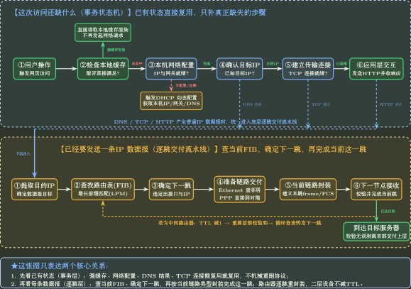
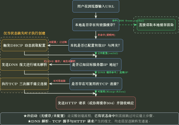
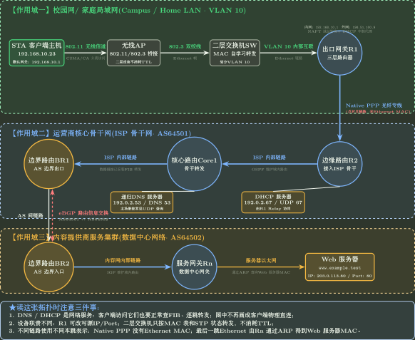
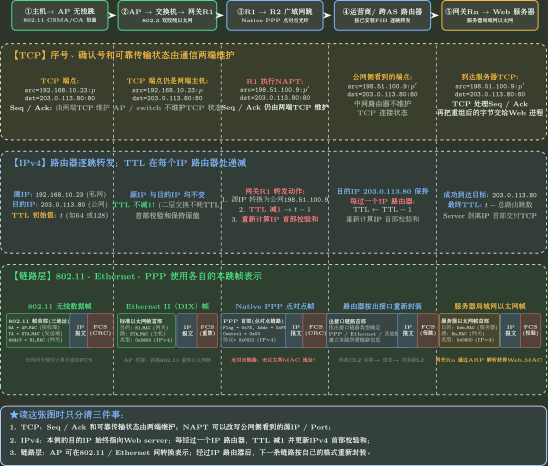

# 跨层网络请求状态推演

> 训练定位：给出一个 URL、当前缓存/表项/连接状态和网络拓扑后，判断真正会发生哪些事件、哪些已有状态可以复用、每个设备会改什么，并找到第一次失败的位置。
> 模型归属：[NET-I01 一个网络请求的一生](NET-I01_一个网络请求的一生_综合手册.tex)。协议机制仍由 NET01--NET08 与 NET-B01--B06 拥有；本文件只训练“怎样调用”和“怎样检查”。

## 先记住两个过程，不背协议顺序

一次 Web 访问不是固定的：

```text
DHCP -> DNS -> ARP -> TCP -> HTTP
```

更稳的想法是：

```text
请求过程：这次访问还缺什么状态？
逐跳过程：一旦要发一条普通 IP 数据报，当前节点怎样把它送到下一节点？
```



看到综合题时，先把这两个问题分开。DNS 查询、TCP SYN、TCP ACK、HTTP 数据都会产生需要逐跳转发的 IP 数据报；DHCP 初始广播则是启动阶段的特殊路径。

## 第一张草稿：先写“现在已经有什么”

不要一上来写协议流程。先把题目给出的状态写成一张表：

```text
HostConfig   = 有效 / 缺失 / 过期
DNSCache     = 命中 / 未命中 / 过期
InstalledFIB = 可用 / 缺路由 / 旧版本
Neighbor     = 命中 / 未命中 / 正在解析
SwitchState  = 已学习 / 目的未知 / STP 阻塞
NATState     = 已有映射 / 无映射
TCPState     = 可复用 / 不存在 / 已复位 / 正在关闭
HTTPState    = 可直接使用缓存 / 需重新验证 / 未命中
```

然后只重建缺失或失效的状态。



注意：FIB、ARP/ND、交换机 MAC 表和 NAT mapping 没有从模型里消失。它们属于“发送每一条数据报时”的逐跳过程，所以没有重复画成高层检查节点。

## 五种名字不要混成一种“地址”

综合题最容易错的不是某个字段没背住，而是把不同层使用的名字混在一起。

| 名字 | 谁解释 | 它回答的问题 |
| ------------------- | --------------------- | ---------------------------- |
| URL / domain | 应用层 | 我要访问哪个资源/站点？ |
| destination IP | IP 层 | 最终目标主机在哪里？ |
| next-hop IP | 当前 host/router 的 FIB | 这一跳先交给谁？ |
| MAC / 当前链路地址 | 当前链路 | 这个 frame 在本链路交给哪个接口/对端？ |
| port | TCP/UDP | 到达主机后交给哪个传输端点？ |

这些不是“逐级变换成同一种东西”。DNS 不产生 next-hop MAC；ARP 不解析 HTTP resource；port 不参与 LPM。

## DNS 先做三分流：不一定真的会发 DNS 查询

浏览器从 URL 得到 host 后，先判断：

```text
host 直接是 IP          -> 跳过 DNS
DNS 缓存命中            -> 复用已有结果
DNS 缓存未命中          -> 向递归 DNS 服务器发送查询
```

若 DNS 缓存未命中，已知的是**递归 DNS 服务器的 IP**，还不是 Web 服务器的 IP。为了把这条 DNS 查询送到递归服务器，客户端仍要执行：

```text
resolver IP
-> 查本机 FIB / LPM
-> 得到 egress + next hop
-> Ethernet/WLAN 若需要，先得到网关的链路地址
-> 当前链路发送
-> routers ...
-> 递归 DNS 服务器
```

所以 **ARP/ND 完全可能出现在目标网站 DNS 应答之前**。这时解析的是 DNS 查询报文当前这一跳的下一跳地址，通常是默认网关，不是 `www.example.test` 对应服务器的 MAC。

递归 DNS 服务器如果自己也没有缓存，再从它自己的网络环境继续查询根 DNS、顶级域 DNS（TLD）和权威 DNS 服务器。客户端不应该被画成亲自和这些层级逐个通信。

DNS 在这条综合链中只负责输出：

```text
domain name -> destination IP candidate(s) + DNS TTL
```

它不输出 next-hop MAC，也不保证目标服务器当前可达。

## 贯穿拓扑：先认清谁是二层设备，谁是路由器



读图时先做三件事：

1. 圈出真正的 IP router：R1、R2、Core、BR1、BR2、Rn；只有它们推进 IP hop / TTL。
2. 圈出二层设备：AP、S1、S2；它们不因为转发 frame 就让 TTL 减 1。
3. 把 DNS/DHCP 看成“通过网络可达的服务”，不要把图中的服务关系误读成客户端物理直连。

主场景中 S1--S2 的冗余链路由 STP 保留一条 active path；R1--R2 是 Native PPP，所以这一段没有 Ethernet 源/目的 MAC；BR1--BR2 的 eBGP 是控制关系，普通 packet 只使用已经安装好的 FIB。

## 核心训练单元：每出现一条 IP 数据报，就跑一次逐跳子程序

无论这条报文来自 DNS、TCP 还是 HTTP，只要已经形成普通 IP 数据报，就先回答六件事：

1. destination IP 是谁？
2. 当前节点的 FIB / LPM 选出哪个出接口和 next hop？
3. 当前链路是否需要 ARP/ND 等邻居解析，还是像 Native PPP 一样直接面对唯一对端？
4. 本跳使用什么链路帧或链路格式？
5. 下一节点若是 router，TTL 和本跳封装怎样变化？
6. 下一节点若已是目的主机，交给哪个 TCP/UDP 端点？

每一跳都可以用同一张草稿表：

| 当前节点 | destination IP | FIB 结果 | next hop | 当前链路怎么交付 | 本节点改了什么 |
|---|---|---|---|---|---|
| 客户端 | 远端 Web IP | 默认路由 | R1 | WLAN/Ethernet，需要网关链路地址 | 通常不改 IP 首部 |
| R1 | 同一个 Web IP | 上游 route | R2 | Native PPP，唯一对端 | TTL--；可能 NAPT |
| 中间 router | 同一个 Web IP | 当前 FIB 的 LPM 结果 | 下一 router | 取决于出接口 | TTL--；重新封装本跳链路 |
| Rn | Web IP | 直连 server LAN | Web host | Ethernet；ARP Web MAC | TTL--；最后一跳 frame |

### 检查：destination 和 next hop 必须同时写

远端访问时第一跳常见关系是：

```text
destination IP = Web server
next-hop IP    = 默认网关 IP
本跳帧目的     = 默认网关 MAC / 当前点对点链路的对端
```

如果草稿只写“目的地址变成网关”，说明已经把 IP destination 和 link destination 混在一起。

## 字段变化用三行账，不用一句“都变”或“都不变”



跨设备推演时只维护三行：

```text
TCP:  port / Seq / Ack / rwnd / cwnd
IP:   source / destination / TTL
Link: frame type / source link address / destination link address / FCS
```

典型变化：

- AP bridge：802.11 表示换成 Ethernet，TTL 不减；
- Ethernet switch：学习 source MAC、查 destination MAC，不产生新的 IP hop；
- R1 router + NAPT：TTL--，source IP/port 可能改写，出接口链路封装重新建立；
- Native PPP：没有 Ethernet 源/目的 MAC；
- 中间 router：每过一台继续 TTL--，再按出接口准备下一跳；
- Rn 最后一跳：ARP 得到 Web MAC，再送到服务器。

## 冷启动和热访问：不要共用一条固定流程

### 冷启动

假设：

```text
HostConfig = 缺失
DNSCache = 未命中
Neighbor(默认网关) = 未命中
SwitchState = MAC 表为空；STP 已收敛
NATState = 无映射
TCPState = 不存在
HTTPState = 未命中
```

正确推演：

```text
1. DHCP 建立主机配置。
2. DNS 缓存未命中，需要向递归 DNS 服务器发送查询。
3. 为了发送这条 DNS 查询：
   FIB -> next hop R1 -> 需要时 ARP 默认网关
   -> WLAN / Ethernet -> R1 -> routers -> DNS server.
4. 得到 Web IP。
5. 建立 TCP connection。
   每个 SYN / SYN+ACK / ACK 都重新走逐跳转发。
6. HTTP request / response。
7. TCP 把字节交给 HTTP；HTML 还可能产生新的子资源请求。
```

最重要的观察：**ARP 可以先为了 DNS query 建立，随后继续被 TCP/HTTP 复用。** 所以 ARP 不能固定放在 DNS 之后。

### 热访问

若第二次很快访问时：

```text
HostConfig = 有效
DNSCache = 命中
Neighbor = 命中
TCPState = 可复用
HTTPState = 未命中
```

DNS 查询、ARP 交换和 TCP 三次握手都可以省掉，但真正发送 HTTP 数据时，FIB 和链路转发仍然在工作，只是已有状态可以直接使用。

若 `HTTPState = 可直接使用缓存`，则本次请求可能在浏览器本地就满足，后续网络事件整体消失。

## 故障题：只找第一次真正断掉的地方

### 局部规则：错误归属必须停在第一次断点

**触发信号**：网页打不开、连接超时、DNS 已成功但页面不返回、某一跳没有后续报文。

**第一动作**：按实际依赖检查当前应该发生的下一件事，不从最终症状直接猜协议。

```text
本地缓存能否直接满足？
-> 网络配置有效？
-> 目标 IP 已知？
-> 当前 FIB 有可执行 route？
-> 当前链路下一跳信息可用？
-> frame 能完成这一跳？
-> router 的 TTL / MTU / NAT / LPM 合法？
-> TCP/UDP 还能继续？
-> HTTP 语义成立？
```

**检查与退出**：第一条有证据“不成立”的位置就是**第一次断点（First Divergence）**。比如 DNS 已经返回 IP，就不能把后面的 ARP 未命中说成“DNS 故障”；TCP 尚未建立时，也不要提前分析 HTTP 状态码。

## 变式轴：改一个条件，看哪一部分必须重算

1. **主机配置**：lease 有效 / 缺失 / 过期；
2. **DNS 状态**：资源记录（RR）命中 / 未命中 / 过期，或上级委派信息已经缓存；
3. **目标范围**：同子网 / 远端网络；
4. **当前链路**：Ethernet / WLAN / Native PPP / PPPoE；
5. **邻居状态**：ARP/ND 命中 / 未命中；
6. **转发状态**：FIB 已安装 / 缺路由 / 仍是旧版本；
7. **NAT 状态**：mapping 已存在 / 需要新建；
8. **TCP 状态**：需要新建 / 可复用 / 已复位 / 零窗口 / 受拥塞窗口限制；
9. **HTTP 状态**：缓存可直接使用 / 需要重新验证 / 未命中；连接是否持久；是否允许 pipeline / multiplex；
10. **MTU 与时延**：是否触发 fragmentation/MSS，是否出现高 RTT/BDP。

### 局部规则：单变量变化只允许影响依赖它的部分

**触发信号**：同一道综合题只改一个 cache、FIB、connection、MTU 或 HTTP 并发条件。

**第一动作**：在原事件图上圈出谁直接依赖这个状态，只从那里开始重算。

**检查与退出**：把 DNS 从“未命中”改成“命中”，不应自动改变得到 destination IP 之后的转发规则；把 ARP 从“未命中”改成“命中”，也不应该让 TCP 三次握手消失。如果无关步骤一起变化，说明模型仍被画成了错误的线性链。

## 题库证据：这些题分别打穿哪一个接口

旧版训练稿中的这组证据应保留，因为它说明 NET-I01 不是凭空设计出来的，而是把已经被题目验证的局部接口组合起来。

| 证据题 | 它验证了什么 |
| --------- | ----------------------------------------------------------- |
| 968 | 二层已经接入但没有 IP 配置时，先通过 DHCP 得到 IP、前缀、默认网关和 DNS 服务器，再进入普通 DNS/TCP 等通信 |
| 987 | URL 使用域名且 DNS 未缓存时，必须先得到目标服务器 IP，才能建立到该服务器的 TCP 连接 |
| 860 | 远端目标的第一跳：IP destination 是远端主机，frame destination 是本地 R1 MAC |
| 862 | 经过 router 后旧 frame 结束，下一跳重新封装；普通转发不改最终 destination IP |
| 865 | ARP 的触发条件是“next-hop IP 已确定，但本地没有该 IP→MAC mapping” |
| 866 | 多段 Ethernet 且相关缓存全空时，每一段发送者都可能为本段 next hop 触发 ARP；换成 PPP 或缓存命中后次数会变 |
| 867 | 同子网时 next hop 就是目标主机，可以直接 ARP 目标主机 MAC |
| 847、909 | LPM 与默认路由：更具体前缀优先，`/0` 只在没有更具体匹配时兜底 |
| 934–936 | TCP 三次握手怎样同步双方序号空间，以及第三次握手补齐的知识是什么 |
| 993–996 | HTTP 主对象与子资源依赖、持久连接/pipeline 和传输时间怎样共同决定 RTT |
| 997 | 一次成功 Web 访问中 DNS、ARP、TCP、HTTP 是否出现取决于题设状态，而不是固定协议清单 |
| 1000 | NAPT 映射按端点组合区分；同一主机换端口仍可能需要新的映射 |

这些题主要验证了局部接口。NET-I01 的价值是把它们放进同一个可重建过程，并要求跨层时始终分清名字属于哪一层、状态保存在哪里、机制作用到什么范围。

## 用现有题做单变量攻击

| 基准题 | 只改一个条件 | 模型应该怎样变 |
| ---------- | -------------------------- | -------------------------------- |
| 968 | `DHCP lease = 有效` | DHCP 建立配置的步骤消失；是否需要 DNS/TCP 继续由后续状态决定 |
| 967 | `.com` 的上级委派信息已经缓存 | 递归 DNS 服务器不必从根 DNS 重新开始完整查询链 |
| 866 | 默认网关 ARP 缓存命中 | 当前第一跳不再发送 ARP Request；不能仍按固定“链路段数”计数 |
| 890 | 某 router 仍使用旧 FIB | 不能拿最终收敛路径倒写当前 packet，转入 NET-B02 的中间态推演 |
| 934–936 | TCP connection 已可复用 | 三次握手消失，但 HTTP request/response 仍存在 |
| 995 | 禁止 pipeline | 图片请求不再共享同一个请求批次，RTT 依赖图改变 |
| 997 | DNS 缓存与邻居缓存都命中 | DNS 查询和 ARP 交换都可能消失，只保留真正缺失的传输层/应用层事件 |

## 代表母题：状态决定事件，不是 URL 决定固定协议链

给定：

```text
URL = http://www.example.test/index.html
HostConfig = 有效
DNSCache = 未命中
FIB = 可用
Neighbor(默认网关) = 命中
TCPState = 不存在
HTTPState = 未命中
```

第一层先判断缺口：

```text
配置可复用
DNS 需要新建结果
FIB / 默认网关邻居表项可复用
TCP 需要建立
HTTP 需要联网取得内容
```

因此高层事件是：

```text
DNS query / response
-> TCP 三次握手
-> HTTP request / response
```

但每一条 DNS/TCP/HTTP 报文内部都还要执行：

```text
destination IP
-> current FIB
-> egress + next hop
-> 当前链路完成本跳交付
-> next node
-> repeat at router
```

这就是整个专题最重要的双层结构。

## 陌生综合题固定落笔协议

```text
1. 写应用目标和初始状态，不先写协议名。
2. 找当前真正缺失的前置条件。
3. 一旦出现“发送一条普通 IP 数据报”，切到逐跳账本。
4. 同时写 destination IP 与 next-hop IP，不能只写“目的地址”。
5. 每到一个设备，只让它修改自己真正负责的状态。
6. OSPF/BGP/STP 怎样形成状态，与当前数据报怎样使用这些状态分开。
7. TCP/UDP 先处理端口、序号和传输状态，HTTP 再解释应用内容。
8. 性能题先画依赖关系；只把真正串行的时间相加。
9. 故障题停在第一次断点，不跨层猜后续。
10. 最后反查六件事：名字类型、IP 跳数、链路帧、状态归属、时间先后和性能代价。
```

## 最短压缩

> **先看这次访问还缺什么，只补缺失状态；一旦要发送一条普通 IP 数据报，就追踪 `destination IP -> 当前 FIB -> 出接口/next hop -> 当前链路交付 -> 下一节点`。经过 router 时重新决定下一跳，经过 switch/AP 不要误加 IP hop。**
