# q03_数据结构

## 📋 题目要求 (题面)

给定二叉树如右图所示。设 N 代表二叉树的根，L 代表根结点的左子树，R 代表根结点的右子树。若遍历后的结点序列是 3，1，7，5，6，2，4，则其遍历方式是（）。

- **A.** LRN
- **B.** NRL
- **C.** RLN
- **D.** RNL

---

## 💡 答案与深度解析

**【正确答案】**：`D`

**正确答案：D**
分析遍历后的结点序列，可以看出根结点是在中间访问，而右子树结点在左子树之前，即遍历的方式是 RNL。本题考查的遍历方法并不是二叉树的 3 种基本 遍历方式，对于考生而言，重要的是要掌握遍历的思想。
