# q04_数据结构

## 📋 题目要求 (题面)

下列二叉排序树中，满足平衡二叉树定义的是（ ）。

- **A**
- **B**
- **C**
- **D**

---

## 💡 答案与深度解析

**【正确答案】**：`B`

**正确答案：B**
根据 AVL 的定义有，任意结点的左、右子树高度差的绝对值不超过 1。而其余 3 个 选项均可以找到不符合该条件的结点。在做题过程中，如果答案不太明显，可以把每个非叶结点的平衡因子都写出来再进行判断。
