# q06_数据结构

## 📋 题目要求 (题面)

将森林转换为对应的二叉树，若在二叉树中，结点 u 是结点 v 的父结点的父结点，则在原来的森林中，u 和 v 可能具有的关系是（ ）。

I. 父子关系

II. 兄弟关系

III. u 的父结点与 v 的父结点是兄弟关系

- **A.** 只有 II
- **B.** I 和 II
- **C.** I 和 III
- **D.** I、II 和 III

---

## 💡 答案与深度解析

**【正确答案】**：`B`

**正确答案：B**

森林与二叉树的 转换规则 为“左孩子右兄弟”。在最后生成的二叉树中，父子关系在对应森林关系中可能是兄弟关系或原本就是父子关系。

情形 I：若结点 V 是结点 u 的第二个孩子结点，在转换时，结点 V 就变成结点 u 第一个孩子的右孩子，符合要求。

情形 II：结点 u 和 V 是兄弟结点的关系，但二者之中还有一个兄弟结点 k, 则转换后，结点 V 就变为结点 k 的右孩子，而结点 k 则是结点 u 的右孩子，符合要求。

u
