# q09_数据结构

## 📋 题目要求 (题面)

已知关键字序列 5，8，12，19，28，20，15，22 是小根堆（最小堆），插入关键字 3，调整后得到的小根堆是（）。

- **A.** 3，5，12，8，28，20，15，22，19
- **B.** 3，5，12，19，20，15，22，8，28
- **C.** 3，8，12，5，20，15，22，28，19
- **D.** 3，12，5，8，28，20，15，22，19

---

## 💡 答案与深度解析

**【正确答案】**：`A`

**正确答案：A**

根据关键字序列得到的 小根堆 的二叉树形式如下图所示。

5
