# q41_数据结构

## 📋 题目要求 (题面)

带权图（权值非负，表示边连接的两顶点间的距离）的最短路径问题是找出从初始顶点到目标顶点之间的一条最短路径。假设从初始顶点到目标顶点之间存在路径，现有一种解决该问题的方法：

① 设最短路径初始时仅包含初始顶点，令当前顶点 u 为初始顶点；

② 选择离 u 最近且尚未在最短路径中的一个顶点 v，加入到最短路径中，修改当前顶点 u=v；

③ 重复步骤②，直到 u 是目标顶点时为止。

请问上述方法能否求得最短路径？若该方法可行，请证明之；否则，请举例说明。

---

## 💡 答案与深度解析

该方法不一定能（或不能）求得最短路径。（4 分）

举例说明：（6 分）

图 (1) 中，设初始顶点为 1，目标顶点为 4，欲求从顶点 1 到顶点 4 之间的最短路径，显然这两点之间的最短路径长度为 2。利用给定方法求得的路径长度为 3，但这条路径并不是这两点之间的最短路径。

图 (2) 中，设初始顶点为 1，目标顶点为 3，欲求从顶点 1 到顶点 3 之间的最短路径。利用给定的方法，无法求出顶点 1 到顶点 3 的路径。

2
