# q44_计算机组成原理

## 📋 题目要求 (题面)

某计算机字长 16 位，采用 16 位定长指令字结构，部分数据通路结构如下图所示，图中所有控制信号为 1 时表示有效、为 0 时表示无效。例如控制信号 MDRinE 为 1 表示允许数据从 DB 打入 MDR，MDRin 为 1 表示允许数据从内总线打入 MDR。假设 MAR 的输出一直处于使能状态。加法指令“ADD (R1)，R0”的功能为 (R0)+((R1)) → (R1)，即将 R0 中的数据与 R1 的内容所指主存单元的数据相加，并将结果送入 R1 的内容所指主存单元中保存。

下表给出了上述指令取指和译码阶段每个节拍（时钟周期）的功能和有效控制信号，请按表中描述方式用表格列出指令执行阶段每个节拍的功能和有效控制信号。

| 时钟 | 功能 | 有效控制信号 |
| --- | --- | --- |
| C1 | MAR ← (PC) | PCout, MARin |
| C2 | MDR ← M(MAR)PC ← (PC) + 1 | MemR, MDRinE, PC+1 |
| C3 | IR ← (MDR) | MDRout, IRin |
| C4 | 指令译码 | 无 |

---

## 💡 答案与深度解析

题干已给出取值和译码阶段每个节拍的功能和有效控制信号，我们应以弄清楚取指阶段中数据通路的信息流动作为突破口，读懂每个节拍的功能和有效控制信号。然后应用到解题思路中，包括划分执行步骤、确定完成的功能、需要的控制信号。

先分析题干中提供的示例（本部分解题时不做要求）：

取指令的功能是根据 PC 的内容所指主存地址，取出指令代码，经过 MDR，最终送至 R。这部分和后面的指令执行阶段的取操作数、存运算结果的方法是相通的。

C1: (PC)→MAR

在读写存储器前，必须先将地址（这里为 PC）送至 MAR。

C2: M(MAR)→MDR, (PC)+1→PC

读写的数据必须经过 DR，指令取出后 PC 自增 1。

C3: (MDR)→IR

然后将读到 MDR 中指令代码送至 IR 进行后续操作。

指令 “ADD(R1),R0” 的操作数一个在主存中，一个在寄存器中，运算结果在主存中。根据指令功能，要读出 R1 的内容所指的主存单元，必须先将 R1 的内容送至 MAR，即 (R1)→MAR。而读出的数据必须经过 MDR，即 M(MAR)→MDR。

因此，将 R1 的内容所指主存单元的数据读出到 MDR 的节拍安排如下：

C5: (R1)→MAR

C6: M(MAR)→MDR

ALU 一端是寄存器 A，MDR 或 R0 中必须有一个先写入 A 中，如 MDR。

C7: (MDR)→A

然后执行加法操作，并将结果送入寄存器 AC。

C8: (A)+(R0)→AC

之后将加法结果写回到 R1 的内容所指主存单元，注意 MAR 中的内容没有改变。

C9: (AC)→MDR

C10: (MDR)→M(MAR)

有效控制信号的安排并不难，只需看数据是流入还是流出，如流入寄存器 X 就是 Xin，流出寄存器 X 就是 Xout。还需注意其他特殊控制信号，如 PC+1、Add 等。

于是得到参考答案如下：

| 时钟 | 功能 | 有效控制信号 |
| --- | --- | --- |
| C5 | MAR ← (R1) | R1out, MARin |
| C6 | MDR ← M(MAR) | MemR, MDRinE |
| C7 | A ← (MDR) | MDRout, Ain |
| C8 | AC ← (A) + (R0) | R0out, Add, ACin |
| C9 | MDR ← (AC) | ACout, MDRin |
| C10 | M(MAR) ← (MDR) | MDRoutE, MemW |

本题答案不唯一，如果在 C6 执行 M(MAR)→MDR 的同时，完成 (R0) → A（即选择将 (R0) 写入 A），并不会发生总线冲突，这种方案可节省 1 个节拍，见下表：

| 时钟 | 功能 | 有效控制信号 |
| --- | --- | --- |
| C5 | MAR ← (R1) | R1out, MARin |
| C6 | MDR ← M(MAR), A ← (R0) | MemR, MDRinE, R0out, Ain |
| C7 | AC ← (MDR) + (A) | MDRout, Add, ACin |
| C8 | MDR ← (AC) | ACout, MDRin |
| C9 | M(MAR) ← (MDR) | MDRoutE, MemW |
