# q47_计算机网络

## 📋 题目要求 (题面)

某网络拓扑如下图所示，路由器 R1 通过接口 E1、E2 分别连接局域网 1、局域网 2，通过接口 L0 连接路由器 R2，并通过路由器 R2 连接域名服务器与互联网。R1 的 L0 接口的 IP 地址是 202.118.2.1；R2 的 L0 接口的 IP 地址是 202.118.2.2，L1 接口的 IP 地址是 130.11.120.1，E0 接口的 IP 地址是 202.118.3.1；域名服务器的 IP 地址是 202.118.3.2。

R1 和 R2 的路由表结构为：

(1) 将 IP 地址空间 202.118.1.0/24 划分为 2 个子网，分别分配给局域网 1、局域网 2，每个局域网需分配的 IP 地址数不少于 120 个。请给出子网划分结果，说明理由或给出必要的计算过程。

(2) 请给出 R1 的路由表，使其明确包括到局域网 1 的路由、局域网 2 的路由、域名服务器的主机路由和互联网的路由。

(3) 请采用路由聚合技术，给出 R2 到局域网 1 和局域网 2 的路由。

---

## 💡 答案与深度解析

(1) CIDR 中的子网号可以全 0 或全 1，但主机号不能全 0 或全 1。

因此若将 IP 地址空间 202.118.1.0/24 划分为 2 个子网，且每个局域网需分配的 IP 地址个数不少于 120 个，子网号至少要占用一位。

由
 $26$ −2<120<27−2
可知，主机号至少要占用 7 位。

由于源 IP 地址空间的网络前缀为 24 位，因此主机号位数 + 子网号位数 = 8。

综上可得主机号位数为 7，子网号位数为 1。

因此子网的划分结果为子网 1：202.118.1.0/25，子网 2：202.118.1.128/25。

地址分配方案：子网 1 分配给局域网 1，子网 2 分配给局域网 2；或子网 1 分配给局域网 2，子网 2 分配给局域网 1。

(2) 由于局域网 1 和局域网 2 分别与路由器 R1 的 E1、E2 接口直接相连，因此在 R1 的路由表中，目的网络为局域网 1 的转发路径是直接通过接口 E1 转发的，目的网络为局域网 2 的转发路径是直接通过接口 E1 转发的。由于局域网 1、2 的网络前缀均为 25 位，因此它们的子网掩码均为 255.255.255.128。

R1 专门为域名服务器设定了一个特定的路由表项，因此该路由表项中的子网掩码应为 255.255.255.255（只有和全 1 的子网掩码相与才能完全保证和目的 P 地址一样，从而选择该特定路由）。对应的下一跳转发地址是 202.118.2.2，转发接口是 L0。

R1 到互联网的路由实质上相当于一个默认路由，默认路由一般写为 0/0，即目的地址为 0.0.0.0，子网掩码为 0.0.0.0。对应的下一跳转发地址是 202.118.2.2，转发接口是 L0。

综上可得到路由器 R1 的路由表如下。

若子网 1 分配给局域网 1，子网 2 分配给局域网 2，见下表。

| 目的网络 IP 地址 | 子网掩码 | 下一跳 IP 地址 | 接口 |
| --- | --- | --- | --- |
| 202.118.1.0 | 255.255.255.128 |  | E1 |
| 202.118.1.128 | 255.255.255.128 |  | E2 |
| 202.118.3.2 | 255.255.255.255 | 202.118.2.2 | L0 |
| 0.0.0.0 | 0.0.0.0 | 202.118.2.2 | L0 |

若子网 1 分配给局域网 2, 子网 2 分配给局域网 1, 见下表。

| 目的网络 IP 地址 | 子网掩码 | 下一跳 IP 地址 | 接口 |
| --- | --- | --- | --- |
| 202.118.1.128 | 255.255.255.128 |  | E1 |
| 202.118.1.0 | 255.255.255.128 |  | E2 |
| 202.118.3.2 | 255.255.255.255 | 202.118.2.2 | L0 |
| 0.0.0.0 | 0.0.0.0 | 202.118.2.2 | L0 |

(3) 局域网 1 和局域网 2 的地址可以聚合为 202.118.1.0/24，而对于路由器 R2 来说，通往局域网 1 和局域网 2 的转发路径都是从 L0 接口转发，因此采用路由聚合后，路由器 R2 到局域网 1 和局域网 2 的路由，见下表：

| 目的网络IP地址 | 子网掩码 | 下一跳IP地址 | 接口 |
| --- | --- | --- | --- |
| 202.118.1.0 | 255.255.255.0 | 202.118.2.1 | L0 |
