# q03_数据结构

## 📋 题目要求 (题面)

下列线索二叉树中（用虚线表示线索），符合后序线索树定义的是（ ）。

- **A**
- **B**
- **C**
- **D**

---

## 💡 答案与深度解析

**【正确答案】**：`D`

**正确答案：D**
题中所给二叉树的后序序列为 d,b,c,a。结点 d 无前驱和左子树，左链域空，无右子树，右链域指向其后继结点 b；结点 b 无左子树，左链域指向其前驱结点 d；结点 c 无左子树，左链域指向其前驱结点 b，无右子树，右链域指向其后继结点 a。故选 D。
