# q04_数据结构

## 📋 题目要求 (题面)

在下图所示的平衡二叉树中，插入关键字 48 后得到一棵新平衡二叉树。在新平衡二叉树中，关键字 37 所在结点的左、右子结点中保存的关键字分别是（ ）。

- **A.** 13, 48
- **B.** 24, 48
- **C.** 24, 53
- **D.** 24, 90

---

## 💡 答案与深度解析

**【正确答案】**：`C`

**正确答案：C**

插入 48 以后，该 AVL 根结点的平衡因子由 -1 变为 -2, 在最小不平衡子树根结点的右子树 (R) 的左子树 (L) 中插入新结点引起的不平衡属于 RL 型平衡旋转，需要做两次旋转操作（先右旋后左旋）。

24
