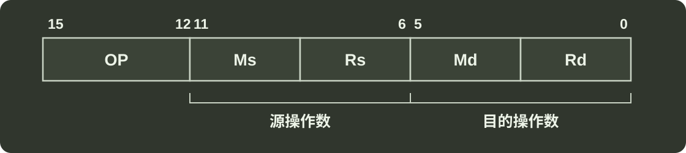

# q43_计算机组成原理

## 📋 题目要求 (题面)

某计算机字长为 16 位，主存地址空间大小为 128KB，按字编址。采用单字长指令格式，指令各字段定义如下：

转移指令采用相对寻址方式，相对偏移量用补码表示，寻址方式定义如下：

| Ms/Md | 寻址方式 | 助记符 | 含义 |
| --- | --- | --- | --- |
| 000B | 寄存器直接 | Rn | 操作数 = (Rn) |
| 001B | 寄存器间接 | (Rn) | 操作数 = ((Rn)) |
| 010B | 寄存器间接、自增 | (Rn)+ | 操作数 = ((Rn)), (Rn) + 1 → Rn |
| 011B | 相对 | D(Rn) | 转移目标地址 = (PC) + (Rn) |

请回答下列问题：

(1) 该指令系统最多可有多少条指令？该计算机最多有多少个通用寄存器？存储器地址寄存器（MAR）和存储器数据寄存器（MDR）至少各需要多少位？

(2) 转移指令的目标地址范围是多少？

(3) 若操作码 0010B 表示加法操作（助记符为 add），寄存器 R4 和 R5 的编号分别为 100B 和 101B，R4 的内容为 1234H，R5 的内容为 5678H，地址 1234H 中的内容为 5678H，地址 5678H 中的内容为 1234H，则汇编语言为“add (R4), (R5)+”（逗号前为源操作数，逗号后为目的操作数）对应的机器码是什么（用十六进制表示）？该指令执行后，哪些寄存器和存储单元中的内容会改变？改变后的内容是什么？

---

## 💡 答案与深度解析

1）操作码占 4 位，则该指令系统最多可有
 $24$ =16
条指令。操作数占 6 位，其中寻址方式占 3 位、寄存器编号占 3 位，因此该机最多有
 $23$ =8
个通用寄存器。主存地址空间大小为 128KB，按字编址，字长为 16 位，共有 128KB/2B =
 $216$
个存储单元，因此 MAR 至少为 16 位；因为字长为 16 位，故 MDR 至少为 16 位。

2）寄存器字长为 16 位，PC 和 Rn 可表示的地址范围均为
 $0∼216$ −1
，而主存地址空间为
 $216$
，故转移指令的目标地址范围为 0000H~FFFFH（
 $0∼216$ −1
）。

3）汇编语句“add(R4),(R5)+”，对应的机器码为

|  |  |  |  |  |  |
| --- | --- | --- | --- | --- | --- |
| 字段 | OP | Ms | Rs | Md | Rd |
| 内容 | 0010 | 001 | 100 | 010 | 101 |
| 说明 | add | 寄存器间接 | R4 | 寄存器间接，自增 | R5 |

将对应的机器码写成十六进制形式为 0010 0011 0001 0101B = 2315H。

该指令的功能是将 R4 的内容所指存储单元的数据与 R5 的内容所指存储单元的数据相加，并将结果送入 R5 的内容所指存储单元中。(R4)=1234H，(1234H)=5678H，(R5)=5678H，(5678H)=1234H；执行加法操作 5678H+1234H=68ACH，之后 R5 自增。

该指令执行后，R5 和存储单元 5678H 的内容会改变，R5 的内容从 5678H 变为 5679H，存储单元 5678H 中的内容变为该指令的计算结果 68ACH。

【注意】第 3 问中两个操作数的存储地址和数值有点令人晕头，请读者务必保持清醒。
