# q44_计算机组成原理

## 📋 题目要求 (题面)

某计算机的主存地址空间大小为 256MB，按字节编址。指令 Cache 和数据 Cache 分离，均有 8 个 Cache 行，每个 Cache 行大小为 64B，数据 Cache 采用直接映射方式。现有两个功能相同的程序 A 和 B，其伪代码如下所示：

```c
// 程序 A
int a[256][256];
.....
int sum_array1()
{
  int i, j, sum=0;
  for (i=0; i<256; i++)
    for (j=0; j<256; j++)
      sum += a[i][j];
  return sum;
}
```

```c
// 程序 B
int a[256][256];
.....
int sum_array2()
{
  int i, j, sum=0;
  for (j=0; j<256; j++)
    for (i=0; i<256; i++)
      sum += a[i][j];
  return sum;
}
```

假定 int 类型数据用 32 位补码表示，程序编译时 i，j，sum 均分配在寄存器中，数组 a 按行优先方式存放，其首地址为 320（十进制数）。请回答下列问题，要求说明理由或给出计算过程。

(1) 若不考虑用于 cache 一致性维护和替换算法的控制位，则数据 Cache 的总容量为多少？

(2) 数组元素 a[0][31] 和 a[1][1] 各自所在的主存块对应的 Cache 行号分别是多少（Cache 行号从 0 开始）？

(3) 程序 A 和 B 的数据访问命中率各是多少？哪个程序的执行时间更短？





---

## 💡 答案与深度解析

1）每个 Cache 行对应一个标记项，如下所示：

`| 有效位 | 脏位 | 替换控制位 | 标记位 |`

不考虑用于 Cache 一致性维护和替换算法的控制位。地址总长度为 28 位（
 $228$ =256
M），块内地址 6 位（
 $26$ =64
），Cache 块号 3 位（
 $23$ =8
），故 Tag 的位数为 28-6-3=19 位，还需使用一个有效位，故题中数据 Cache 行的结构如下图所示。

1 bit
