# q47_计算机网络

## 📋 题目要求 (题面)

某局域网采用 CSMA/CD 协议实现介质访问控制，数据传输速率为 10 Mbps，主机甲和主机乙之间的距离为 2 km，信号传播速度是 200 000 km/s。请回答下列问题，要求说明理由或写出计算过程。

(1) 若主机甲和主机乙发送数据时发生冲突，则从开始发送数据时刻起，到两台主机均检测到冲突时刻止，最短需经过多长时间？最长需经过多长时间（假设主机甲和主机乙发送数据过程中，其他主机不发送数据）？

(2) 若网络不存在任何冲突与差错，主机甲总是以标准的最长以太网数据帧（1518 字节）向主机乙发送数据，主机乙每成功收到一个数据帧后立即向主机甲发送一个 64 字节的确认帧，主机甲收到确认帧后方可发送下一个数据帧。此时主机甲的有效数据传输速率是多少（不考虑以太网的前导码）？

---

## 💡 答案与深度解析

1）显然当甲和乙同时向对方发送数据时，信号在信道中发生冲突后，冲突信号继续向两个方向传播。这种情况下两台主机均检测到冲突需要经过的时间最短：

 $T(a)$ =1km/200000km/s×2=0.01ms=单程传播时延t0

设甲先发送数据，当数据即将到达乙时，乙也开始发送数据，此时乙将立刻检测到冲突，而甲要检测到冲突还需等待冲突信号从乙传播到甲。两台主机均检测到冲突的时间最长：

 $T(b)$ =2km/200000km/s×2=0.02ms=双程传播时延2t0

甲
