# q11_计算机组成原理

## 📋 题目要求 (题面)

已知序列 25,13,10,12,9 是大根堆，在序列尾部插入新元素 18，将其再调整为大根堆，调整过程中元素之间进行的比较次数是（）

- **A.** 1
- **B.** 2
- **C.** 4
- **D.** 5

---

## 💡 答案与深度解析

**【正确答案】**：`B`

**正确答案：B**

插入 18 后，首先将 18 与 10 比较，交换位置，再将 18 与 25 比较，不交换位置。共比较了 2
次，调整的过程如下图所示。

25
