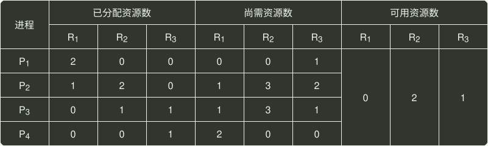

# q27_操作系统

## 📋 题目要求 (题面)

某时刻进程的资源使用情况如下表所示。

此时的安全序列是（ ）。

- **A.** $P_{1}$
- **B.** $P_{1}$
- **C.** $P_{1}$
- **D.** 不存在

---

## 💡 答案与深度解析

**【正确答案】**：`D`

**正确答案：D**
题应采用排除法，逐个代入分析。当剩余资源分配给
 $P_{1}$
，待
 $P_{1}$
执行完后，可用资源数为 (2,2,1)，此时仅能满足
 $P_{4}$
的需求，排除 A、B；接着分配给
 $P_{4}$
，待
 $P_{4}$
执行完后，可用资源数为 (2,2,2)，此时已无法满足任何进程的需求，排除 C。此外，本题还可以使用 银行家算法 求解（对于选择题来说，显得过于复杂）。
