# q37_计算机网络

## 📋 题目要求 (题面)

某网络拓扑如下图所示，路由器 `R1` 只有到达子网 `192.168.1.0/24` 的路由。为使 `R1` 可以将 `IP` 分组正确地路由到图中所有子网，则在 `R1` 中需要增加的一条路由（目的网络，子网掩码，下一跳）是（ ）。

- **A.** 192.168.2.0，255.255.255.128，192.168.1.1
- **B.** 192.168.2.0，255.255.255.0，192.168.1.1
- **C.** 192.168.2.0，255.255.255.128，192.168.1.2
- **D.** 192.168.2.0，255.255.255.0，192.168.1.2

---

## 💡 答案与深度解析

**【正确答案】**：`D`

**正确答案：D**

要使 R1 能够正确将分组路由到所有子网，则 R1 中需要有到 192.168.2.0/25 和 192.168.2.128/25 的路由，分别转换成二进制如下：

192.168.2.0: 11000000 10101000 00000010 00000000

192.168.2.128: 11000000 10101000 00000010 10000000

前 24 位都是相同的，于是可以 聚合 成超网 192.168.2.0/24, 子网掩码为前 24 位，即 255.255.255.0。下 一跳是与 R1 直接相连的 R2 的地址，因此是 192.168.1.2。
