# q44_计算机组成原理

## 📋 题目要求 (题面)

某计算机存储器按字节编址，虚拟（逻辑）地址空间大小为 16MB，主存（物理）地址空间大小为 1MB，页面大小为 4KB：Cache 采用直接映射方式，共 8 行：主存与 Cache 之间交换的块大小为 32B。系统运行到某一时刻时，页表的部分内容和 Cache 的部分内容分别如题 44-a 图、题 44-b 图所示，图中页框号及标记字段的内容为十六进制形式。

请回答下列问题∶

(1) 虚拟地址共有几位，哪几位表示虚页号？物理地址共有几位，哪几位表示页框号（物理页号）？

(2) 使用物理地址访问 Cache 时，物理地址应划分成哪几个字段？要求说明每个字段的位数及在物理地址中的位置。

(3) 虚拟地址 001C60H 所在的页面是否在主存中？若在主存中，则该虚拟地址对应的物理地址是什么？访问该地址时是否 Cache 命中？要求说明理由。

(4) 假定为该机配置一个 4 路组相连的 TLB，该 TLB 共可存放 8 个页表项，若其当前内容（十六进制）如题 44-c 图所示，则此时虚拟地址 024BACH 所在的页面是否在主存中？要求说明理由。

---

## 💡 答案与深度解析

1）存储器按字节编址，虚拟地址空间大小为 16B=24B，故虚拟地址为 24 位；页面大小为
 $4KB=212$ B
，故高 12 位为虚页号。主存地址空间大小为
 $1MB=22B$
，故物理地址为 20 位；由于页内地址为 12 位，故高 8 位为页框号。

2）由于 Cache 采用直接映射方式，所以物理地址各字段的划分如下。

| Tag 标记 | Cache 行号 | 块内偏移 |

块大小为 32B，所以块内偏移为 5 位；Cache 共 8 行，故 Cache 行号为 3 位，标记字段为 20-5-3=12 位。

3）虚拟地址 001C60H 的前 12 位为虚页号，即 001H，查看 001H 处的页表项，其对应的效位为 1，故虚拟地址 001C60H 所在的页面在主存中。页表 001H 处的页框号为 04H，与页内偏移（虚拟地址后 12 位）拼接成物理地址为 04C60H.物理地址 04C60H=00000100110001100000B，主存块只能映射到 Cache 的第 3 行（即第 011B 行），由于该行的有效位=1，标记（值为 105H) ≠ 04CH（物理地址高 12 位），故不命中。

4）由于 TLB 采用四路组相联，故 TLB 被分为 8/4=2 个组，因此虚页号中高 11 位为 TLB 标记、最低 1 位为 TLB 组号。虚拟地址 024BACH=000000100100101110101100B，虚页号为 000000100100B，TLB 标记为 00000010010B（即 012H)，TLB 组号为 0B，因此，该虚拟地址所对应物理页面只可能映射到 TLB 的第 0 组。组 0 中存在有效位=1、标记=012H 的项，因此访问 TLB 命中，即虚拟地址 024BACH 所在的页面在主存中。
