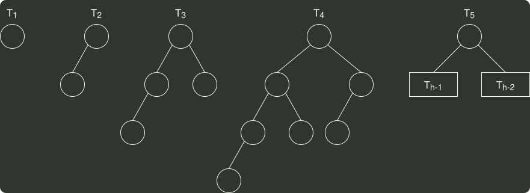

# q04_数据结构

## 📋 题目要求 (题面)

若平衡二叉树的高度为 6 ，且所有非叶结点的平衡因子均为 1 ，则该平衡二叉树的结点总数为（ ）。

- **A.** 10
- **B.** 20
- **C.** 32
- **D.** 33

---

## 💡 答案与深度解析

**【正确答案】**：`B`

**正确答案：B**

所有非叶结点的平衡因子均为 1，即平衡二叉树满足平衡的最少结点情况，如下图所示。
