# q07_数据结构

## 📋 题目要求 (题面)

对如下有向图带权图，若采用迪杰斯特拉（Dijkstra）算法求从源点 a 到其他各顶点的最短路径，则得到的第一条最短路径的目标顶点是 b，第二条最短路径的目标顶点是 c，后续得到的其余最短路径的目标顶点依次是（ ）。

- **A.** d, e, f
- **B.** e, d, f
- **C.** f, d, e
- **D.** f, e, d

---

## 💡 答案与深度解析

**【正确答案】**：`C`

**正确答案：C**

从 a 到各顶点的最短路径的求解过程：

| 顶点 | 第 1 趟 | 第 2 趟 | 第 3 趟 | 第 4 趟 | 第 5 趟 |
| --- | --- | --- | --- | --- | --- |
| b | (a,b)2 |  |  |  |  |
| c | (a,c)5 | (a,b,c)3 |  |  |  |
| d | ∞ | (a,b,d)5 | (a,b,d)5 | (a,b,d)5 |  |
| e | ∞ | ∞ | (a,b,c,f)4 |  |  |
| f | ∞ | ∞ | (a,b,c,e)7 | (a,b,c,e)7 | (a,b,d,e)6 |
| 集合 S | {a,b} | {a,b,c} | {a,b,c,f} | {a,b,c,f,d} | {a,b,c,f,d,e} |

后续目标顶点依次为 f, d, e。

【排除法】对于 A，若下一个顶点为 d，路径 a,b,d 的长度5，而 a,b,c,f 的长度仅为4，显然错误。同理可以排除B。将 f 加入集合 S 后，采用上述的方法也可以排除 D。
