# q09_数据结构

## 📋 题目要求 (题面)

已知一棵 3 阶 B 树，如下图所示。删除关键字 78 得到一棵新 B 树，其最右叶结点中的关键字是（）。

- **A.** 60
- **B.** 60, 62
- **C.** 62, 65
- **D.** 65

---

## 💡 答案与深度解析

**【正确答案】**：`D`

**正确答案：D**

本题考察 B 树的 删除 操作。对于上图所示的 3 阶 B 树，被删关键字 78 所在结点在删除前的关键字个数 = 1 = ⌈3/2⌉-1，且其左兄弟结点的关键字个数 = 2 ≥ ⌈3/2⌉，属于“兄弟够借”的情况，则需把该结点的左兄弟结点中最大的关键字上移到双亲结点中，同时把双亲结点中大于上移关键字的关键字下移到要删除关键字的结点中，这样就达到了新的平衡，如下图所示。

45
