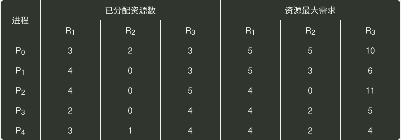
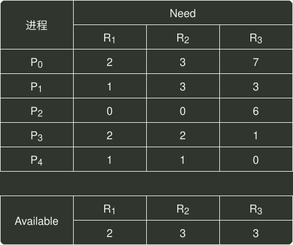

# q27_操作系统

## 📋 题目要求 (题面)

假设 5 个进程
 $P_{0}$
、
 $P_{1}$
、
 $P_{2}$
、
 $P_{3}$
、
 $P_{4}$
共享三类资源
 $R_{1}$
、
 $R_{2}$
、
 $R_{3}$
，这些资源总数分别为 18、6、22。T0 时刻的资源分配情况如下表所示，此时存在的一个安全序列是（ ）。

- **A.** $P_{0}$
- **B.** $P_{1}$
- **C.** $P_{2}$
- **D.** $P_{3}$

---

## 💡 答案与深度解析

**【正确答案】**：`D`

**正确答案：D**

首先求得各进程的需求矩阵 Need 与可利用资源矢量 Available：
