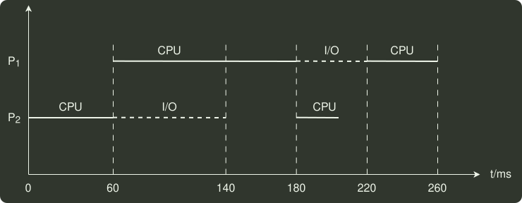

# q29_操作系统

## 📋 题目要求 (题面)

一个多道批处理系统中仅有
 $P_{1}$
和
 $P_{2}$
两个作业，
 $P_{2}$
比
 $P_{1}$
晚 5ms 到达，它们的计算和 I/O 操作顺序如下：

 $P_{1}$
：计算 60ms，I/O 80ms，计算 20ms

 $P_{2}$
：计算 120ms，I/O 40ms，计算 40ms

若不考虑调度和切换时间，则完成两个作业需要的时间最少是（ ）。

- **A.** 240ms
- **B.** 260ms
- **C.** 340ms
- **D.** 360ms

---

## 💡 答案与深度解析

**【正确答案】**：`B`

**正确答案：B**

由于
 $P_{2}$
比
 $P_{1}$
晚 5ms 到达，
 $P_{1}$
先占用 CPU, 作业运行的甘特图如下所示。
