# q40_计算机网络

## 📋 题目要求 (题面)

若用户 1 与用户 2 之间发送和接收电子邮件的过程如下图所示，则图中 ①、②、③ 阶段分别使用的应用层协议可以是

- **A.** SMTP、SMTP、SMTP
- **B.** POP3、SMTP、POP3
- **C.** POP3、SMTP、SMTP
- **D.** SMTP、SMTP、POP3

---

## 💡 答案与深度解析

**【正确答案】**：`D`

**正确答案：D**
SMTP 采用 “推” 的通信方式，在用户代理向邮件服务器及邮件服务器之间发送邮件时，SMTP 客户主动将邮件“推”送到 SMTP 服务器。而 POP3 采用 “拉” 的通信方式，当用户读取邮件时，用户代理向邮件服务器发出请求，“拉”取用户邮箱中的邮件。
