# q41_数据结构

## 📋 题目要求 (题面)

设有 6 个有序表 A、B、C、D、E、F，分别含有 10、35、40、50、60 和 200 个数据元素，各表中元素按升序排列。要求通过 5 次两两合并，将 5 个表最终合并成 1 个升序表，并在最坏情况下比较的总次数达到最小。请回答下列问题。

(1) 给出完整的合并过程，并求出最坏情况下比较的总次数。

(2) 根据你的合并过程，描述
 $N(N\ge 2)$
 个不等长升序表的合并策略，并说明理由。

---

## 💡 答案与深度解析

1）对于长度分别为 m, n 的两个有序表的合并，最坏情况下是一直比较到两个表尾元素，比较次数为 m +n-1 次。故最坏情况的比较次数依赖于表长，为了缩短总的比较次数，根据哈夫曼树（最佳归并树）思想的启发，可采用如图所示的合并顺序。

395
