# q42_数据结构

## 📋 题目要求 (题面)

假定采用带头结点的单链表保存单词，当两个单词有相同的后缀时，则可共享相同的后缀存储空间，例如，“loading" 和 “being” 的存储映像如下图所示。

设 str1 和 str2 分别指向两个单词所在单链表的头结点，链表结点结构为 `| data | next |`，请设计一个时间上尽可能高效的算法，找出由 str1 和 str2 所指向两个链表共同后缀的起始位置（如图中字符 i 所在的结点位置 p）。要求：

1）给出算法的基本设计思想。

2）根据设计思想，采用 C 或 C++ 或 Java 语言描述算法，关键之处给出注释。

3）说明你所设计算法的时间复杂度。

---

## 💡 答案与深度解析

顺序遍历两个链表到尾结点时，并不能保证两个链表同时到达尾结点。这是因为两个链表的长度不同。假设一个链表比另 一个链表长 k 个结点，我们先在长链表上遍历 k 个结点，之后同步遍历两个链表，这样就能够保证它们同时到达最后一个结点。由于两个链表从第一个公共结点到链表的尾结点都是重合的，所以它们肯定同时到达第 一个公共结点。

l
