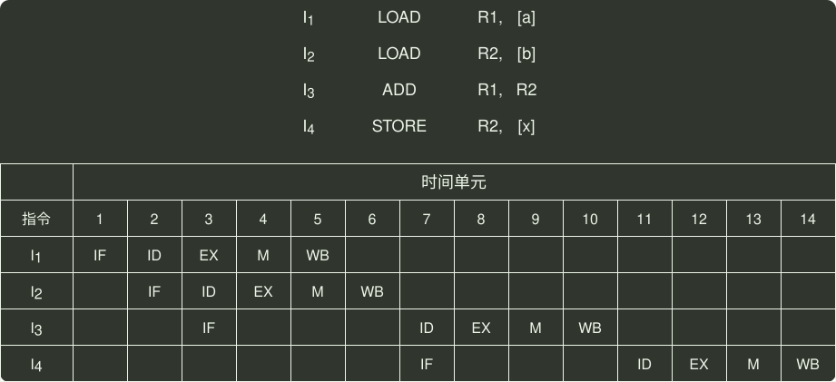
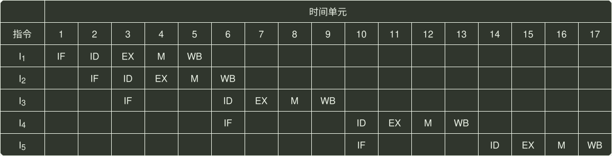

# q44_计算机组成原理

## 📋 题目要求 (题面)

某 16 位计算机中，带符号整数用补码表示，数据 Cache 和指令 Cache 分离。下表给出了指令系统中部分指令格式，其中 Rs 和 Rd 表示寄存器，mem 表示存储单元地址，(x) 表示寄存器 x 或存储单元 x 的内容。

该计算机采用 5 段流水方式执行指令，各流水段分别是取指（IF）、译码/读寄存器（ID）、执行/计算有效地址（EX）、访问存储器（M）和结果写回寄存器（WB），流水线采用 “按序发射，按序完成” 方式，没有采用转发技术处理数据相关，并且同一个寄存器的读和写操作不能在同一个时钟周期内进行。请回答下列问题：

(1) 若 int 型变量 x 的值为 -513，存放在寄存器 R1 中，则执行指令 “SHR R1” 后，R1 的内容是多少（用十六进制表示）？

(2) 若某个时间段中，有连续的 4 条指令进入流水线，在其执行过程中没有发生任何阻塞，则执行这 4 条指令所需的时钟周期数为多少？

(3) 若高级语言程序中某赋值语句为 `x=a+b`，`x`、`a` 和 `b` 均为 int 型变量，它们的存储单元地址分别表示为`[x]`、`[a]`和`[b]`。该语句对应的指令序列及其在指令流水线中的执行过程如下图所示。

则这 4 条指令执行过程中，
 $I_{3}$
的 ID 段和
 $I_{4}$
的 IF 段被阻塞的原因各是什么？

(4) 若高级语言程序中某赋值语句为 `x=x*2+a`，`x` 和 `a` 均为 unsigned int 类型变量，它们的存储单元地址分别表示为`[x]`、`[a]`，则执行这条语句至少需要多少个时钟周期？要求模仿题 44 图画出这条语句对应的指令序列及其在流水线中的执行过程示意图。







---

## 💡 答案与深度解析

1）x 的机器码为
 $[x]补$
= 1111 1101 1111 1111B，即指令执行前 (R1)=FDFFH，右移 1 位后为 1111 1110 1111 1111B，即指令执行后 (R1) = FEFFH。（2 分）

2）每个时钟周期只能有一条指令进入流水线，从第 5 个时钟周期开始，每个时钟周期都会有一条指令执行完毕，故至少需要 4+(5-1)=8 个时钟周期。（2 分）

3）
 $I_{3}$
的 ID 段被阻塞的原因：因为
 $I_{3}$
与
 $I_{1}$
和
 $I_{2}$
都存在 数据冒险，需等到
 $I_{1}$
和
 $I_{2}$
将结果写回寄存器后，
 $I_{3}$
才能读寄存器内容，所以
 $I_{3}$
的 ID 段被阻塞（1 分）。
 $I_{4}$
的 IF 段被阻塞的原因：因为
 $I_{4}$
的前一条指令
 $I_{3}$
在 ID 段被阻塞，所以
 $I_{4}$
的 IF 段被阻塞（1 分）。

注意：要求“按序发射，按序完成”，故 2) 中下一条指令的 IF 必须和上一条指令的 ID 并行，以免因上一条指令发生冲突而导致下一条指令先执行完。

4）因 `2*x` 操作有左移和加法两种实现，故 `x=x*2+a` 对应的指令序列为：

```c
I1    LOAD  R1, [x]
I2    LOAD  R2, [a]
I3    SHL   R1       // 或者 ADD R1, R1
I4    ADD   R1, R2
I5    STORE R2, [x]
```

这 5 条指令在流水线中的执行过程如下表所示：
