# q04_数据结构

## 📋 题目要求 (题面)

已知三叉树 T 中 6 个叶结点的权分别是 2，3，4，5，6，7，T 的带权（外部）路径长度最小是（ ）。

- **A.** 27
- **B.** 46
- **C.** 54
- **D.** 56

---

## 💡 答案与深度解析

**【正确答案】**：`B`

**正确答案：B**

将 哈夫曼树 的思想推广到三叉树的情形。为了构成严格的三叉树，需添加权为 0 的虚叶结点，对于严格的三叉树
 $(n_{0}$ −1)%(3−1)=u=1=0
，需要添加
 $m−u−1=3−1−1$
个叶结点，说明 7 个叶结点刚好可以构成一个严格的三叉树。按照哈夫曼树的原则，权为 0 的叶结点应离树根最远构造最小带权生成树的过程如下：

0
