# q27_操作系统

## 📋 题目要求 (题面)

设系统缓冲区和用户工作区均采用单缓冲，从外设读入 1 个数据块到系统缓冲区的时间为 100，从系统缓冲区读入 1 个数据块到用户工作区的时间为 5，对用户工作区中的 1 个数据块进行分析的时间为 90（如下图所示）。

进程从外设读入并分析 2 个数据块的最短时间是（ ）。

- **A.** 200
- **B.** 295
- **C.** 300
- **D.** 390

---

## 💡 答案与深度解析

**【正确答案】**：`C`

**正确答案：C**
在 单缓冲 中，数据块 1 从外设到用户工作区的总时间为 105，在这段时间中，数据块 2 没有进行操作。在数据块 1 进行分析处理 时，数据块 2 从外设到用户工作区的总时间为 105，这段时间是并行的。再加上处理数据块 2 的时间 90，总时间为 300，答案为 C。
