# q42_数据结构

## 📋 题目要求 (题面)

设包含 4 个数据元素的集合 S = { “do”, “for”, “repeat”, “while” }，各元素的查找概率依次为：
 $p_{1}$ =0.35
，
 $p_{2}$ =0.15
，
 $p_{3}$ =0.15
，
 $p_{4}$ =0.35
 。将 S 保存在一个长度为 4 的顺序表中，采用折半查找法，查找成功时的平均查找长度为 2.2 。请回答：

(1) 若采用顺序存储结构保存 S ，且要求平均查找长度更短，则元素应如何排列？应使用何种查找方法？查找成功时的平均查找长度是多少？

(2) 若采用链式存储结构保存 S ，且要求平均查找长度更短，则元素应如何排列？应使用何种查找方法？查找成功时的平均查找长度是多少？

---

## 💡 答案与深度解析

1）折半查找要求元素有序顺序存储，若各个元素的查找概率不同，则折半查找的性能不一定优于顺序查找。采用顺序查找时，元素按其查找概率的降序排列时查找长度最小。

采用顺序存储结构，数据元素按其查找概率降序排列。采用顺序查找方法。

查找成功时的平均查找长度=0.35×1+0.35×2+0.15×3+0.15×4=2.1。

此时，显然查找长度比折半查找的更短。

2）答案一：采用链式存储结构时，只能采用顺序查找，其性能和顺序表一样，类似于上题。数据元素按其查找概率降序排列，构成单链表。采用顺序查找方法。

查找成功时的平均查找长度=0.35×1+0.35×2+0.15×3+0.15×4=2.1。

答案二：还可以构造成二叉排序树的形式。采用二叉链表的存储结构，构造二叉排序树，元素的存储方式见下图。采用二叉排序树的查找方法。

for
