# q44_计算机组成原理

## 📋 题目要求 (题面)

某计算机采用 16 位定长指令字格式，其 CPU 中有一个标志寄存器，其中包含进位/借位标志 CF、零标志 ZF 和符号标志 NF。假定为该机设计了条件转移指令，其格式如下：

其中，00000 为操作码 OP；C、Z 和 N 分别为 CF、ZF 和 NF 的对应检测位，某检测位为 1 时表示需检测对应标志，需检测的标志位中只要有一个为 1 就转移，否则就不转移，例如，若 C=1，Z=0，N=1，则需检测 CF 和 NF 的值，当 CF=1 或 NF=1 时发生转移；OFFSET 是相对偏移量，用补码表示。转移执行时，转移目标地址为 (PC)+2+2×OFFSET；顺序执行时，下条指令地址为 (PC)+2。请回答下列问题。

(1) 该计算机存储器按字节编址，还是按字编址？该条件转移指令向后（反向）最多可跳转最多少条指令？

(2) 某条件转移指令的地址为 200CH，指令内容如下图所示，若该执行时 CF=0，ZF=0，NF=1，则该指令执行后 PC 的值是多少？若该指令执行时 CF=1，ZF=0，NF=0，则该指令执行后 PC 的值又是多少？请给出计算过程。

(3) 实现“无符号数比较小于等于时转移”功能的指令中，C、Z 和 N 应各是什么？

(4) 以下是该指令对应的数据通路示意图，要求给出中部件①~③的名称或功能说明。

---

## 💡 答案与深度解析

1）因为指令长度为 16 位，且下条指令地址为 (PC)+2，故编址单位是字节。

偏移量 OFFSET 为 8 位补码，范围为 -128~127，故相对于当前条件转移指令，向后最多可跳转 127 条指令。

【评分说明】若正确给出 OFFSET 的取值范围，则酌情给分。

2）指令中 C=0，Z=1，N=1，故应根据 ZF 和 NT 的值来判断是否转移。当 CF=0，ZF=0，NF=1 时，需转移。己知指令中偏移量为 11100011B=E3H，符号扩展后为 FFE3H，左移一位（乘 2）后为 FFC6H，故 PC 的值（即转移目标地址）为 200CH+2+FFC6H=1FD4H。当 CF=1，ZF=0，NF=0 时不转移。PC 的值为 200CH+2=200EH。

3）指令中的 C、Z 和 N 应分别设置为 C=Z=1，N=0，进行数之间的大小比较通常是对两个数进行减法，而因为是无符号数比较小于等于时转移，即两个数相减结果为 0 或者负数都应该转移，若是 0，则 ZF 标志应当为 1，所以是负数，则借位标志应该为 1，而无符号数并不涉及符号标志 NF。

4）部件①用于存放当前指令，不难得出为指令寄存器；多路选择器根据符号标志 C/Z/N 来决定下一条指令的地址是 PC+2 还是 PC+2+2×OFFSET，故多路选择器左边线上的结果应该是 PC+2+2×OFFSET。根据运算的先后顺序以及与 PC+2 的连接，部件②用于左移一位实现乘 2，为移位寄存器。部件③用于 PC+2 和 2×OFFSET 相加，为加法器。

部件②：移位寄存器（用于左移一位）；部件③：加法器（地址相加）。

【评分说明】合理给出部件名称或功能说明均给分。
