# q46_操作系统

## 📋 题目要求 (题面)

某计算机主存按字节编址，逻辑地址和物理地址都是 32 位，页表项大小为 4 字节。请回答下列问题。

(1) 若使用一级页表的分页存储管理方式，逻辑地址结构为：

则页的大小是多少字节？页表最大占用多少字节？

(2) 若使用二级页表的分页存储管理方式，逻辑地址结构为：

设逻辑地址为 LA，请分别给出其对应的页目录号和页表索引的表达式。

(3) 采用 (1) 中的分页存储管理方式，一个代码段起始逻辑地址为 0000 8000H，其长度为 8KB，被装载到从物理地址 0090 0000H 开始的连续主存空间中。页表从主存 0020 0000H 开始的物理地址处连续存放，如下图所示（地址大小自下向上递增）。请计算出该代码段对应的两个页表项的物理地址、这两个页表项中的页框号以及代码页面 2 的起始物理地址。

---

## 💡 答案与深度解析

1）因为主存按字节编址，页内偏移量是 12 位，所以页大小为
 $212$
B=
 $4$
KB。（1 分）

页表项数为
 $220$
，故该一级页表最大为
 $220$ ×4
B =
 $4$
MB。（2 分）

2）页目录号可表示为：`(((unsigned int)(LA)) >> 22) & 0x3FF`。（1 分）

页表索引可表示为：`(((unsigned int)(LA)) >> 12) & 0x3FF`。（1 分）

【评分说明】

①页目录号也可以写成 `(unsigned int)(LA) > 22`；如果两个表达式没有对 LA 进行类型转换，同样给分。

②如果用除法和其他开销很大的运算方法，但对基本原理是理解的，同样给分。

③参考答案给出的是 C 语言的描述，用其他语言（包括自然语言）正确地表述了，同样给分。

3）代码页面 1 的逻辑地址为 00008000H，表明其位于第 8 个页的位置，对应页表中的第 8 个页表项，所以第 8 个页表项的物理地址 = 页表起始地址 + 8×页表项的字节数 = 00200000H + 8×4 = 00200020H。由此可得如下图所示的答案。（3 分）

00901H
