# q47_计算机网络

## 📋 题目要求 (题面)

假设 Internet 的两个自治系统构成的网络如题 47 图所示，自治系统 AS1 由路由器 R1 连接两个子网构成；自治系统 AS2 由路由器 R2、R3 互联并连接 3 个子网构成。各子网地址、R2 的接口名、R1 与 R3 的部分接口 IP 地址如题 47 图所示。

请回答下列问题。

(1) 假设路由表结构如下表所示。

请利用路由聚合技术，给出 R2 的路由表，要求包括到达题 47 图中所有子网的路由，且路由表中的路由项尽可能少。

(2) 若 R2 收到一个目的 IP 地址为 194.17.20.200 的 IP 分组，R2 会通过哪个接口转发该 IP 分组？

(3) R1 与 R2 之间利用哪个路由协议交换路由信息？该路由协议的报文被封装到哪个协议的分组中进行传输？

---

## 💡 答案与深度解析

1）要求 R2 的路由表能到达图中所有的子网，且路由项尽可能的少，则应对每个路由接口的子网进行 聚合。在 AS1 中，子网 153.14.5.0/25 和子网 153.14.5.128/25 可以聚合为子网 153.14.5.0/24；在 AS2 中，子网 194.17.20.0/25 和子网 194.17.21.0/24 可以聚合为子网 194.17.20.0/23；子网 194.17.20.128/25 单独连接到 R2 的接口 E0。（6 分）

于是可以得到 R2 的路由表如下：

| 目的网络 | 下一跳 | 接口 |
| --- | --- | --- |
| 153.14.5.0/24 | 153.14.3.2 | S0 |
| 194.17.20.0/23 | 194.17.24.2 | S1 |
| 194.17.20.128/25 | - | E0 |

【评分说明】①每正确解答 1 个路由项，给 2 分，共 6 分。每条路由项正确解答目的网络 IP 地址但无前缀长度，给 0.5 分，正确解答前缀长度给 0.5 分，正确解答下一跳 IP 地址给 0.5 分，正确解答接口给 0.5 分。

②路由项解答部分正确或路由项多于 3 条，可酌情给分。

2）该 IP 分组的目的 P 地址 194.17.20.200 与路由表中 194.17.20.0/23 和 194.17.20.128/25 两个路由表项均匹配，根据 最长匹配原则，R2 将通过 E0 接口转发该 P 分组。（1 分）

3）R1 和 R2 属于不同的 自治系统，故应使用边界网关协议 BGP（或 BGP4）交换路由信息；（1 分）BGP 是应用层协议，它的报文被封装到 TCP 协议段中进行传输。（1 分）

【评分说明】若考生解答为 EGP 协议，且正确解答 EGP 采用 IP 协议进行通信，亦给分。
