# q04_数据结构

## 📋 题目要求 (题面)

若对如下的二叉树进行中序线索化，则结点 x 的左、右线索指向的结点分别是（ ）。

- **A.** e、c
- **B.** e、a
- **C.** d、c
- **D.** b、a

---

## 💡 答案与深度解析

**【正确答案】**：`D`

**正确答案：D**
线索二叉树 的线索实际上指向的是相应遍历序列特定结点的前驱结点和后继结点，所以先写出二叉树的中序遍历序列 debxac, 中序遍历中在 x 左边和右边的字符，就是它在中序线索化的左、右线索，即 b、a, 选 D。
