# q07_数据结构

## 📋 题目要求 (题面)

对如下所示的有向图进行拓扑排序，得到的拓扑序列可能是（）

- **A.** 3,1,2,4,5,6
- **B.** 3,1,2,4,6,5
- **C.** 3,1,4,2,5,6
- **D.** 3,1,4,2,6,5

---

## 💡 答案与深度解析

**【正确答案】**：`D`

**正确答案：D**
按照 拓扑排序 的算法，每次都选择入度为 0 的结点从图中删去，此图中一开始只有结点 3 的入度为 0；删掉结点 3 后，只有结点 1 的入度为 0; 删掉结点 1 后，只有结点 4 的入度为 0；删掉结点 4 后，结点 2 和结点 6 的入度都为 0，此时选择删去不同的结点，会得出不同的拓扑序列，分别处理完毕后可知可能的拓扑序列为 3,1 4,2,6,5 和 3,1,4,6,2,5, 选 D。
