# q34_计算机网络

## 📋 题目要求 (题面)

某以太网拓扑及交换机当前转发表如下图所示，主机 00-e1-d5-00-23-a1 向主机 00-e1-d5-00-23-c1 发送 1 个数据帧，主机 00-e1-d5-00-23-c1 收到该帧后，向主机 00-e1-d5-00-23-a1 发送 1 个确认帧，交换机对这两个帧的转发端口分别是（ ）。

- **A.** {3} 和 {1}
- **B.** {2,3} 和 {1}
- **C.** {2,3} 和 {1,2}
- **D.** {1,2,3} 和 {1}

---

## 💡 答案与深度解析

**【正确答案】**：`B`

**正确答案：B**
主机 00-el-d5-00-23-a1 向 00-el-d5-00-23-c1 发送数据帧时，交换机 转发表中没有 00-el-d5-00-23-c1 这项，所以向除 1 接口外的所有接口广播这帧，即 2、3 端口会转发这帧，同时因为转发表中并没有 00-e1-d5-00-23-a1 这项，所以转发表会把（目的地址 00-el-d5-00-23-a1，端口 1）这项加入转发表。而当 00-el-d5-00-23-c1 向 00-e1-d5-00-23-a1 发送确认帧时，由于转发表已经有 00-el-d5-00-23-a1 这项，所以交换机只向 1 端口转发，选 B。
