# q42_数据结构

## 📋 题目要求 (题面)

某网络中的路由器运行 OSPF 路由协议，题 42 表是路由器 R1 维护的主要链路状态信息（LSI），题 42 图是根据题 42 表的接口名构造出来的网络拓扑。

请回答下列问题。

⑴ 本题中的网络可抽象为数据结构中的哪种结构？

⑵ 针对题 42 表中的内容，设计合理的链式存储结构，以保存题 42 表中的链路状态信息（LSI）。要求给出链式存储结构的数据定义，并画出对应题 42 表的链式存储结构示意图（示意图中仅以 ID 标识结点）。

⑶ 按照迪杰斯特拉（Dijkstra）算法的策略，依次给出 R1 到达题 42 图中子网 192.1.x.x 的最短路径及费用。




---

## 💡 答案与深度解析

很多考生乍看之下以为是网络的题目，其实该题本身并没有涉及太多的网络知识点，只是
应用了网络的模型，实际上考查的还是数据结构的内容。

1）图（1 分）

题中给出的是一个简单的网络拓扑图，可以抽象为无向图。

【评分说明】只要考生的答案中给出与图含义相似的描述，例如，“网状结构”“非线性结构”等，同样
给分。

2）链式存储结构的如下图所示。

```c
struct Arc {
  uint32_t id;
  uint32_t ip;
  int metric;
};

struct Net {
  uint32_t prefix;
  uint32_t mask;
  int metric;
};

struct LNode {
  LNode *next;
  // flag == 1：链路连接到路由器
  // flag == 2：链路连接到子网
  int flag;
  union NetOrArc {
    Net net;
    Arc arc;
  };
};

struct HNode {
  uint32_t router_id;
  LNode *next;
  HNode *next_hnode;
};
```
