# q05_数据结构

## 📋 题目要求 (题面)

设有向图 G=(V,E)，顶点集 V={
 $v_{0}$
,
 $v_{1}$
,
 $v_{2}$
,
 $v_{3}$
}，边集 E={<
 $v_{0}$
,
 $v_{1}$
>，<
 $v_{0}$
,
 $v_{2}$
>，<
 $v_{0}$
,
 $v_{3}$
>，<
 $v_{1}$
,
 $v_{3}$
>}。若从顶点
 $v_{0}$
开始对图进行深度优先遍历，则可能得到的不同遍历序列个数是（）。

- **A.** 2
- **B.** 3
- **C.** 4
- **D.** 5

---

## 💡 答案与深度解析

**【正确答案】**：`D`

**正确答案：D**

画出该有向图图形如下：

0
