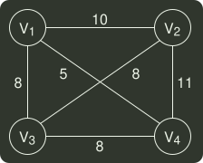

# q06_数据结构

## 📋 题目要求 (题面)

求下面带权图的最小（代价）生成树时，可能是克鲁斯卡（Kruskal）算法第 2 次选中但不是普里姆（Prim）算法（从 V4 开始）第 2 次选中的边是（）。

- **A.** (
 $V_{1}$
- **B.** (
 $V_{1}$
- **C.** (
 $V_{2}$
- **D.** (
 $V_{3}$

---

## 💡 答案与深度解析

**【正确答案】**：`C`

**正确答案：C**
 $V_{4}$
开始， kruskal 算法 选中的第一条边一定是权值最小的 (
 $V_{1}$
,
 $V_{4}$
), B 错误。由于
 $V_{1}$
和
 $V_{4}$
已经可达，第二条边含有
 $V_{1}$
和
 $V_{4}$
的权值为 8 的一定符合 prim 算法，排除 A、D。
