# q10_数据结构

## 📋 题目要求 (题面)

已知小根堆为 8,15,10,21,34,16,12，删除关键字 8 之后需重建堆，在此过程中，关键字之间的比较次数是（）。

- **A.** 1
- **B.** 2
- **C.** 3
- **D.** 4

---

## 💡 答案与深度解析

**【正确答案】**：`C`

**正确答案：C**

删除 8 后，将 12 移动到堆顶，第一 次是 15 和 10 比较，第二次是 10 和 12 比较并交换，第三次还需比较 12 和 16, 故比较次数为 3 次。

8
